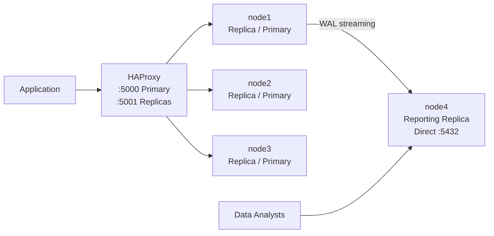

# Adding a Reporting Node to an Existing PostgreSQL HA Cluster
## Patroni + etcd Learner + HAProxy Exclusion on Rocky Linux 9

---

## Overview

This guide covers adding a dedicated **reporting node** (node4) to an existing 3-node PostgreSQL HA cluster managed by Patroni and etcd. This node is designed exclusively for data analysts and reporting workloads — it stays in sync with the cluster in real time but never receives application traffic and never becomes a Primary.

### What Makes This Node Different From a Regular Replica

A regular replica added to the cluster would:
- Be eligible for promotion to Primary during a failover
- Receive read traffic from HAProxy (port 5001)
- Participate in etcd quorum voting

The reporting node does **none of these things**. It is a purpose-built read-only node isolated from the application traffic path.

| Property | Regular Replica | Reporting Node (node4) |
|---|---|---|
| etcd membership | Voting member | Learner (non-voting) |
| Failover candidate | Yes | No |
| HAProxy load balancing | Yes | No |
| Data sync | Real-time WAL | Real-time WAL |
| Who connects | Application via HAProxy | Data analysts directly |

### Architecture



node4 receives WAL streaming replication from whichever node is the current Primary, just like any other replica. The difference is that HAProxy does not know about node4, and Patroni is configured to never promote it.

### Node Reference

| Hostname | IP | Role |
|---|---|---|
| node1 | 172.16.171.128 | PostgreSQL + Patroni + etcd (voting) |
| node2 | 172.16.171.129 | PostgreSQL + Patroni + etcd (voting) |
| node3 | 172.16.171.130 | PostgreSQL + Patroni + etcd (voting) |
| haproxy | 172.16.171.131 | HAProxy Load Balancer |
| node4 | 172.16.171.132 | PostgreSQL + Patroni + etcd (learner) — Reporting Node |

---

## Prerequisites

Before starting, verify the existing cluster is healthy. Run this from any existing node:

```bash
patronictl -c /etc/patroni/patroni.yml list
```

All three nodes should show `streaming` or `running` state with `Lag = 0`. If the cluster is unhealthy, resolve that before adding node4.

---

## Phase 1 — Network and Firewall Setup

### Step 1 — Update /etc/hosts on All Existing Nodes

Run on **node1, node2, node3, and haproxy**:

```bash
echo "172.16.171.132 node4" | sudo tee -a /etc/hosts
```

**Why:** All nodes communicate by hostname. Without this entry, existing nodes cannot resolve `node4` during replication and etcd peer communication.

**Verify:**
```bash
grep node4 /etc/hosts
# Expected: 172.16.171.132 node4
```

### Step 2 — Configure /etc/hosts on node4

Run on **node4**:

```bash
sudo tee -a /etc/hosts <<EOF
172.16.171.128 node1
172.16.171.129 node2
172.16.171.130 node3
172.16.171.131 haproxy
172.16.171.132 node4
EOF
```

**Why:** node4 needs to resolve all other nodes — etcd peers for cluster sync and existing nodes for `pg_basebackup` during Patroni bootstrap.

### Step 3 — Open Firewall Ports on node4

Run on **node4**:

```bash
sudo firewall-cmd --permanent --add-port=2379/tcp
sudo firewall-cmd --permanent --add-port=2380/tcp
sudo firewall-cmd --permanent --add-port=5432/tcp
sudo firewall-cmd --permanent --add-port=8008/tcp
sudo firewall-cmd --reload
```

**Why each port:**
- `2379` — etcd client port, Patroni connects here to read/write cluster state
- `2380` — etcd peer port, existing etcd nodes sync with node4 here
- `5432` — PostgreSQL, data analysts connect here directly
- `8008` — Patroni REST API (not used by HAProxy for this node, but Patroni requires it)

**Verify:**
```bash
sudo firewall-cmd --list-ports
# Expected: 2379/tcp 2380/tcp 5432/tcp 8008/tcp
```

---

## Phase 2 — etcd Setup (Learner Member)

> **This is the most critical difference from adding a regular node.**
>
> In a standard etcd cluster, every member participates in leader election and quorum voting. If you add node4 as a normal voting member, the cluster would require 3 out of 4 nodes for quorum instead of 2 out of 3 — making the cluster less fault-tolerant (you could only lose 1 node instead of 1).
>
> A **learner** member receives all data from the cluster but does not vote. The quorum calculation stays at the original 3 nodes. node4 gets full data sync without affecting cluster stability.

### Step 1 — Register node4 as an etcd Learner

> ⚠️ **Common mistake:** If you accidentally registered node4 as a normal voting member (using `member add` without `--learner`), you must remove it first and re-add it as a learner. See the note at the end of this step.

Run from **any existing node (node1, node2, or node3)**:

```bash
etcdctl --endpoints=http://172.16.171.128:2379,http://172.16.171.129:2379,http://172.16.171.130:2379 \
  member add etcd4 \
  --learner \
  --peer-urls=http://172.16.171.132:2380
```

**Why `--learner`:** This flag is what tells etcd to add node4 as a non-voting member. Without it, node4 becomes a full voting member and changes the quorum requirements for the entire cluster.

**Why register before starting etcd on node4:** etcd uses Raft consensus — a new member must be approved by the existing cluster before it can join. Starting etcd on node4 without registering first will cause a cluster ID mismatch error and etcd will refuse to start.

**Expected output:**
```
Member 8672188a61a44e3 added to cluster 7a6e6b38df080c52
ETCD_NAME="etcd4"
ETCD_INITIAL_CLUSTER="etcd4=http://172.16.171.132:2380,..."
ETCD_INITIAL_CLUSTER_STATE="existing"
```

**Verify — node4 should appear as `unstarted` with `true` in the last column (IS LEARNER):**
```bash
etcdctl --endpoints=http://172.16.171.128:2379,http://172.16.171.129:2379,http://172.16.171.130:2379 member list
```

Expected output:
```
8672188a61a44e3, unstarted, , http://172.16.171.132:2380, , true   ← IS LEARNER = true
344a5d0661fa16e4, started, etcd3, ...                              ← IS LEARNER = false
a1a0903cb0c43305, started, etcd1, ...                              ← IS LEARNER = false
b0f7a0a34136d474, started, etcd2, ...                              ← IS LEARNER = false
```

> **If you already added node4 as a normal voting member (last column = false):**
> ```bash
> # Get node4's member ID from member list output
> etcdctl --endpoints=http://172.16.171.128:2379,http://172.16.171.129:2379,http://172.16.171.130:2379 \
>   member remove <node4_member_id>
>
> # Re-add as learner
> etcdctl --endpoints=http://172.16.171.128:2379,http://172.16.171.129:2379,http://172.16.171.130:2379 \
>   member add etcd4 \
>   --learner \
>   --peer-urls=http://172.16.171.132:2380
> ```

### Step 2 — Install etcd Binary on node4

Run on **node4**:

```bash
ETCD_VER=v3.5.17
cd /tmp
sudo curl -L https://github.com/etcd-io/etcd/releases/download/${ETCD_VER}/etcd-${ETCD_VER}-linux-amd64.tar.gz -o etcd.tar.gz
tar xzvf etcd.tar.gz
sudo mv /tmp/etcd-${ETCD_VER}-linux-amd64/etcd /usr/local/bin/
sudo mv /tmp/etcd-${ETCD_VER}-linux-amd64/etcdctl /usr/local/bin/
sudo restorecon -v /usr/local/bin/etcd
sudo restorecon -v /usr/local/bin/etcdctl
```

**Why `restorecon`:** Rocky Linux runs SELinux in Enforcing mode. Manually placed binaries do not have the correct SELinux context and will be blocked from executing. `restorecon` applies the correct context.

```bash
sudo useradd -r -s /sbin/nologin etcd
sudo mkdir -p /etcd/data /etc/etcd
sudo chown etcd:etcd /etcd/data
sudo chmod 700 /etcd/data
```

**Why a dedicated `etcd` user:** Running services as root is a security risk. `-r` creates a system user with no home directory. `-s /sbin/nologin` prevents anyone from logging in as this user. `chmod 700` ensures only the `etcd` user can access the data directory.

### Step 3 — Create etcd Configuration File on node4

Run on **node4**:

```bash
sudo tee /etc/etcd/etcd.conf <<EOF
ETCD_NAME="etcd4"
ETCD_DATA_DIR="/etcd/data"
ETCD_LISTEN_PEER_URLS="http://172.16.171.132:2380"
ETCD_LISTEN_CLIENT_URLS="http://172.16.171.132:2379,http://127.0.0.1:2379"
ETCD_INITIAL_ADVERTISE_PEER_URLS="http://172.16.171.132:2380"
ETCD_ADVERTISE_CLIENT_URLS="http://172.16.171.132:2379"
ETCD_INITIAL_CLUSTER="etcd4=http://172.16.171.132:2380,etcd3=http://172.16.171.130:2380,etcd1=http://172.16.171.128:2380,etcd2=http://172.16.171.129:2380"
ETCD_INITIAL_CLUSTER_STATE="existing"
ETCD_INITIAL_CLUSTER_TOKEN="etcd-cluster-1"
ETCD_QUOTA_BACKEND_BYTES=8589934592
ETCD_AUTO_COMPACTION_MODE=revision
ETCD_AUTO_COMPACTION_RETENTION=1000
EOF
```

**Key parameter explanations:**

| Parameter | Value | Why |
|---|---|---|
| `ETCD_NAME` | `etcd4` | Must match the name used in `member add` |
| `ETCD_INITIAL_CLUSTER_STATE` | `existing` | **Critical:** tells etcd this node is joining a running cluster, not bootstrapping a new one. Using `new` here will cause a conflict with the existing cluster |
| `ETCD_INITIAL_CLUSTER_TOKEN` | `etcd-cluster-1` | Must be identical to the existing cluster's token |
| `ETCD_LISTEN_CLIENT_URLS` | includes `127.0.0.1:2379` | Allows Patroni on the same node to connect via localhost — faster and avoids network overhead |

### Step 4 — Create etcd systemd Service on node4

Run on **node4**:

```bash
sudo tee /etc/systemd/system/etcd.service <<EOF
[Unit]
Description=etcd key-value store
After=network.target

[Service]
User=etcd
EnvironmentFile=/etc/etcd/etcd.conf
ExecStart=/usr/local/bin/etcd
Restart=always
RestartSec=5s
LimitNOFILE=40000

[Install]
WantedBy=multi-user.target
EOF
```

### Step 5 — Start etcd on node4

Run on **node4**:

```bash
sudo systemctl daemon-reload
sudo systemctl enable etcd
sudo systemctl start etcd
sudo journalctl -u etcd -f
```

Watch the logs. You should see `published local member to cluster` and `ready to serve client requests`. Press `Ctrl+C` to exit the log view.

**Verify from any existing node:**
```bash
etcdctl --endpoints=http://172.16.171.128:2379,http://172.16.171.129:2379,http://172.16.171.130:2379 member list
```

node4 should now show `started` with `true` in the IS LEARNER column:
```
8672188a61a44e3, started, etcd4, http://172.16.171.132:2380, http://172.16.171.132:2379, true
```

---

## Phase 3 — PostgreSQL Setup on node4

> **Do NOT run `initdb` or start PostgreSQL manually.** Patroni will initialize the data directory and start PostgreSQL automatically during bootstrap by cloning from the current Primary via `pg_basebackup`.

### Step 1 — Add PostgreSQL Repository

Run on **node4**:

```bash
sudo dnf install -y https://download.postgresql.org/pub/repos/yum/reporpms/EL-9-x86_64/pgdg-redhat-repo-latest.noarch.rpm
sudo dnf -qy module disable postgresql
```

**Why disable the built-in module:** Rocky Linux ships an older PostgreSQL version. Without disabling the built-in module, `dnf` may install the wrong version instead of PostgreSQL 16 from PGDG.

### Step 2 — Install PostgreSQL 16

Run on **node4**:

```bash
sudo dnf install -y postgresql16-server postgresql16-contrib
sudo passwd postgres
```

Set the same `postgres` OS user password as the other nodes.

### Step 3 — Create Data Directory

Run on **node4**:

```bash
sudo mkdir -p /data/patroni
sudo chown postgres:postgres /data/patroni
sudo chmod 700 /data/patroni
```

**Why:** Patroni runs as the `postgres` OS user and must have full ownership of this directory to initialize and manage PostgreSQL. `chmod 700` ensures no other user can access it.

---

## Phase 4 — Patroni Setup on node4

> **This is the second critical difference from adding a regular node.**
>
> Two tags in the Patroni configuration control node4's behavior:
> - `nofailover: true` — Patroni will never promote this node to Primary, even if all other nodes fail
> - `noloadbalance: true` — HAProxy will skip this node when load balancing read traffic on port 5001
>
> These two tags together ensure node4 is completely invisible to the application while still being a fully functional replica receiving real-time data.

### Step 1 — Install Patroni

Run on **node4**:

```bash
sudo dnf install -y python3-pip python3-devel gcc
sudo pip3 install patroni[etcd] psycopg2-binary
sudo mkdir -p /etc/patroni
sudo chown postgres:postgres /etc/patroni
```

### Step 2 — Create Patroni Configuration File

Run on **node4**:

```bash
sudo -u postgres tee /etc/patroni/patroni.yml <<EOF
scope: postgres-cluster
namespace: /service/
name: node4

restapi:
  listen: 172.16.171.132:8008
  connect_address: 172.16.171.132:8008

etcd3:
  hosts:
    - 172.16.171.128:2379
    - 172.16.171.129:2379
    - 172.16.171.130:2379
    - 172.16.171.132:2379

bootstrap:
  dcs:
    ttl: 30
    loop_wait: 10
    retry_timeout: 10
    maximum_lag_on_failover: 1048576
    postgresql:
      use_pg_rewind: true
      use_slots: true
      parameters:
        wal_level: replica
        hot_standby: "on"
        max_wal_senders: 10
        max_replication_slots: 10
        wal_log_hints: "on"

  initdb:
    - encoding: UTF8
    - data-checksums

  pg_hba:
    - host replication replicator 127.0.0.1/32 md5
    - host replication replicator 172.16.171.0/24 md5
    - host all all 0.0.0.0/0 md5

  users:
    admin:
      password: admin123
      options:
        - createrole
        - createdb
    replicator:
      password: replicator123
      options:
        - replication

postgresql:
  listen: 172.16.171.132:5432
  connect_address: 172.16.171.132:5432
  data_dir: /data/patroni
  bin_dir: /usr/pgsql-16/bin
  pgpass: /tmp/pgpass
  authentication:
    replication:
      username: replicator
      password: replicator123
    superuser:
      username: postgres
      password: postgres123

tags:
  nofailover: true
  noloadbalance: true
  clonefrom: false
  nosync: false
EOF
```

**Tag explanations — these are what make node4 a reporting node:**

| Tag | Value | Effect |
|---|---|---|
| `nofailover` | `true` | Patroni will never promote node4 to Primary during failover. Even if node1, node2, and node3 all go down, node4 will not take over. This protects the reporting workload from suddenly becoming a Primary under write load. |
| `noloadbalance` | `true` | HAProxy reads this tag via the Patroni REST API. When this is `true`, HAProxy excludes node4 from the replica pool on port 5001, so no application read traffic is routed here. |
| `nosync` | `false` | Keeps node4 eligible for synchronous replication if the cluster is ever configured to use it. Set to `true` only if you explicitly want to exclude node4 from sync replication. |

**Why `sudo -u postgres tee`:** The Patroni service runs as the `postgres` user. The config file must be readable by that user. Writing it as `postgres` directly avoids a separate `chown` step.

### Step 3 — Create Patroni systemd Service

Run on **node4**:

```bash
sudo tee /etc/systemd/system/patroni.service <<EOF
[Unit]
Description=Patroni PostgreSQL HA
After=syslog.target network.target etcd.service
Wants=etcd.service

[Service]
Type=simple
User=postgres
Group=postgres
ExecStart=/usr/local/bin/patroni /etc/patroni/patroni.yml
ExecReload=/bin/kill -s HUP \$MAINPID
KillMode=process
TimeoutSec=30
Restart=always
RestartSec=5s

[Install]
WantedBy=multi-user.target
EOF
```

**Key settings:**
- `After=etcd.service` — systemd starts Patroni only after etcd is running
- `KillMode=process` — when stopping Patroni, only Patroni itself is killed, not PostgreSQL
- `Restart=always` — if Patroni crashes, systemd automatically restarts it

### Step 4 — Start Patroni

Run on **node4**:

```bash
sudo systemctl daemon-reload
sudo systemctl enable patroni
sudo systemctl start patroni
sudo journalctl -u patroni -f
```

Watch the logs. You should see:

```
INFO: bootstrap from leader 'nodeX' in progress
INFO: no action. I am (node4), a secondary, and following a leader (nodeX)
```

The `bootstrap from leader` line means Patroni is cloning the current Primary via `pg_basebackup`. Once cloning completes, node4 will start streaming WAL in real time. Press `Ctrl+C` to exit the log view.

---

## Phase 5 — HAProxy (No Changes Needed)

> **Do NOT add node4 to the HAProxy configuration.**
>
> The `noloadbalance: true` tag in Patroni's config tells HAProxy to exclude node4 when it queries the Patroni REST API. However, HAProxy only checks nodes it knows about. Since node4 is not listed in `haproxy.cfg`, HAProxy is completely unaware of it — which is exactly what we want.
>
> Adding node4 to `haproxy.cfg` and relying solely on the `noloadbalance` tag would still expose node4 to HAProxy's health check traffic. Keeping it out of the config entirely is cleaner and more secure.

---

## Phase 6 — Verification

### Verify Cluster State

Run from **any existing node**:

```bash
patronictl -c /etc/patroni/patroni.yml list
```

Expected output — node4 should appear as `Replica` with `Lag = 0`:

```
+ Cluster: postgres-cluster ------+----+-----------+-----+
| Member | Host           | Role    | State     | TL | Lag |
+--------+----------------+---------+-----------+----+-----+
| node1  | 172.16.171.128 | Replica | streaming |  X |   0 |
| node2  | 172.16.171.129 | Leader  | running   |  X |     |
| node3  | 172.16.171.130 | Replica | streaming |  X |   0 |
| node4  | 172.16.171.132 | Replica | streaming |  X |   0 |
+--------+----------------+---------+-----------+----+-----+
```

To confirm the `nofailover` and `noloadbalance` tags are applied:

```bash
patronictl -c /etc/patroni/patroni.yml list -v
```

node4 should show `Tags: nofailover, noloadbalance`.

### Verify HAProxy Does Not Route Traffic to node4

Run from any node, multiple times:

```bash
psql -h 172.16.171.131 -p 5001 -U postgres -c "SELECT inet_server_addr();"
```

The returned IP should rotate between node1, node2, and node3. `172.16.171.132` should never appear.

### Verify Real-Time Replication

Run from **any existing node**:

```bash
psql -h 172.16.171.131 -p 5000 -U postgres -c \
  "SELECT client_addr, state, sync_state FROM pg_stat_replication;"
```

node4's IP (`172.16.171.132`) should appear with `state = streaming`.

### Verify Data Analysts Can Connect Directly

Run from any node or from the analyst's machine:

```bash
psql -h 172.16.171.132 -p 5432 -U postgres -d <your_database> -c "SELECT * FROM <your_table>;"
```

Data should be visible and match the Primary. Writes will be rejected since node4 is a read-only standby:

```bash
psql -h 172.16.171.132 -p 5432 -U postgres -d <your_database> -c "INSERT INTO ..."
# Expected: ERROR: cannot execute INSERT in a read-only transaction
```

### Verify etcd Learner Status

Run from **any existing node**:

```bash
etcdctl --endpoints=http://172.16.171.128:2379,http://172.16.171.129:2379,http://172.16.171.130:2379 member list
```

node4 (etcd4) should show `true` in the IS LEARNER column. This confirms it is not participating in quorum voting.

---

## How Data Analysts Should Connect

Data analysts connect directly to node4 using any PostgreSQL client:

```
Host:     172.16.171.132
Port:     5432
Database: <database_name>
User:     <read_user>
```

> **Best practice:** Create a dedicated read-only database user for analysts instead of using `postgres`. This limits what analysts can access and provides an audit trail.
>
> ```sql
> -- Run on Primary via HAProxy port 5000
> CREATE USER analyst WITH PASSWORD 'analyst_password';
> GRANT CONNECT ON DATABASE your_database TO analyst;
> GRANT USAGE ON SCHEMA public TO analyst;
> GRANT SELECT ON ALL TABLES IN SCHEMA public TO analyst;
> ```

---

## Quick Reference

```bash
# Check cluster state including node4
patronictl -c /etc/patroni/patroni.yml list

# Check node4 tags (nofailover, noloadbalance)
patronictl -c /etc/patroni/patroni.yml list -v

# Check replication lag on node4
psql -h 172.16.171.131 -p 5000 -U postgres -c \
  "SELECT client_addr, state, pg_wal_lsn_diff(sent_lsn, replay_lsn) AS lag_bytes FROM pg_stat_replication WHERE client_addr = '172.16.171.132';"

# Check etcd learner status
etcdctl --endpoints=http://172.16.171.128:2379,http://172.16.171.129:2379,http://172.16.171.130:2379 \
  member list

# Patroni logs on node4
sudo journalctl -u patroni -f

# etcd logs on node4
sudo journalctl -u etcd -f
```

---

*Guide prepared for: Rocky Linux 9 | PostgreSQL 16 | Patroni 4.x | etcd 3.5.x*
