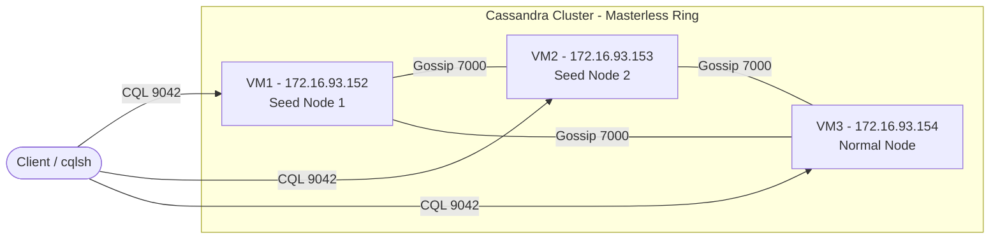
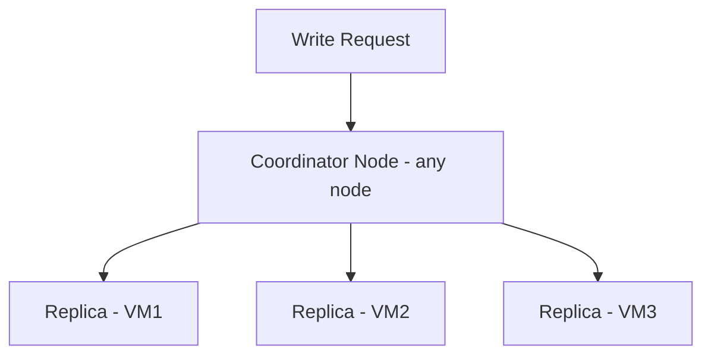
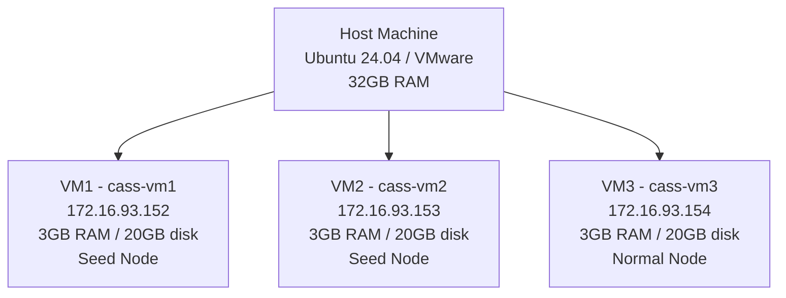

# Apache Cassandra 3-Node Cluster Setup Guide

A complete end-to-end guide for setting up a production-style Apache Cassandra cluster on Ubuntu 24.04 LTS using VMware virtual machines. Covers installation, configuration, authentication, replication, consistency level testing, and node failure simulation.

---

## Environment

| Component | Details |
|-----------|---------|
| OS | Ubuntu 24.04 LTS |
| Virtualization | VMware (local, host RAM 32GB) |
| Cassandra Version | 4.1.10 |
| Nodes | 3 VMs — 3GB RAM, 20GB disk, 2 vCPU each |

| Role | Hostname | IP Address |
|------|----------|------------|
| Seed Node 1 | cass-vm1 | 172.16.93.152 |
| Seed Node 2 | cass-vm2 | 172.16.93.153 |
| Normal Node | cass-vm3 | 172.16.93.154 |

---

## Architecture Overview

### Cluster Ring Topology



### Replication Flow



### Server Setup Overview



### How It Works

**Masterless Ring:** Unlike traditional databases with a primary/replica model, Cassandra has no master node. Every node is equal — any node can accept reads and writes from a client. The node that receives a client request becomes the **coordinator** for that operation and routes it to the appropriate replica nodes.

**Gossip Protocol:** Nodes communicate with each other continuously using a gossip protocol over port 7000. Each node periodically exchanges state information (alive/dead, load, schema version) with a few random peers. Within seconds, information propagates across the entire cluster — no central coordinator is needed to track node health.

**Seed Nodes:** When a new node starts up for the first time, it does not know anything about the cluster. It contacts one of the configured seed nodes to get the initial cluster topology — who is in the cluster, what tokens they own, and how data is distributed. Seed nodes are only special at bootstrap time; after a node has joined, seeds have no ongoing special role.

**Virtual Nodes (vnodes):** Each physical node is assigned `num_tokens` (256 in this setup) positions in the ring. This means data is distributed across many small token ranges per node rather than one large contiguous range. The benefit is automatic, even load balancing — adding or removing a node redistributes many small ranges rather than one large chunk.

**Replication Factor (RF=3):** Every row written to the cluster is stored on 3 nodes. The coordinator determines which nodes own the token range for a given partition key and writes to all of them. This means the cluster can lose any 1 node and still serve all data without interruption.

**Consistency Levels:** Because data exists on multiple nodes, Cassandra lets you choose per-query how many nodes must respond before the operation succeeds. `ONE` is fastest but may return stale data. `QUORUM` (majority) balances speed and consistency. `ALL` guarantees every node has the latest copy but fails if any node is down.

---

## Port Reference

| Port | Protocol | Purpose |
|------|----------|---------|
| 7000 | TCP | Inter-node gossip — nodes share cluster state, membership, and health info |
| 9042 | TCP | CQL native transport — client applications connect on this port |
| 22 | TCP | SSH — admin access to VMs |

---

## Step 1 — System Preparation

> Run everything in this section on **all three VMs**.

### 1.1 — Update System and Install Prerequisites

```bash
sudo apt update && sudo apt upgrade -y
sudo apt install -y curl wget gnupg2 software-properties-common apt-transport-https ca-certificates lsb-release
```

- `gnupg2` — used to verify the GPG signing key from Apache's repository
- `apt-transport-https` — allows `apt` to fetch packages over HTTPS
- `lsb-release` — detects the Ubuntu version for repository configuration

### 1.2 — Install Java 11

Cassandra is written in Java and requires a JRE to run. Cassandra 4.x is tested against Java 11.

```bash
sudo apt install -y openjdk-11-jdk-headless
```

`openjdk-11-jdk-headless` is a lightweight JDK without GUI libraries — appropriate for server environments.

Verify the installation:

```bash
java -version
```

Expected output: `openjdk version "11.x.x"`. If you see this, Java is correctly installed.

### 1.3 — Add the Apache Cassandra APT Repository

**Download the GPG signing key:**

```bash
sudo curl -o /etc/apt/keyrings/apache-cassandra.asc \
  https://downloads.apache.org/cassandra/KEYS
```

> **Important:** Use `sudo` before `curl` — without it, `curl` cannot write to `/etc/apt/keyrings/` and will fail with a permission error. The full command must run as root, not just the file write portion.

The GPG key allows `apt` to verify that downloaded packages genuinely come from Apache and have not been tampered with.

**Add the repository source:**

```bash
echo "deb [signed-by=/etc/apt/keyrings/apache-cassandra.asc] \
  https://debian.cassandra.apache.org 41x main" \
  | sudo tee /etc/apt/sources.list.d/cassandra.list
```

`41x` refers to the Cassandra 4.1.x branch — the current stable release. The `signed-by` parameter binds this repository to the specific GPG key downloaded above.

### 1.4 — Install Cassandra

```bash
sudo apt update
sudo apt install -y cassandra
```

> **Known Issue — Download Failure:** On slow or unstable connections (common when downloading from AWS S3 endpoints in regions far from `us-west-2`), the package download may fail mid-way with an `Input/output error`. If this happens, retry with:
>
> ```bash
> sudo apt install -y cassandra --fix-missing
> ```
>
> If it still fails, download the `.deb` file directly using `wget -c` (the `-c` flag resumes interrupted downloads) and install manually:
>
> ```bash
> wget -c https://apache.jfrog.io/artifactory/cassandra-deb/pool/main/c/cassandra/cassandra_4.1.10_all.deb
> sudo dpkg -i cassandra_4.1.10_all.deb
> sudo apt install -f -y
> ```

Verify the installation:

```bash
cassandra -v
```

Expected output: `4.1.10`

### 1.5 — Stop Cassandra and Clear Default Data

When Cassandra installs, it immediately starts in single-node mode and writes its own identity (cluster name, host ID) into the `system` keyspace. If this stale data is not removed before cluster configuration, it will conflict with the new cluster setup.

```bash
sudo systemctl stop cassandra
sudo rm -rf /var/lib/cassandra/data/system/*
```

### 1.6 — Configure /etc/hosts

Even though Cassandra configuration uses IP addresses, adding hostnames to `/etc/hosts` makes logs and `nodetool` output more readable and simplifies future IP changes.

Run on **all three VMs**:

```bash
sudo tee -a /etc/hosts <<EOF

# Cassandra Cluster Nodes
172.16.93.152   cass-vm1
172.16.93.153   cass-vm2
172.16.93.154   cass-vm3
EOF
```

### 1.7 — Configure Firewall (UFW)

> **Critical:** Always allow SSH **before** enabling UFW. If UFW is enabled without an SSH rule, you will be locked out on reconnect — your current session stays alive but new connections are blocked.

Run on **all three VMs**:

```bash
sudo ufw allow OpenSSH
sudo ufw allow 7000/tcp comment 'Cassandra inter-node gossip'
sudo ufw allow 9042/tcp comment 'Cassandra CQL native transport'
sudo ufw enable
sudo ufw status
```

> **Note on SSH rules:** `ufw allow OpenSSH` and `ufw allow 22/tcp` both allow SSH — one uses a pre-defined application profile, the other specifies the port directly. They are equivalent. If you run both by accident, remove the duplicate:
>
> ```bash
> sudo ufw delete allow 22/tcp
> ```
>
> Keep the `OpenSSH` rule — it is the UFW standard and more readable.

---

## Step 2 — Cassandra Configuration

The main configuration file is `/etc/cassandra/cassandra.yaml`. Each VM gets a slightly different version of this file — the `listen_address` and `rpc_address` change per node. All other values are identical.

Take a backup before editing:

```bash
sudo cp /etc/cassandra/cassandra.yaml /etc/cassandra/cassandra.yaml.bak
```

Open the file:

```bash
sudo nano /etc/cassandra/cassandra.yaml
```

Use `Ctrl+W` to search for each parameter by name and replace its value.

### 2.1 — Parameters and Explanation

| Parameter | Value | Explanation |
|-----------|-------|-------------|
| `cluster_name` | `CassandraLabCluster` | Must be **identical on all nodes** — this is how nodes recognize they belong to the same cluster |
| `num_tokens` | `256` | Number of virtual nodes (vnodes) each physical node claims in the ring. Higher values give better data distribution across nodes |
| `seeds` | `172.16.93.152,172.16.93.153` | IPs of seed nodes. New nodes contact seeds first when joining the cluster. VM3 is intentionally excluded — seed nodes must bootstrap themselves |
| `listen_address` | Each VM's own IP | The IP address used for inter-node (gossip) communication. Must be set to the node's own IP — **not** `127.0.0.1` |
| `rpc_address` | Each VM's own IP | The IP address that client applications use to connect via CQL |
| `endpoint_snitch` | `GossipingPropertyFileSnitch` | Tells Cassandra the network topology (datacenter and rack). This snitch shares topology info via gossip and is production-ready |
| `authenticator` | `PasswordAuthenticator` | Enables username/password authentication. Default is `AllowAllAuthenticator` which accepts all connections without credentials |
| `authorizer` | `CassandraAuthorizer` | Enables per-user permission control (GRANT/REVOKE on keyspaces and tables) |

> **Common Mistake — seeds value:** The default value contains `127.0.0.1:7000`. Replace the entire value — do not keep `127.0.0.1` alongside the real IPs. Cassandra would attempt to gossip with localhost and fail to form the cluster.

### 2.2 — VM1 Configuration (`172.16.93.152`)

```yaml
cluster_name: 'CassandraLabCluster'
num_tokens: 256
seed_provider:
  - class_name: org.apache.cassandra.locator.SimpleSeedProvider
    parameters:
      - seeds: "172.16.93.152,172.16.93.153"
listen_address: 172.16.93.152
rpc_address: 172.16.93.152
endpoint_snitch: GossipingPropertyFileSnitch
authenticator: PasswordAuthenticator
authorizer: CassandraAuthorizer
```

### 2.3 — VM2 Configuration (`172.16.93.153`)

```yaml
cluster_name: 'CassandraLabCluster'
num_tokens: 256
seed_provider:
  - class_name: org.apache.cassandra.locator.SimpleSeedProvider
    parameters:
      - seeds: "172.16.93.152,172.16.93.153"
listen_address: 172.16.93.153
rpc_address: 172.16.93.153
endpoint_snitch: GossipingPropertyFileSnitch
authenticator: PasswordAuthenticator
authorizer: CassandraAuthorizer
```

### 2.4 — VM3 Configuration (`172.16.93.154`)

```yaml
cluster_name: 'CassandraLabCluster'
num_tokens: 256
seed_provider:
  - class_name: org.apache.cassandra.locator.SimpleSeedProvider
    parameters:
      - seeds: "172.16.93.152,172.16.93.153"
listen_address: 172.16.93.154
rpc_address: 172.16.93.154
endpoint_snitch: GossipingPropertyFileSnitch
authenticator: PasswordAuthenticator
authorizer: CassandraAuthorizer
```

### 2.5 — Configure cassandra-rackdc.properties

When using `GossipingPropertyFileSnitch`, Cassandra also reads this file to learn which datacenter and rack each node belongs to. Run on **all three VMs**:

```bash
sudo nano /etc/cassandra/cassandra-rackdc.properties
```

```properties
dc=dc1
rack=rack1
```

All nodes are in the same datacenter (`dc1`) and the same rack (`rack1`) since this is a single-site lab environment. In production, nodes on separate physical racks would use different `rack` values so Cassandra can distribute replicas for hardware fault tolerance.

### 2.6 — Verify Configuration

Before starting the cluster, verify the config was saved correctly:

```bash
grep -E "listen_address|rpc_address|cluster_name|num_tokens|seeds|authenticator|authorizer" /etc/cassandra/cassandra.yaml
```

```bash
cat /etc/cassandra/cassandra-rackdc.properties
```

Confirm the values match what you entered. If anything looks wrong, re-edit the file before proceeding.

---

## Step 3 — Start the Cluster

Seed nodes must be started first. Starting all nodes simultaneously can cause bootstrap conflicts.

**On VM1 — start first:**

```bash
sudo systemctl start cassandra
```

Wait 1–2 minutes, then check the node status:

```bash
sudo nodetool status
```

Wait until VM1 shows `UN` (Up/Normal) before proceeding to VM2.

**On VM2:**

```bash
sudo systemctl start cassandra
```

Wait 1–2 minutes. Run `nodetool status` again — both VM1 and VM2 should show `UN`.

**On VM3:**

```bash
sudo systemctl start cassandra
```

Wait 1–2 minutes. VM3 may briefly show `UJ` (Up/Joining) while it bootstraps into the cluster — this is normal.

**Final verification from any VM:**

```bash
sudo nodetool status
```

Expected output:

```
Datacenter: dc1
===============
Status=Up/Down
|/ State=Normal/Leaving/Joining/Moving
--  Address        Load        Tokens  Owns (effective)  Host ID   Rack
UN  172.16.93.152  xxx KiB     256     100.0%            xxxxxxxx  rack1
UN  172.16.93.153  xxx KiB     256     100.0%            xxxxxxxx  rack1
UN  172.16.93.154  xxx KiB     256     100.0%            xxxxxxxx  rack1
```

All three nodes showing `UN` means the cluster is fully operational.

> **Note on Owns percentage:** With Replication Factor 3, every row is stored on all 3 nodes. So each node technically "owns" 100% of the data — this is expected and correct. The percentage becomes meaningful (roughly 33% each) after a keyspace with RF=3 is created and data is distributed.

> **Troubleshooting — nodes not joining:** If after restarting you see `127.0.0.1` as the address or `datacenter1` instead of `dc1`, the configuration was not applied. This usually means the service was not stopped and system data not cleared before reconfiguring. Stop all nodes, clear system data (`sudo rm -rf /var/lib/cassandra/data/system/*`), and start again from VM1.

---

## Step 4 — Enable Systemd Auto-start

So that Cassandra starts automatically after a VM reboot, enable the systemd service on **all three VMs**:

```bash
sudo systemctl enable cassandra
```

---

## Step 5 — Fix cqlsh on Ubuntu 24.04

Cassandra 4.1 ships with a bundled `cqlsh.py` that is incompatible with Python 3.12 (which Ubuntu 24.04 uses by default). Running `cqlsh` will fail with:

```
ModuleNotFoundError: No module named 'six.moves'
```

**Fix — install the standalone cqlsh package and replace the broken script:**

Run on **all VMs** where you want to use `cqlsh`:

```bash
sudo pip3 install cqlsh --break-system-packages
sudo mv /usr/bin/cqlsh.py /usr/bin/cqlsh.py.bak
sudo ln -sf /usr/local/bin/cqlsh /usr/bin/cqlsh
```

- `pip3 install cqlsh` installs a newer, Python 3.12-compatible version of cqlsh
- `mv ... .bak` renames the old broken script to a backup instead of deleting it
- `ln -sf` creates a symbolic link (shortcut) at `/usr/bin/cqlsh` pointing to the new installation. `-s` means symbolic, `-f` means force-overwrite if a file already exists there

Now `cqlsh` typed from anywhere will use the newly installed version.

---

## Step 6 — Password Authentication Setup

Connect using the default superuser credentials. Run from **any one VM** — changes replicate across the cluster:

```bash
cqlsh 172.16.93.152 -u cassandra -p cassandra
```

**Create a new superuser:**

```sql
CREATE ROLE admin WITH PASSWORD = 'Admin@1234' AND LOGIN = true AND SUPERUSER = true;
```

**Exit and reconnect as the new admin:**

```bash
EXIT;
cqlsh 172.16.93.152 -u admin -p Admin@1234
```

**Disable the default cassandra account:**

```sql
ALTER ROLE cassandra WITH PASSWORD = 'SomeRandomLongPassword!987' AND SUPERUSER = false AND LOGIN = false;
```

> **Why not delete the cassandra role?** The `cassandra` role is internally protected — attempting to `DROP ROLE cassandra` returns an error. Setting `SUPERUSER = false` and `LOGIN = false` effectively locks it out.

> **Why reconnect as admin first?** Cassandra prevents a superuser from altering their own superuser status. You must be logged in as a *different* superuser (admin) to demote the cassandra account.

---

## Step 7 — Create Keyspace, Table, and Test Data

While connected as `admin`:

```sql
-- Create a keyspace with Replication Factor 3 across datacenter dc1
CREATE KEYSPACE lab_keyspace
  WITH replication = {'class': 'NetworkTopologyStrategy', 'dc1': 3};

USE lab_keyspace;

-- Create a table
CREATE TABLE employees (
  id UUID PRIMARY KEY,
  name TEXT,
  department TEXT,
  salary INT
);

-- Insert test data
INSERT INTO employees (id, name, department, salary)
  VALUES (uuid(), 'Alice Rahman', 'Engineering', 90000);
INSERT INTO employees (id, name, department, salary)
  VALUES (uuid(), 'Bob Hossain', 'Marketing', 75000);
INSERT INTO employees (id, name, department, salary)
  VALUES (uuid(), 'Carol Ahmed', 'Engineering', 85000);

-- Read all data
SELECT * FROM employees;
```

**Why `NetworkTopologyStrategy` instead of `SimpleStrategy`:**
`SimpleStrategy` is only suitable for single-datacenter setups. `NetworkTopologyStrategy` is datacenter-aware and works correctly with `GossipingPropertyFileSnitch`. The `'dc1': 3` parameter means: place 3 replicas in datacenter `dc1`.

---

## Step 8 — Consistency Level Testing

Consistency level controls how many nodes must acknowledge a read or write before the operation is considered successful. This is set per-query inside a `cqlsh` session.

Connect from VM1:

```bash
cqlsh 172.16.93.152 -u admin -p Admin@1234
```

```sql
USE lab_keyspace;

-- ONE: any single node responding is enough
CONSISTENCY ONE;
SELECT * FROM employees;

-- QUORUM: majority of nodes must respond (floor(3/2)+1 = 2 nodes)
CONSISTENCY QUORUM;
SELECT * FROM employees;

-- ALL: every node must respond
CONSISTENCY ALL;
SELECT * FROM employees;
```

| Consistency Level | Nodes Required (3-node cluster) | Trade-off |
|---|---|---|
| ONE | 1 | Fastest. Risk of reading stale data if a recent write has not yet replicated |
| QUORUM | 2 | Balanced. Tolerates 1 node failure. Recommended for most production use cases |
| ALL | 3 | Strongest consistency. Fails if any node is unavailable |

---

## Step 9 — Node Failure Test

This test demonstrates Cassandra's fault tolerance — the cluster continues serving requests even when a node goes down.

**Stop VM3:**

```bash
# On VM3
sudo systemctl stop cassandra
```

**Check cluster status from VM1 or VM2:**

```bash
sudo nodetool status
```

VM3 will show `DN` (Down/Normal).

**Run consistency queries from VM1:**

```sql
-- cqlsh 172.16.93.152 -u admin -p Admin@1234
USE lab_keyspace;

-- Succeeds — only 1 node needed
CONSISTENCY ONE;
SELECT * FROM employees;

-- Succeeds — 2 nodes are available, quorum (2 of 3) is met
CONSISTENCY QUORUM;
SELECT * FROM employees;

-- Fails — all 3 nodes required but VM3 is down
CONSISTENCY ALL;
SELECT * FROM employees;
-- Error: Cannot achieve consistency level ALL
```

This confirms that with RF=3 and CONSISTENCY QUORUM, the cluster remains fully operational with one node down. Only ALL-level queries fail.

**Bring VM3 back:**

```bash
# On VM3
sudo systemctl start cassandra
```

VM3 will rejoin and show `UJ` briefly, then transition back to `UN`. Verify with `nodetool status`.

---

## Summary

| Step | What | Key Detail |
|------|------|------------|
| 1 — System Preparation | Install Java 11, Cassandra, configure firewall and `/etc/hosts` | Always allow SSH before enabling UFW. Stop Cassandra and clear `system/*` before configuring |
| 2 — cassandra.yaml | Set cluster name, seed IPs, listen/rpc addresses, snitch, auth | `listen_address` and `rpc_address` differ per node — all other values are identical across nodes |
| 3 — cassandra-rackdc.properties | Assign datacenter and rack | Required when using `GossipingPropertyFileSnitch`. All nodes: `dc=dc1`, `rack=rack1` |
| 4 — Start Cluster | Start VM1 → VM2 → VM3 with pauses in between | Seed nodes must start first. VM3 will briefly show `UJ` (Joining) — wait for all nodes to reach `UN` |
| 5 — Systemd Auto-start | `systemctl enable cassandra` on all VMs | Ensures Cassandra restarts automatically after VM reboot |
| 6 — Fix cqlsh | Install standalone `cqlsh` via pip, replace broken symlink | Cassandra 4.1's bundled `cqlsh.py` is incompatible with Python 3.12 on Ubuntu 24.04 |
| 7 — Authentication | Create `admin` superuser, lock default `cassandra` account | Must reconnect as `admin` before demoting `cassandra` — a superuser cannot alter its own status |
| 8 — Keyspace and Table | Create `lab_keyspace` with RF=3, insert test data | Use `NetworkTopologyStrategy` with `GossipingPropertyFileSnitch` — `SimpleStrategy` is not datacenter-aware |
| 9 — Consistency Testing | Test ONE, QUORUM, ALL consistency levels | QUORUM is the recommended default — tolerates 1 node failure while maintaining consistency |
| 10 — Node Failure Test | Stop VM3, verify ONE and QUORUM succeed, ALL fails | Confirms RF=3 + QUORUM provides fault tolerance against single-node failure |

---

## Troubleshooting

| Symptom | Likely Cause | Fix |
|---------|-------------|-----|
| `curl: Permission denied` when downloading GPG key | Running `curl` without `sudo` — the output path `/etc/apt/keyrings/` requires root | Use `sudo curl -o /etc/apt/...` — the entire command needs root, not just the file write |
| `apt install cassandra` fails with `Input/output error` | Network dropout mid-download from S3 endpoint | Retry with `--fix-missing`, or use `wget -c` to download the `.deb` directly and install with `dpkg` |
| `nodetool status` shows `127.0.0.1` and `datacenter1` after start | Cassandra started before config was applied, or service was not restarted after editing `cassandra.yaml` | Stop all nodes, delete `/var/lib/cassandra/data/system/*`, then start VM1 → VM2 → VM3 in order |
| VM3 stuck on `UJ` (Joining) for more than 5 minutes | Bootstrap taking long due to low resources, or seed nodes not fully up when VM3 started | Wait longer — 3GB RAM VMs can be slow to bootstrap. If still stuck, check `sudo journalctl -u cassandra -f` for errors |
| `cqlsh` fails with `No module named 'six.moves'` | Cassandra 4.1's bundled `cqlsh.py` is incompatible with Python 3.12 | Install standalone cqlsh via pip and replace the symlink — see Step 5 |
| `Unauthorized: You aren't allowed to alter your own superuser status` | Trying to demote `cassandra` while logged in as `cassandra` | Create `admin` first, exit, reconnect as `admin`, then alter the `cassandra` role |
| `CONSISTENCY ALL` fails with `Cannot achieve consistency level ALL` | One or more nodes are down | Expected behavior — ALL requires every node. Use QUORUM instead, or bring the down node back online |
| Node rejoins but shows stale/missing data | Node was down during writes; Cassandra uses hinted handoff to replay missed writes | Wait a few minutes after the node rejoins — Cassandra automatically repairs missed writes via hinted handoff |
