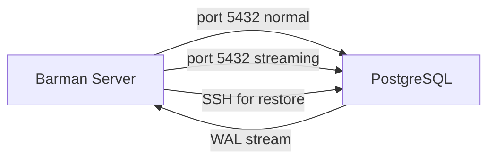

# PostgreSQL DBA — In-Depth Guide
### WAL · Checkpoint · Backup & Restore · PITR · Audit · Role Admin · RLS · Patroni · PgBouncer · pgpool-II

> **এই গাইডের philosophy:**
> প্রতিটা topic শুরু হয় একটা **problem** দিয়ে।
> তারপর দেখানো হয় সহজ solution-এ কী সমস্যা।
> তারপর PostgreSQL কেন এইভাবে design করেছে — **reasoning সহ।**
> Internal mechanics বোঝার পর commands মনে রাখা সহজ হয়।

---

## Learning Sequence

```
WAL internals
    ↓ (WAL ছাড়া backup বোঝা যাবে না)
Checkpoint
    ↓ (Checkpoint ছাড়া recovery বোঝা যাবে না)
Logical Backup (pg_dump, pg_dumpall)
    ↓
Physical Backup (pg_basebackup)
    ↓ (Physical backup ছাড়া PITR বোঝা যাবে না)
Backup types (Full, Incr, Diff)
    ↓
pgBackRest + Barman (enterprise tools)
    ↓
PITR — সব একসাথে
    ↓
Security (Audit, Roles, RLS)
    ↓
HA + Connection Management (Patroni, PgBouncer, pgpool-II)
```

---

# Section 1: WAL — Write-Ahead Log

---

## শুরুটা একটা প্রশ্ন দিয়ে

তুমি একটা ব্যাংকের database চালাচ্ছো। কেউ টাকা transfer করলো:

```sql
UPDATE accounts SET balance = balance - 5000 WHERE id = 1;  -- sender
UPDATE accounts SET balance = balance + 5000 WHERE id = 2;  -- receiver
COMMIT;
```

এই দুটো UPDATE disk-এ লেখার ঠিক মাঝখানে যদি server crash করে?

- প্রথম UPDATE গেছে (sender-এর টাকা কাটা হয়েছে)
- দ্বিতীয় UPDATE যায়নি (receiver পায়নি)

৫,০০০ টাকা বাতাসে মিলিয়ে গেলো।

**এটাই হলো সেই fundamental problem যেটা solve করার জন্য WAL তৈরি হয়েছে।**

---

## Naive Solution — এবং কেন সেটা কাজ করে না

সহজ সমাধান মাথায় আসে: প্রতিটা COMMIT-এ সব data সাথে সাথে disk-এ লিখে দাও। Crash হলে disk-এ যা আছে সেটাই সত্য।

এটা কাজ করতো — কিন্তু অসম্ভব slow হতো।

**কেন slow?**

Database data রাখে "pages" (8KB blocks) এ। একটা table-এর data হাজারো page জুড়ে ছড়িয়ে থাকে। তুমি যখন একটা row update করো:

```
Row টা আছে page #4821 এ (disk-এ somewhere)
তুমি update করলে শুধু ওই page-টা change হয়
সেই একটা page টা disk-এ লিখতে হবে
```

এটা "random write" — disk-এর যেকোনো জায়গায় লেখা। HDD-তে এটা অনেক slow কারণ physical read head move করতে হয়। SSD-তেও random write বেশি expensive।

এখন ধরো তোমার transaction-এ ১০০টা row update হলো, ৫০টা আলাদা page-এ। মানে ৫০টা random write। প্রতিটা transaction-এ এটা করলে database অনেক slow হয়ে যাবে।

**এই problem-এর নাম: "Force-at-Commit" problem।**

---

## WAL-এর Core Insight

WAL-এর designers একটা চালাক observation করলেন:

> "Data page disk-এ লেখার দরকার নেই। শুধু **কী change হলো** সেটা লিখলেই হয়।"

"কী change হলো" এই description টা data page-এর চেয়ে অনেক ছোট। আর এটা লেখা হয় একটা append-only log file-এ — মানে সবসময় file-এর শেষে লেখা হয়। এটা sequential write — disk-এর জন্য সবচেয়ে efficient operation।

```
Data page write (random):  [4821] .... [1204] .... [9043] ....  ← disk-এর random জায়গায়
WAL write (sequential):    [record1][record2][record3][record4]  ← সবসময় শেষে append
```

**WAL লেখার পর crash হলে:**
- WAL-এ আছে "page #4821 এ row X-এর balance 5000 থেকে 0 হয়েছিল"
- Recovery-তে এই instruction follow করে page ঠিক করো
- সব ঠিক হয়ে যাবে

**এই approach-এর নাম: Write-Ahead Logging।**
"Write-Ahead" মানে data change-এর **আগে** log লেখো।

---

## WAL-এর দুটো Fundamental Rule

PostgreSQL-এর WAL implementation দুটো rule সবসময় মানে:

**Rule 1 (Redo Rule):** Data page disk-এ যাওয়ার আগে সেই page-এর WAL record অবশ্যই disk-এ যেতে হবে।

**Rule 2 (Commit Rule):** Transaction commit ঘোষণা করার আগে সেই transaction-এর সব WAL record অবশ্যই disk-এ যেতে হবে।

এই দুটো rule মানলে guarantee হয়:
- যেকোনো সময় crash হলে WAL থেকে recover করা যাবে
- Committed transaction কখনো হারাবে না

---

## ভেতরে কী হচ্ছে — Mechanics

### Shared Buffers

PostgreSQL disk থেকে data সরাসরি read/write করে না। একটা shared memory pool আছে — **Shared Buffers** — এটা database-এর RAM cache।

```
postgresql.conf:
shared_buffers = 256MB   (default, production-এ RAM এর 25% দাও)
```

কোনো page দরকার হলে:
1. Shared buffer-এ আছে? → সেখান থেকে নাও (fast)
2. নেই? → Disk থেকে load করো Shared buffer-এ, তারপর নাও

Page modify হলে সেটা "dirty" হয়। Dirty page মানে memory-তে change হয়েছে কিন্তু disk-এ এখনো পুরনো version।

### WAL Buffer

WAL record প্রথমে disk-এ যায় না — আরেকটা memory area-তে যায়: **WAL Buffer**।

```
postgresql.conf:
wal_buffers = 16MB   (default -1 মানে auto = shared_buffers-এর 1/32)
```

### একটা Transaction-এর সম্পূর্ণ জীবন

```
BEGIN;
UPDATE accounts SET balance = 0 WHERE id = 1;
UPDATE accounts SET balance = 10000 WHERE id = 2;
COMMIT;
```

**ধাপ ১: Page load**
```
backend process → shared buffer check → miss → disk read
page #4821 loaded into shared buffer
```

**ধাপ ২: WAL record তৈরি**
```
WAL record structure:
┌─────────────────────────────────────────────────────┐
│ Header:                                              │
│   xl_tot_len: record-এর মোট size                   │
│   xl_xid: transaction ID (e.g. 12345)               │
│   xl_prev: আগের WAL record-এর LSN                  │
│   xl_info: record type                              │
│   xl_rmid: Resource Manager ID (heap? btree? xact?) │
│ Body:                                                │
│   before-image বা after-image of changed data        │
│   (depends on WAL level)                            │
│ CRC: checksum (corruption detect করতে)              │
└─────────────────────────────────────────────────────┘
```

এই record WAL buffer-এ যায়।

**ধাপ ৩: Shared buffer modify**
```
page #4821 এর row update হয় memory-তে
page টা "dirty" mark হয়
```

**ধাপ ৪: COMMIT**
```
একটা special COMMIT WAL record তৈরি হয়
WAL buffer → WAL file-এ fsync() — এখানেই disk guarantee হয়
```

**fsync() কী?** এটা OS-কে বলে "তুমি যা cache করে রেখেছো সেটা physical disk-এ লেখো এবং confirm করো।" এটা ছাড়া OS নিজের cache-এ রাখতে পারে — crash হলে হারাবে।

**ধাপ ৫: Client-কে "COMMIT OK" বলা**
এই মুহূর্তে dirty page এখনো disk-এ নেই! শুধু WAL গেছে।

**ধাপ ৬: Checkpoint-এ dirty pages disk-এ**
(পরে দেখবো)

```
Timeline:
─────────────────────────────────────────────────────────
t=0  BEGIN
t=1  WAL record in WAL buffer (RAM)
t=2  Shared buffer modified (RAM)
t=3  COMMIT → WAL fsync to disk ← এখানে durability guarantee
t=4  Client gets "OK"
t=5  (later) bgwriter flushes dirty page to disk
─────────────────────────────────────────────────────────
     ^                          ^
     crash এখানে হলে:          crash এখানে হলে:
     transaction হারাবে         WAL থেকে recover হবে
     (ok, not committed)        (committed ছিল, recover করো)
```

---

## WAL Record-এর Resource Managers

WAL-এ সব ধরনের change লেখা হয় — শুধু data change না। প্রতিটা ধরনের change একটা "Resource Manager" handle করে:

| Resource Manager | কী লেখে |
|---|---|
| `Heap` | Table row insert/update/delete |
| `Btree` | B-tree index changes |
| `Hash` | Hash index changes |
| `Gin`, `Gist`, `Spgist`, `Brin` | Other index types |
| `Transaction` | COMMIT, ABORT, checkpoint |
| `XLOG` | Backup labels, timeline switches |
| `Sequence` | Sequence value changes |
| `Heap2` | VACUUM, HOT updates |

```bash
# WAL content দেখো
pg_waldump $PGDATA/pg_wal/000000010000000000000001

# আউটপুট example:
rmgr: Heap        len: 59, lsn: 0/01000028, prev: 0/00000000, desc: INSERT off 1
rmgr: Transaction len: 46, lsn: 0/01000063, prev: 0/01000028, desc: COMMIT 2024-01-15...
rmgr: Btree       len: 64, lsn: 0/01000091, prev: 0/01000063, desc: INSERT_LEAF...
```

---

## LSN — Log Sequence Number

WAL-এর প্রতিটা byte-এর একটা unique "address" আছে। এটাই **LSN (Log Sequence Number)**।

Format: `segment/offset` (hexadecimal)
```
0/3A1F2B8
↑ ↑
│ └── segment এর মধ্যে byte offset
└──── segment number (WAL file)
```

LSN কেন important?

1. **Crash recovery:** "এই LSN পর্যন্ত data page disk-এ আছে" — checkpoint record এটা বলে। Recovery শুধু এই LSN থেকে শুরু করে।

2. **Replication:** Replica বলে "আমার কাছে 0/5000000 পর্যন্ত আছে, এরপরেরটা দাও।"

3. **PITR:** "2024-01-15 14:59 এ LSN ছিল 0/7A40000 — এখানে stop করো।"

```sql
-- Current WAL position
SELECT pg_current_wal_lsn();
-- 0/3A1F2B8

-- কত bytes WAL তৈরি হয়েছে
SELECT pg_wal_lsn_diff(pg_current_wal_lsn(), '0/0');
-- 61014968

-- Replication lag bytes-এ
SELECT pg_wal_lsn_diff(sent_lsn, replay_lsn) AS lag_bytes
FROM pg_stat_replication;
```

---

## WAL File Structure

```
$PGDATA/pg_wal/
├── 000000010000000000000001    ← 16MB
├── 000000010000000000000002    ← 16MB
├── 000000010000000000000003    ← 16MB
└── archive_status/
    ├── 000000010000000000000001.done    ← archived
    └── 000000010000000000000002.ready   ← ready to archive
```

**Filename format:**
```
00000001  00000000  00000001
────────  ────────  ────────
Timeline  High 32   Low 32
(8 hex)   bits of   bits of
          segment   segment
```

Timeline কী? পরে PITR section-এ বিস্তারিত দেখবো।

**WAL file-এর ভেতর:**
```
┌──────────────────────────────────────────────┐
│ Page 1 (8KB)                                 │
│  ┌─────────────────────────────────────────┐ │
│  │ Page Header (magic, LSN, checksum, ...) │ │
│  │ WAL Record 1                            │ │
│  │ WAL Record 2                            │ │
│  │ WAL Record 3                            │ │
│  │ ...                                     │ │
│  └─────────────────────────────────────────┘ │
│ Page 2 (8KB)                                 │
│ ...                                          │
│ Total: 2048 pages × 8KB = 16MB              │
└──────────────────────────────────────────────┘
```

---

## wal_level — কতটুকু Information লেখা হবে?

```
postgresql.conf:
wal_level = minimal | replica | logical
```

এটা control করে WAL record-এ কতটুকু information থাকবে:

**`minimal`:**
- শুধু crash recovery-র জন্য যতটুকু দরকার
- Replication বা PITR সম্ভব না
- কম disk I/O
- Production-এ কখনো ব্যবহার করো না

**`replica`** (production standard):
- Physical replication-এর জন্য যথেষ্ট
- PITR সম্ভব
- Hot standby possible

**`logical`:**
- Logical replication-এর জন্য (row-level change tracking)
- সবচেয়ে বেশি WAL তৈরি হয়
- Logical decoding possible

```
বেশিরভাগ production setup: wal_level = replica
```

---

## synchronous_commit — Durability vs Performance Trade-off

এটা একটা অনেক important setting যেটা অনেকে ignore করে:

```
postgresql.conf:
synchronous_commit = on | remote_apply | remote_write | local | off
```

**`on` (default):** COMMIT return করার আগে WAL disk-এ fsync হওয়া wait করে। Maximum durability।

**`off`:** WAL disk-এ না গিয়েই COMMIT return করে। কিছুক্ষণ পরে (wal_writer_delay = 200ms) WAL লেখা হয়।

```
on:  COMMIT → fsync WAL → "OK"    ← safe, কিন্তু fsync time লাগে
off: COMMIT → "OK" → (200ms later) WAL write  ← fast, কিন্তু...
```

**`off` হলে কী ঝুঁকি?**
Crash হলে শেষ ২০০ms-এর committed transactions হারাতে পারে। কিন্তু database corrupt হবে না — শুধু কিছু committed transactions হারাবে।

**কখন `off` ব্যবহার করবে?**
- Analytics workload যেখানে কিছু data loss acceptable
- বা temporary/staging database

**Replication-এ:**
```
synchronous_commit = remote_apply  ← replica-তে apply হওয়া পর্যন্ত wait
synchronous_commit = remote_write  ← replica disk-এ write হওয়া পর্যন্ত
synchronous_commit = local         ← local WAL disk-এ গেলেই ok (replica-র জন্য wait না)
```

---

## WAL Recycling — Disk ভরে যাওয়া আটকানো

WAL file তৈরি হতেই থাকে। কিন্তু সব রাখলে disk ভরে যাবে। কোনটা রাখবো, কোনটা মুছবো?

**Rule:** Checkpoint থেকে আগের WAL আর দরকার নেই (সেগুলো data page-এ apply হয়ে গেছে)।

কিন্তু delete করার বদলে PostgreSQL **recycle** করে — file rename করে নতুন WAL file হিসেবে ব্যবহার করে। File create করার overhead বাঁচে।

```
max_wal_size = 1GB  (default)
min_wal_size = 80MB (default)
```

এই range-এর মধ্যে WAL রাখার চেষ্টা করে। বেশি হলে old files delete করে।

**WAL archiving চালু থাকলে:** Archived না হওয়া WAL delete করা হয় না। তাই archive command slow বা fail হলে pg_wal ভরে যেতে পারে — PostgreSQL pause করে দেয়!

```bash
# pg_wal এর size monitor করো
du -sh $PGDATA/pg_wal/

# Archive status
SELECT * FROM pg_stat_archiver;
```

---

## Crash Recovery — WAL কীভাবে ব্যবহার হয়

Server crash করলে PostgreSQL restart-এ কী করে:

```
১. pg_control file পড়ো
   → এটা বলে শেষ checkpoint কোথায় ছিল (কোন LSN)

২. সেই checkpoint থেকে WAL file পড়া শুরু করো

৩. প্রতিটা WAL record:
   - "এই page-এ এই change হয়েছিল"
   - Check করো: data page-এ কি এই change আছে?
   - নেই? → Apply করো (REDO)

৪. সব WAL শেষ হলে → database ready

এই process-এর নাম: REDO recovery
```

**Undo নেই PostgreSQL-এ?**

MySQL InnoDB-তে UNDO log আছে। PostgreSQL-এ নেই কারণ MVCC (Multi-Version Concurrency Control) ব্যবহার করে — পুরনো version আলাদা row হিসেবে থাকে, in-place update হয় না (HOT update ছাড়া)। Uncommitted transaction-এর data অন্যরা দেখতে পায় না visibility rules-এর কারণে।

---

## সারসংক্ষেপ — WAL কেন এইভাবে?

```
Problem:   Data page directly লিখলে slow (random I/O) এবং crash-unsafe
Solution:  আগে WAL লেখো (sequential I/O) → তারপর data page (later, bulk)

Trade-off: Disk-এ data এবং WAL দুটোই লিখতে হয়
           কিন্তু WAL sequential হওয়ায় net gain বেশি

Guarantee: WAL disk-এ গেলে = committed (crash হলেও recover হবে)
           WAL disk-এ না গেলে = not committed (crash হলে হারাবে, কিন্তু সেটাই correct)

Side effects যা পরে কাজে লাগে:
  - WAL = complete change history → Replication সম্ভব
  - WAL = timestamped changes → PITR সম্ভব  
  - WAL = ordered operations → Logical decoding সম্ভব
```
# Section 2: Checkpoint

---

## আবার একটা Problem থেকে শুরু

WAL দিয়ে durability solve হলো। কিন্তু দুটো নতুন সমস্যা তৈরি হলো:

**সমস্যা ১: WAL ফাইল জমতে থাকে**
প্রতিটা change WAL-এ যায়। কোনটা delete করবো? সব রাখলে disk ভরবে।

**সমস্যা ২: Crash recovery অনেক slow**
Crash হলে শুরু থেকে সব WAL replay করতে হবে। ১ মাস-এর WAL replay করতে ঘণ্টার পর ঘণ্টা লাগবে।

**এই দুটো সমস্যার সমাধান: Checkpoint।**

---

## Checkpoint কী — Core Idea

Checkpoint মানে: "এই মুহূর্তে সব dirty page disk-এ লিখে দাও, এবং সেটা WAL-এ note করো।"

Checkpoint হওয়ার পর বলা যায়: "এই Checkpoint-এর আগের WAL আর দরকার নেই, কারণ সব change data page-এ আছে।"

```
WAL timeline:
──────────────────────────────────────────────────
[old WAL] ← checkpoint_lsn → [new WAL continuing]
                ↑
        এই point-এর আগের সব dirty page এখন disk-এ
        মানে এই আগের WAL আর recovery-তে দরকার নেই
        → delete বা recycle করা যায়
──────────────────────────────────────────────────
```

---

## Checkpoint-এর সময় ঠিক কী হয়?

```
Checkpoint শুরু হলো:

১. checkpoint_lsn নোট করো (এই মুহূর্তের WAL position)

২. Shared buffer-এর সব dirty page খুঁজে বের করো
   (Dirty = memory-তে change হয়েছে, disk-এ পুরনো version)

৩. এই dirty pages গুলো disk-এ লেখো
   - একসাথে না, ধীরে ধীরে (performance spike এড়াতে)
   - checkpoint_completion_target = 0.9
     মানে: checkpoint_timeout এর ৯০% সময়ের মধ্যে শেষ করো

৪. WAL-এ একটা "checkpoint record" লেখো:
   "checkpoint_lsn পর্যন্ত সব page disk-এ আছে"

৫. pg_control file update করো (শেষ successful checkpoint কোথায়)
```

---

## pg_control — PostgreSQL-এর "State File"

`$PGDATA/global/pg_control` — এই ছোট্ট ফাইলটা অনেক important। এখানে থাকে:

```
- Last checkpoint location (LSN)
- Prior checkpoint location (LSN)
- Database system identifier (cluster-এর unique ID)
- Database state: starting, running, shut down, in crash recovery...
- WAL block size, segment size
- Data page checksum version
```

Crash হলে PostgreSQL প্রথমে এই ফাইল পড়ে জানে কোথা থেকে WAL replay শুরু করতে হবে।

```sql
-- pg_control এর তথ্য
SELECT * FROM pg_control_checkpoint();

-- Output:
-- checkpoint_lsn     | 0/5000028
-- redo_lsn           | 0/5000028
-- redo_wal_file      | 000000010000000000000005
-- timeline_id        | 1
-- full_page_writes   | t
-- checkpoint_endtime | 2024-01-15 02:00:15+00
```

```bash
# Raw info দেখো
pg_controldata $PGDATA
```

---

## Checkpoint এবং full_page_writes

এটা একটা subtlety যেটা অনেকে জানে না।

**Problem:** Disk write অনেক সময় "torn write" করে। মানে একটা 8KB page লেখার সময় মাঝখানে crash হলে page-এর অর্ধেক নতুন, অর্ধেক পুরনো — corrupt।

**WAL দিয়ে এটা fix করা যায় না** কারণ WAL record বলে "এই bytes change হয়েছে" — কিন্তু base page-ই যদি torn হয় তাহলে apply করলেও corrupt থাকবে।

**Solution: full_page_writes = on (default)**

Checkpoint-এর পরে প্রথমবার একটা page modify হলে WAL-এ সম্পূর্ণ page-এর image রাখা হয় (full page image)।

```
Checkpoint হলো।
তারপর page #4821 modify হলো।
WAL-এ লেখা হলো: "page #4821 এর full content + এই change"

Crash হলে:
- এই full page image দিয়ে page restore করো (torn page problem নেই)
- তারপর subsequent changes apply করো
```

**Cost:** WAL অনেক বড় হয় checkpoint-এর পর। প্রতিটা modified page-এর ৮KB full image যায়। এটাই WAL spike দেখার কারণ checkpoint-এর পরে।

---

## Checkpoint কখন হয়?

তিনটা trigger:

**১. Time-based (checkpoint_timeout):**
```
postgresql.conf:
checkpoint_timeout = 5min   (default)
```
৫ মিনিট পর পর checkpoint হয়। Database খুব বেশি write না করলে এটাই trigger করে।

**২. WAL size-based (max_wal_size):**
```
max_wal_size = 1GB   (default)
```
WAL folder ১GB হলে checkpoint force হয়। Heavy write workload-এ এটাই trigger করে।

এই দুটো মিলিয়ে recovery time estimate করা যায়:
```
Worst case recovery time ≈ checkpoint_timeout + (max_wal_size / write rate)
```

**৩. Manual:**
```sql
CHECKPOINT;
```
pg_dump, pg_basebackup শুরু হওয়ার আগে।

---

## Background Writer (bgwriter) — Checkpoint-এর Helper

Checkpoint-এ একসাথে হাজারো dirty page লিখতে হলে massive I/O spike হবে। এটা দেরিতে চলে, performance impact করে।

**bgwriter** হলো একটা background process যে সবসময় ধীরে ধীরে dirty pages লিখতে থাকে — checkpoint-এর "কাজ হালকা করে দেয়।"

```
postgresql.conf:

bgwriter_delay = 200ms          # কতক্ষণ পর পর চলবে
bgwriter_lru_maxpages = 100     # প্রতিবার max কতটা page লিখবে
bgwriter_lru_multiplier = 2.0   # কতটা "extra" cache রাখবে
```

**Mental model:**
```
bgwriter:   [page][page][page]...  ← ধীরে ধীরে, সবসময়
checkpoint: ──────────────[FLUSH ALL REMAINING]  ← বাকিটা একবারে
```

bgwriter ভালোভাবে কাজ করলে checkpoint-এ করার কিছু থাকে না।

```sql
-- bgwriter statistics
SELECT
  checkpoints_timed,          -- সময়-ভিত্তিক checkpoint count
  checkpoints_req,             -- forced checkpoint count (max_wal_size hit)
  buffers_checkpoint,          -- checkpoint-এ কতটা buffer লেখা হয়েছে
  buffers_clean,               -- bgwriter কতটা লিখেছে
  buffers_backend              -- backend process নিজে কতটা লিখেছে (bad!)
FROM pg_stat_bgwriter;
```

`buffers_backend` বেশি হলে মানে bgwriter যথেষ্ট দ্রুত কাজ করছে না — `bgwriter_lru_maxpages` বাড়াও।

---

## Checkpoint এবং Performance

```
checkpoints_req >> checkpoints_timed হলে:
  → max_wal_size বাড়াও, বা checkpoint_timeout বাড়াও
  → মানে writes এত বেশি যে WAL সীমা ছুঁয়ে ফেলছে

checkpoint I/O spike দেখলে:
  → checkpoint_completion_target = 0.9 (default) আছে কিনা দেখো
  → bgwriter settings tune করো
```

---

## REDO vs UNDO — PostgreSQL-এর Philosophy

অনেক database-এ (MySQL InnoDB) দুটো log আছে:
- **REDO log:** Crash হলে committed change পুনরায় apply
- **UNDO log:** Uncommitted change rollback করো

**PostgreSQL শুধু REDO করে। UNDO নেই।**

কেন? MVCC-র কারণে।

PostgreSQL UPDATE করলে পুরনো row delete করে না — নতুন version তৈরি করে। Uncommitted transaction-এর row অন্যরা দেখতে পায় না (visibility rules)। Transaction rollback হলে নতুন version "invisible" হয়ে যায় — পরে VACUUM সেটা clean করে।

```
id=1 এর balance:
Old version: balance=1000, xmin=100, xmax=200  ← transaction 200 এর UPDATE
New version: balance=5000, xmin=200, xmax=null ← transaction 200 এর নতুন row

Transaction 200 commit না হলে:
  New version → invisible to others (xmin=200, transaction 200 not committed)

Transaction 200 rollback হলে:
  New version → marked as aborted → invisible
  Old version → still visible (xmax=200, but 200 aborted)
```

এই approach-এ crash হলে:
- Committed changes → WAL থেকে REDO করো
- Uncommitted changes → visibility rules-এ এমনিই দেখা যায় না, UNDO দরকার নেই

এটাই PostgreSQL-এর elegance।

---

## সারসংক্ষেপ

```
WAL problem:    অনেক WAL জমে, crash recovery slow
Checkpoint:     Periodically dirty pages flush → WAL-এর পুরনো অংশ delete possible

Checkpoint এর side effects:
  full_page_writes → WAL বড় হয় (torn write protection)
  I/O spike → checkpoint_completion_target দিয়ে ছড়িয়ে দাও
  bgwriter → ধীরে ধীরে কাজ করে I/O spike কমায়

Recovery time control:
  checkpoint_timeout কম → recovery fast, কিন্তু বেশি checkpoint overhead
  checkpoint_timeout বেশি → recovery slow, কিন্তু কম overhead
  max_wal_size বেশি → checkpoint কম হয়, কিন্তু disk বেশি লাগে
```
# Section 3: pg_dump — Logical Backup

---

## "Logical" মানে কী?

Backup দুভাবে নেওয়া যায়:

**Physical:** File system-এর exact copy — `$PGDATA` directory-র সব file।
**Logical:** Database-এর data-কে "meaning" হিসেবে export — SQL statements।

`pg_dump` logical backup করে। আউটপুটে পাবে:

```sql
CREATE TABLE orders (
    id integer NOT NULL,
    customer_id integer,
    amount numeric
);

INSERT INTO orders VALUES (1, 42, 5000.00);
INSERT INTO orders VALUES (2, 43, 1200.00);
```

এটা PostgreSQL-এর internal storage format না, standard SQL। যেকোনো PostgreSQL version-এ, এমনকি অন্য database-এও (কিছু modification করে) চলবে।

---

## pg_dump চলার সময় Database কি Lock হয়?

না। এটা pg_dump-এর সবচেয়ে গুরুত্বপূর্ণ property।

কিন্তু কেন না? Backup চলার সময় data change হলে backup inconsistent হবে না?

এখানে MVCC-র জাদু।

---

## MVCC এবং Consistent Snapshot

PostgreSQL-এর MVCC (Multi-Version Concurrency Control) বোঝা দরকার।

যখন তুমি একটা transaction শুরু করো, তুমি পাও একটা **snapshot** — ঐ মুহূর্তে কোন transactions committed আছে তার list। তুমি শুধু সেই committed transactions-এর data দেখবে।

```
Transaction A (pg_dump): snapshot নিলো → "আমি XID 1000 পর্যন্ত committed data দেখবো"

Transaction B: এখন চলছে, INSERT করলো, COMMIT করলো → XID 1001

Transaction A (pg_dump): এই নতুন row দেখবে না
  কারণ snapshot নেওয়ার সময় XID 1001 ছিল না
```

`pg_dump` শুরুতে একটা transaction খোলে এবং snapshot নেয়। পুরো dump চলার সময় এই একটাই snapshot ব্যবহার করে। ফলে dump-এর শুরু থেকে শেষ পর্যন্ত database-এর একটাই consistent view পায় — অন্য transactions যাই করুক।

এটাই "serializable snapshot isolation" — এবং এজন্য কোনো lock দরকার নেই।

**কিন্তু একটা lock আছে:** Schema-level lock। Dump চলার সময় table DROP করা বা ALTER করা যাবে না। Data lock নেই।

---

## Output Formats — কেন এতগুলো?

চারটা format আছে। প্রতিটা আলাদা problem solve করে।

### Plain SQL (-F p)

```bash
pg_dump -U postgres -F p mydb > mydb.sql
```

**Output:** একটা বড় .sql file।

```sql
-- mydb.sql
SET statement_timeout = 0;
CREATE TABLE public.orders (...);
COPY public.orders (id, customer_id, amount) FROM stdin;
1	42	5000.00
2	43	1200.00
\.
ALTER TABLE ONLY public.orders ADD CONSTRAINT orders_pkey PRIMARY KEY (id);
```

**কেন COPY, INSERT না?**
`COPY` অনেক faster। একটা `INSERT` per row চালানো মানে প্রতিটার জন্য parse, plan, execute overhead। `COPY` bulk load করে — ১০x+ faster।

**Restore:**
```bash
psql -U postgres -d targetdb -f mydb.sql
```

**সমস্যা:**
- একটা table এর data restore করা যায় না (সব নিতে হবে)
- বড় database এ file size অনেক বড় হয়
- Parallel restore হয় না

### Custom Format (-F c)

```bash
pg_dump -U postgres -F c mydb > mydb.dump
```

**কীভাবে আলাদা:**
- Binary compressed format (zlib by default)
- Metadata + data আলাদাভাবে organized
- Table of contents আছে — কোথায় কোন table-এর data

**এই internal structure-এর কারণে:**

```bash
# Content দেখো restore না করেই
pg_restore --list mydb.dump
# 197; 1259 16385 TABLE public orders postgres
# 198; 1259 16390 TABLE public customers postgres
# 200; 0 0 TABLE DATA public orders postgres

# শুধু orders table restore করো
pg_restore -d targetdb -t orders mydb.dump

# Parallel restore — 4 worker একসাথে
pg_restore -d targetdb -j 4 mydb.dump
```

Parallel restore কাজ করে কারণ প্রতিটা table independent — একসাথে load করা যায়।

**এই format সবচেয়ে বেশি ব্যবহার করবে production-এ।**

### Directory Format (-F d)

```bash
pg_dump -U postgres -F d -j 4 mydb -f mydb_dir/
```

**Output:**
```
mydb_dir/
├── toc.dat           ← table of contents
├── 3456.dat.gz       ← orders table
├── 3457.dat.gz       ← customers table
└── 3458.dat.gz       ← products table
```

**কেন custom format-এর চেয়ে আলাদা?**

Custom format-এ সব একটা file-এ। Parallel **dump** করতে হলে সেই একটা file-এ একসাথে লেখা সম্ভব না (race condition)।

Directory format-এ প্রতিটা table আলাদা file → parallel dump possible।

```
-j 4 dump:
  Worker 1: orders table    → 3456.dat.gz
  Worker 2: customers table → 3457.dat.gz
  Worker 3: products table  → 3458.dat.gz
  Worker 4: next table...
  সবাই একসাথে চলছে
```

**কখন দরকার:** ১০০GB+ database এবং dump time কমাতে চাও।

### Tar Format (-F t)

Custom format-এর মতো কিন্তু .tar archive-এ। Seeking support নেই, তাই selective restore কম efficient। Specific use case ছাড়া এড়াও।

---

## Command Anatomy — প্রতিটা অংশ

```bash
pg_dump  -h localhost  -p 5432  -U postgres  -F c  -Z 9  -f mydb.dump  mydb
   1           2           3         4          5     6        7          8
```

1. **`pg_dump`** — tool নাম
2. **`-h localhost`** — কোন host-এ PostgreSQL চলছে। Local হলে socket ব্যবহার করে (faster, no TCP overhead)
3. **`-p 5432`** — port। Default 5432, না দিলে এটাই ধরে
4. **`-U postgres`** — কোন user দিয়ে connect। এই user-এর read access দরকার সব tables-এ
5. **`-F c`** — custom format
6. **`-Z 9`** — compression level 9 (max)। 0=none, 1=fast, 9=best। Custom format-এ কাজ করে। সাধারণত 6 ভালো balance
7. **`-f mydb.dump`** — output file। এটা বা `>` redirect — দুটোই চলে (directory format-এ শুধু `-f`)
8. **`mydb`** — database নাম। এটা শেষে আসে (positional argument)

**`>` redirect vs `-f` flag:**
```bash
pg_dump -F c mydb > mydb.dump      # stdout redirect
pg_dump -F c -f mydb.dump mydb     # -f flag
```
দুটো same result। Directory format-এ শুধু `-f` চলে কারণ folder create করতে হয়।

---

## গুরুত্বপূর্ণ Options এবং তাদের কারণ

### `--schema-only` এবং `--data-only` কেন আলাদা?

```bash
# শুধু structure
pg_dump -F c --schema-only mydb > schema.dump

# শুধু data
pg_dump -F c --data-only mydb > data.dump
```

**Use case: Schema migration testing**
```
নতুন schema deploy করবে?
১. schema.dump দিয়ে নতুন schema তৈরি করো
২. test data load করো
৩. Migration script চালাও
৪. দেখো ঠিক হয়েছে কিনা
```

**Use case: Data sync**
```
Production থেকে staging-এ নতুন data নিতে চাও কিন্তু schema already আছে?
→ --data-only
```

### `--exclude-table` কেন দরকার?

```bash
pg_dump -F c \
  --exclude-table='logs_*' \
  --exclude-table=session_data \
  mydb > mydb_clean.dump
```

Production database-এ অনেক সময় এরকম tables থাকে:
- `access_logs` — request logging, টেরাবাইট হতে পারে
- `job_queue` — processed jobs, restore করার দরকার নেই
- `temp_*` — temporary data

এগুলো backup-এ না নিলে backup অনেক ছোট এবং fast হয়।

### Table-specific dump

```bash
# শুধু orders এবং customers
pg_dump -F c -t orders -t customers mydb > partial.dump

# একটা schema-র সব
pg_dump -F c -n billing mydb > billing_schema.dump
```

**Use case:** Specific table corrupt হয়েছে বা গেছে। পুরো database restore করার দরকার নেই।

---

## Large Object (BLOB) Handling

```bash
# Large objects include করো (default-এ included)
pg_dump -F c -b mydb > mydb.dump

# Large objects exclude করো (size কমাতে)
pg_dump -F c -B mydb > mydb_no_blobs.dump
```

Large objects (bytea columns, lo type) আলাদাভাবে stored। অনেক জায়গা নেয়। না দরকার হলে exclude করো।

---

## Parallel Dump কীভাবে কাজ করে

```bash
pg_dump -U postgres -F d -j 4 mydb -f mydb_dir/
```

`-j 4` মানে ৪টা parallel worker process।

**কিন্তু সব table কি একসাথে dump হয়?**

না, smart scheduling আছে:
1. বড় tables আগে শুরু হয়
2. ছোট tables পরে
3. Dependencies respect করা হয় (foreign key order)

**MVCC একটা challenge তৈরি করে:**
৪টা worker = ৪টা আলাদা connection। আলাদা connection = আলাদা snapshot?

না! `pg_dump` একটা "synchronised snapshot" ব্যবহার করে — সব worker একই snapshot share করে।

```
Worker coordinator:
  → snapshot তৈরি করো
  → snapshot ID সব workers-এ দাও
  → Workers: SET TRANSACTION SNAPSHOT 'xxxx' ব্যবহার করো

এখন সব worker একই consistent view দেখে
```

---

## Authentication — Password ছাড়া চালানো

Production-এ cron job দিয়ে pg_dump চালানো হয়। Interactive password দেওয়া সম্ভব না।

**Option 1: .pgpass file**
```bash
# ~/.pgpass
# hostname:port:database:username:password
localhost:5432:mydb:backupuser:backuppass
*:5432:*:backupuser:backuppass  # wildcard

chmod 600 ~/.pgpass  # mandatory, নইলে PostgreSQL ignore করে
```

**Option 2: PGPASSWORD env variable (কম secure)**
```bash
PGPASSWORD='mypass' pg_dump -U postgres mydb > backup.sql
# প্রতিটা shell command history-তে যায় — risky
```

**Option 3: .pgpass + dedicated backup role (best practice)**
```sql
-- Dedicated backup user
CREATE ROLE backup_user WITH LOGIN PASSWORD 'strong_backup_pass';

-- শুধু read access
GRANT CONNECT ON DATABASE mydb TO backup_user;
GRANT USAGE ON SCHEMA public TO backup_user;
GRANT SELECT ON ALL TABLES IN SCHEMA public TO backup_user;
GRANT SELECT ON ALL SEQUENCES IN SCHEMA public TO backup_user;

-- pg_dump-এর জন্য দরকার
GRANT pg_read_all_data TO backup_user;  -- PostgreSQL 14+ এ এই role আছে
```

---

## Restore Best Practices

### Target database already exist করে?

```bash
# এই command fail করবে যদি tables already exist করে
pg_restore -d existingdb mydb.dump

# --clean flag: আগে DROP, তারপর CREATE
pg_restore --clean -d existingdb mydb.dump

# --if-exists: DROP এ error না হলে
pg_restore --clean --if-exists -d existingdb mydb.dump
```

### Errors ignore করা উচিত?

```bash
# Default: error হলে continue (exit code 0 ও হতে পারে)
pg_restore -d targetdb mydb.dump

# Error হলে stop
pg_restore --exit-on-error -d targetdb mydb.dump
```

Production restore-এ `--exit-on-error` ব্যবহার করো। নইলে error চলে গেলে বুঝতে পারবে না।

### Restore Progress দেখো

```bash
pg_restore -v -d targetdb mydb.dump 2>&1 | tee restore.log
# 2>&1 মানে stderr কেও stdout-এ পাঠাও (log-এ যাক)
```

---

## Logical Backup-এর Limitations

```
১. PITR সম্ভব না
   pg_dump শুধু একটা time point-এর snapshot
   মাঝের কোনো সময়ে যেতে পারবে না

২. বড় database-এ restore অনেক slow
   সব SQL re-execute করতে হয়
   Indexes rebuild করতে হয়
   Constraints check করতে হয়

৩. Tablespace information
   pg_dump tablespace data include করে না by default
   নতুন server-এ আলাদা tablespace setup দরকার

৪. PostgreSQL version-specific features
   Advanced features (custom types, extensions) migration করতে হয়

৫. Large databases (100GB+)
   Physical backup অনেক দ্রুত — pg_dump এক্ষেত্রে practical না
```

**তাহলে কখন pg_dump?**
- Small to medium databases
- Cross-version migration
- Partial restore (specific tables)
- Development/staging refresh
- Schema export
- Data format change করা দরকার

**কখন physical backup?**
- Large databases (10GB+)
- PITR দরকার
- Fast restore critical
- Production-level disaster recovery
# Section 4: pg_dumpall — Global Objects

---

## pg_dump-এর একটা বড় Gap

```bash
pg_dump -U postgres mydb > mydb.sql
```

এই command mydb-এর সব tables, views, functions dump করে। কিন্তু একটা জিনিস dump করে না: **Roles (users)।**

কেন? কারণ roles "global objects" — এগুলো কোনো একটা database-এর না, পুরো PostgreSQL cluster-এর।

```
PostgreSQL cluster:
├── Global objects (cluster-wide):
│   ├── Role: postgres (superuser)
│   ├── Role: appuser
│   ├── Role: readonly
│   └── Tablespace: fast_ssd
├── Database: mydb
│   ├── Table: orders
│   └── Table: customers
└── Database: analytics
    └── Table: reports
```

নতুন server-এ migrate করলে:
```
pg_dump mydb → restore → mydb আছে, tables আছে
                          কিন্তু "appuser" নেই!
                          appuser owned objects → ownership error
                          appuser grants → dangling grants
```

**এই gap fill করে `pg_dumpall`।**

---

## pg_dumpall কী করে

```bash
pg_dumpall -U postgres > full_cluster.sql
```

Output-এ থাকে:
1. সব roles এবং তাদের attributes
2. Tablespaces
3. Role memberships এবং grants
4. প্রতিটা database-এর content (internally `pg_dump` call করে)

```sql
-- full_cluster.sql এর structure:

-- Roles section:
CREATE ROLE appuser;
ALTER ROLE appuser WITH NOSUPERUSER INHERIT NOCREATEROLE ...;
CREATE ROLE readonly;
GRANT readonly TO appuser;

-- Tablespace section:
CREATE TABLESPACE fast_ssd OWNER postgres LOCATION '/mnt/nvme/pgdata';

-- Per-database:
\connect postgres
-- postgres db content...

\connect mydb
-- mydb content (same as pg_dump mydb output)

\connect analytics
-- analytics content...
```

---

## Globals-only — Migration Best Practice

Full migrate করার সঠিক order:

```bash
# ধাপ ১: নতুন server-এ global objects আনো
pg_dumpall -U postgres --globals-only > globals.sql
# এতে আছে: roles, tablespaces (database content নেই)

scp globals.sql newserver:/tmp/

ssh newserver
psql -U postgres -f /tmp/globals.sql

# ধাপ ২: Individual databases restore করো
# (custom format ব্যবহার করলে parallel restore করা যাবে)
pg_dump -U postgres -F c mydb > mydb.dump
pg_dump -U postgres -F c analytics > analytics.dump

pg_restore -U postgres -C -d postgres mydb.dump
pg_restore -U postgres -C -d postgres analytics.dump
# -C flag: create database নিজে করবে

# কেন এই order?
# globals আগে না থাকলে restore-এ "role does not exist" error
```

---

## pg_dumpall এর Limitations

```
১. শুধু plain SQL output
   Custom/directory format নেই
   মানে parallel restore নেই
   বড় cluster-এ slow

২. Password dump করে না by default
   --dump-passwords দিলে করে, কিন্তু plain text → unsafe

৩. pg_dump এর চেয়ে কম flexible
   Selective database dump নেই
   Selective table dump নেই
```

**বড় cluster-এ recommended approach:**
```bash
# Globals আলাদা (pg_dumpall)
pg_dumpall --globals-only > globals.sql

# প্রতিটা database আলাদা (pg_dump custom format)
for db in $(psql -t -A -c "SELECT datname FROM pg_database WHERE datistemplate = false"); do
  pg_dump -F c $db > ${db}.dump
done
```

---

---

# Section 5: pg_restore — Restore-এর Mechanics

---

## কেন pg_restore আলাদা tool?

`psql -f mydb.sql` দিয়ে plain SQL restore করা যায়। কিন্তু custom/directory/tar format binary — psql সেটা parse করতে পারে না।

আরো গুরুত্বপূর্ণ: `pg_restore` intelligent। Restore-এর order, parallelism, selective restore — এগুলো manage করে।

---

## Restore Order কেন Important?

Database objects-এর মধ্যে dependencies আছে:

```
Table B-তে Foreign Key আছে Table A-র দিকে
→ Table A আগে তৈরি না হলে Table B তৈরি হবে না

View V uses Table T
→ Table T আগে দরকার

Function F uses Type U
→ Type U আগে দরকার
```

`pg_dump` এই dependency graph বুঝে সঠিক order-এ dump করে।
`pg_restore` সেই order follow করে restore করে।

---

## Parallel Restore এর Mechanics

```bash
pg_restore -d targetdb -j 4 mydb.dump
```

**কীভাবে parallel করা safe?**

৪টা worker ৪টা আলাদা connection-এ কাজ করে। কিন্তু:
- Indexes foreign key constraints টেবিল create হওয়ার পর
- Table A যদি Table B-র আগে দরকার হয়, সেটা respect করতে হবে

`pg_restore` একটা "dependency queue" maintain করে:
```
Queue:
  Table A (no deps) → Worker 1 নেয়
  Table B (no deps) → Worker 2 নেয়
  Table C (depends on A) → A complete না হওয়া পর্যন্ত wait
  Index on A → A data load-এর পরে
```

**Constraint deferring:**
Parallel restore-এ foreign key check temporarily disable হয়:
```sql
SET session_replication_role = replica;
-- data load
SET session_replication_role = DEFAULT;
```
এতে circular dependency সমস্যা নেই, এবং constraint check শেষে হয়।

---

## Table of Contents — Selective Restore-এর Core

```bash
# TOC দেখো
pg_restore --list mydb.dump

# আউটপুট:
; Archive created at 2024-01-15 02:00:00 UTC
; dbname: mydb
;
197; 1259 16385 TABLE public orders postgres
198; 1259 16390 TABLE public customers postgres
200; 0 0 TABLE DATA public orders postgres
201; 0 0 TABLE DATA public customers postgres
202; 2606 16393 CONSTRAINT public orders orders_pkey postgres
```

প্রতিটা line-এ: `item_id; oid type schema name owner`

TOC manipulate করে selective restore:
```bash
# TOC save করো
pg_restore --list mydb.dump > my_toc.txt

# TOC edit করো — যেগুলো দরকার না সেগুলো comment করো (;)
# ; 200; 0 0 TABLE DATA public orders postgres  ← comment করলে skip

# Modified TOC দিয়ে restore
pg_restore -L my_toc.txt -d targetdb mydb.dump
```

---

## Common Restore Scenarios

```bash
# Scenario 1: নতুন server-এ fresh restore
createdb -U postgres targetdb
pg_restore -U postgres -d targetdb mydb.dump

# Scenario 2: Existing database-এ overwrite
pg_restore -U postgres --clean --if-exists -d existingdb mydb.dump

# Scenario 3: শুধু একটা table হারিয়ে গেছে
pg_restore -U postgres -d mydb -t lost_table mydb.dump

# Scenario 4: Schema change rollback
# আগের backup থেকে schema নিয়ে current data রাখো
pg_restore -U postgres --schema-only -d mydb old_backup.dump

# Scenario 5: Production থেকে staging refresh
pg_restore -U postgres -d staging -j 8 \
  --no-owner \           # ownership change করবে না (staging user different)
  --no-privileges \      # grants change করবে না
  production.dump
```

---

---

# Section 6: pg_basebackup — Physical Backup

---

## Physical Backup কেন দরকার — Limitations of pg_dump

pg_dump logical — SQL export। Production-এ এর সীমাবদ্ধতা:

**১. Restore time:**
100GB database এর pg_dump restore মানে 100GB SQL re-execute। Indexes rebuild, constraints check — সব মিলিয়ে ৬-৮ ঘণ্টা লাগতে পারে।

Physical backup restore: 100GB file copy → ১ ঘণ্টা (disk speed-এ)।

**২. PITR:**
pg_dump শুধু dump-এর সময়ের snapshot। "Tuesday 3PM-এ কী data ছিল" জানা যাবে না।

Physical backup + WAL archive = যেকোনো second-এ ফিরে যাওয়া সম্ভব।

**৩. Replica তৈরি:**
pg_dump দিয়ে streaming replication replica তৈরি করা যায় না। Physical backup লাগে।

---

## pg_basebackup কীভাবে কাজ করে Internally

```bash
pg_basebackup -U replicator -D /backup/base -X stream -P
```

এটা চালালে যা হয়:

**ধাপ ১: Replication protocol connect**
`pg_basebackup` PostgreSQL-এর replication protocol ব্যবহার করে — same protocol যা streaming replication ব্যবহার করে। Regular SQL connection না।

এজন্য `REPLICATION` privilege দরকার:
```sql
CREATE USER replicator WITH REPLICATION PASSWORD 'secret';
-- pg_hba.conf:
-- host replication replicator 0.0.0.0/0 scram-sha-256
```

**ধাপ ২: BASE_BACKUP command**
PostgreSQL server-কে বলে "backup শুরু করো"। Server internally:
- Checkpoint force করে (সব dirty pages flush)
- Backup start LSN note করে
- Exclusive backup lock নেয় (pg_basebackup 15 থেকে non-exclusive)

**ধাপ ৩: Data streaming**
প্রতিটা data file server থেকে client-এ stream হয়। `$PGDATA` directory-র সব কিছু।

**ধাপ ৪: WAL streaming (-X stream)**
```
-X stream কী করে:
  Backup চলার সময় একটা আলাদা connection খোলে
  এই connection দিয়ে নতুন WAL stream হয়
  মানে backup complete হওয়ার পর WAL gaps নেই
  Backup self-contained হয় — আলাদা WAL archive ছাড়াও restore হবে
```

**`-X fetch` কেন avoid করবে:**
```
-X fetch:
  Backup শেষে প্রয়োজনীয় WAL fetch করে
  কিন্তু ততক্ষণে যদি WAL recycle হয়ে গেছে?
  → Backup unusable!

-X stream:
  Real-time stream করে
  WAL recycle-এর আগেই ধরে নেয়
  Safe
```

**ধাপ ৫: Backup end**
Stop LSN note করে। Backup label file তৈরি হয়।

---

## backup_label File — কেন Important

Backup directory-তে একটা `backup_label` file তৈরি হয়:

```
START WAL LOCATION: 0/5000028 (file 000000010000000000000005)
BACKUP METHOD: streamed
BACKUP FROM: primary
START TIME: 2024-01-15 02:00:00 UTC
LABEL: pg_basebackup base backup
START TIMELINE: 1
```

Recovery-তে PostgreSQL এই file পড়ে জানে:
- WAL replay কোথা থেকে শুরু করতে হবে
- কোন timeline-এ ছিলো

**কখন এই file না থাকলে সমস্যা?**
Manual file copy করলে `backup_label` তৈরি হয় না। `pg_start_backup()` / `pg_stop_backup()` manually call করতে হয়। `pg_basebackup` এটা automatically করে — তাই safer।

---

## `-F tar` এবং `-z` — Compressed Backup

```bash
pg_basebackup -U replicator -D /backup -F tar -z -P
```

**Output:**
```
/backup/
├── base.tar.gz        ← main data directory
└── pg_wal.tar.gz      ← WAL files (যদি -X fetch/stream)
```

**কখন tar format:**
- Backup server-এ storage সাশ্রয়
- Network transfer-এ পাঠাতে (SCP, rsync)
- S3-এ upload করতে

**Plain file vs tar:**
```
Plain (-F plain):
  → Restore: সরাসরি PostgreSQL চালাতে পারো
  → Modify করা সহজ

Tar (-F tar -z):
  → Extract করতে হবে আগে
  → Smaller size
```

---

## Concurrent vs Exclusive Backup Mode

PostgreSQL 15 থেকে exclusive backup mode deprecated হয়েছে। কারণ:

**Exclusive mode সমস্যা:**
শুধু একটা backup একসাথে চলতে পারে। Backup চলার সময় server crash হলে `backup_label` file আটকে থাকে — পরের backup নেওয়া যায় না। Manual cleanup দরকার।

**Non-exclusive mode (pg_basebackup default):**
Multiple concurrent backup possible। Crash হলে cleanup automatic।

---

## Rate Limiting — Network/Disk না মারতে

Production-এ backup নেওয়ার সময় I/O limit করা যায়:

```bash
# Max 50MB/s তে transfer
pg_basebackup -U replicator -D /backup --max-rate=50M -P
```

বড় database-এ backup চলার সময় production queries slow হতে পারে — rate limit করে সেটা avoid করো।

---

## Verify করা Backup ঠিক আছে কিনা

```bash
# Backup নেওয়ার পরে checksums verify করো
pg_basebackup -U replicator -D /backup --checksum-algorithm=sha224 -P

# বা existing backup verify
pg_verifybackup /backup/
# Output:
# backup successfully verified
```

Corrupted backup-এর কোনো মূল্য নেই — verify করো।

---

## pg_basebackup এর Limitations

```
১. Full backup শুধু
   Incremental/Differential নেই
   প্রতিবার পুরো database copy করে

২. Compression সীমিত
   শুধু gzip (-z)
   pgBackRest-এ lz4, zstd আছে (faster)

৩. Backup catalog নেই
   কোন backup কবে নিয়েছো manually track করতে হবে

৪. S3/Cloud storage নেই
   Local বা SSH destination শুধু

৫. Retention management নেই
   পুরনো backup manually delete করতে হবে
```

**এই limitations-এর কারণেই pgBackRest এবং Barman exist করে।**
# Section 7: Full, Incremental, Differential Backup

---

## Problem: প্রতিদিন Full Backup নেওয়া যায় না

ধরো তোমার database 500GB।

```
প্রতিদিন full backup:
  Storage: 500GB × 30 days = 15TB/month
  Backup window: 4-5 ঘণ্টা প্রতিদিন
  Network bandwidth: 500GB × 30 = প্রতিদিন পুরো db transfer
```

এটা impractical। কিন্তু শুধু weekly full backup নিলে:
```
Disaster Tuesday: শুধু Sunday-র backup আছে
৩ দিনের data হারালো
```

**Solution: Full + Incremental বা Differential combination।**

---

## Full Backup

সম্পূর্ণ database-এর copy। অন্য সব backup-এর base।

```
Monday Full:    [====500GB====]
                      ↑
              এটাই সব কিছুর ভিত্তি
```

**Restore:** শুধু এই একটা backup দরকার।

---

## Changed Blocks — কীভাবে Track করা হয়?

Incremental/Differential করতে হলে জানতে হবে "কোন blocks changed?"

PostgreSQL 13 থেকে আছে **pg_waldump** দিয়ে WAL থেকে changed blocks বের করা যায়। কিন্তু proper incremental backup করতে দরকার **block-level change tracking**।

pgBackRest এবং Barman এটা WAL-এর information ব্যবহার করে করে:
```
প্রতিটা WAL record বলে: "page X এর এই block change হয়েছে"
pgBackRest WAL scan করে বের করে কোন blocks changed
শুধু সেই blocks copy করে
```

এটাই "block-level incremental backup।"

---

## Incremental Backup

```
Monday:    Full   [====500GB====]    ← base
Tuesday:   Incr   [=50GB=]          ← Monday থেকে যা change হয়েছে
Wednesday: Incr   [==30GB==]        ← Tuesday থেকে যা change হয়েছে
Thursday:  Incr   [=40GB=]          ← Wednesday থেকে যা change হয়েছে

Total storage: 620GB (vs 2000GB for daily full)
```

**Restore Thursday করতে:**
```
Monday Full + Tuesday Incr + Wednesday Incr + Thursday Incr = Thursday state
```

**Chain dependency — এটাই সবচেয়ে বড় risk:**


Wednesday Incr corrupt হলে Thursday restore করা অসম্ভব। Chain broken।

**কখন chain break করবে:**
- নতুন Full backup নিলে নতুন chain শুরু
- pgBackRest `repo1-retention-full=2` মানে ২টা full-এর পরের chain রাখবে

---

## Differential Backup

```
Monday:    Full   [====500GB====]    ← base, কখনো change হবে না
Tuesday:   Diff   [=50GB=]          ← Monday থেকে কতটা change (50GB)
Wednesday: Diff   [===80GB===]      ← Monday থেকে কতটা change (80GB — বাড়ছে)
Thursday:  Diff   [=====120GB=====] ← Monday থেকে কতটা change (120GB — আরো বাড়লো)
```

Wednesday Diff-এ Tuesday-র change + Wednesday-র change দুটোই আছে।

**Restore Thursday করতে:**
```
Monday Full + Thursday Diff = Thursday state
শুধু দুটো backup দরকার, chain নেই
```

**কেন Diff-এর size বাড়তে থাকে:**
Monday থেকে যত বেশি দিন যাবে, তত বেশি change হবে, Diff তত বড় হবে। এজন্য নতুন Full নেওয়া দরকার নিয়মিত।

---

## তিনটার Comparison — Real Numbers

500GB database, দৈনিক 30GB change:

```
Full দৈনিক:
  Daily: 500GB
  Weekly: 3,500GB
  Monthly: 15,000GB

Full weekly + Incremental daily:
  Week 1: 500 + 30 + 30 + 30 + 30 + 30 + 30 = 680GB
  Month: ~2,720GB (80% কম)
  Worst restore: Full + 6 Incr

Full weekly + Differential daily:
  Week 1: 500 + 30 + 60 + 90 + 120 + 150 + 180 = 1,130GB
  Month: ~4,520GB
  Worst restore: Full + 1 Diff (fast!)
```

**সিদ্ধান্ত:**
```
Storage চিন্তা → Incremental
Restore speed চিন্তা → Differential
Balance চাও → Differential (recommended)
```

---

## pgBackRest-এ তিনটা Type

```bash
# Full
pgbackrest --stanza=mycluster --type=full backup

# Differential
pgbackrest --stanza=mycluster --type=diff backup

# Incremental
pgbackrest --stanza=mycluster --type=incr backup
```

pgBackRest নিজেই track করে কোনটা base, কোনটা parent। তোমাকে chain manually manage করতে হবে না।

---

---

# Section 8: pgBackRest — Enterprise Backup Tool

---

## কেন pgBackRest? pg_basebackup এর সাথে পার্থক্য

```
pg_basebackup:
  ✓ Built-in, সহজ
  ✗ Full backup শুধু
  ✗ Backup catalog নেই
  ✗ Cloud storage নেই
  ✗ Encryption নেই
  ✗ Parallel নেই
  ✗ Retention management নেই

pgBackRest:
  ✓ Full / Incremental / Differential
  ✓ Backup catalog — কোন backup কবে, কতটুকু
  ✓ S3, GCS, Azure native support
  ✓ AES-256 encryption
  ✓ Parallel backup AND restore
  ✓ Automatic retention (পুরনো backup delete)
  ✓ Delta restore (শুধু changed files restore)
  ✓ Backup verification
```

---

## Architecture — Component গুলো কীভাবে কথা বলে

```
PostgreSQL server:
  ├── archive_command → pgbackrest archive-push → repo
  └── pg_basebackup-like → pgbackrest backup → repo

Backup repo (local বা remote):
  ├── backup/ (full, diff, incr snapshots)
  ├── archive/ (WAL files)
  └── backup.info (catalog)

Restore:
  repo → pgbackrest restore → PostgreSQL data dir
```

**Stanza কী?**

Stanza হলো একটা PostgreSQL cluster-এর pgBackRest configuration unit। একটা pgBackRest-এ multiple stanza থাকতে পারে — যদি multiple PostgreSQL clusters manage করো।

```ini
[primary_cluster]
pg1-path=/var/lib/postgresql/14/main

[reporting_cluster]
pg1-path=/var/lib/postgresql/14/reporting
```

---

## Installation এবং Initial Setup

```bash
# Ubuntu/Debian
sudo apt install pgbackrest

# RHEL/CentOS
sudo yum install pgbackrest
```

**Configuration file hierarchy:**
```
/etc/pgbackrest/pgbackrest.conf  ← global config
```

```ini
# /etc/pgbackrest/pgbackrest.conf

[global]
repo1-path=/var/lib/pgbackrest    # backup কোথায় রাখবে

# Retention — কতটা রাখবে
repo1-retention-full=2            # ২টা full backup রাখো
repo1-retention-diff=7            # ৭টা diff rাখো (optional)
repo1-retention-archive=2         # retention-full এর সাথে align করে WAL রাখো

# Compression
compress-type=lz4                 # lz4 = fast, gz = smaller, zst = best ratio
compress-level=6

# Logging
log-level-console=info
log-level-file=detail
log-path=/var/log/pgbackrest

[mycluster]                       # stanza name
pg1-path=/var/lib/postgresql/14/main
pg1-user=postgres
pg1-port=5432
```

**PostgreSQL configuration:**
```bash
# postgresql.conf
wal_level = replica
archive_mode = on
archive_command = 'pgbackrest --stanza=mycluster archive-push %p'
# %p = WAL file path, PostgreSQL দেয়
```

**Stanza তৈরি:**
```bash
# একবারই করতে হয়
sudo -u postgres pgbackrest --stanza=mycluster stanza-create

# এটা কী করে:
# - repo-তে stanza directory তৈরি করে
# - backup.info file তৈরি করে (catalog)
# - PostgreSQL cluster-এর system identifier save করে
#   (cluster মিলছে কিনা পরে verify করতে)

# Check — সব ঠিক আছে?
sudo -u postgres pgbackrest --stanza=mycluster check
# Output:
# P00   INFO: check command begin
# P00   INFO: WAL segment 000000010000000000000001 successfully archived
# P00   INFO: check command end: completed successfully
```

---

## Backup নেওয়া

```bash
# Full backup (first backup always full)
sudo -u postgres pgbackrest --stanza=mycluster --type=full backup

# Progress দেখো
sudo -u postgres pgbackrest --stanza=mycluster --type=full backup --log-level-console=detail

# Differential
sudo -u postgres pgbackrest --stanza=mycluster --type=diff backup

# Incremental
sudo -u postgres pgbackrest --stanza=mycluster --type=incr backup
```

**Backup info:**
```bash
sudo -u postgres pgbackrest --stanza=mycluster info

# Output:
stanza: mycluster
    status: ok
    cipher: none

    db (current)
        wal archive min/max (14): 000000010000000000000001/00000001000000000000001F

        full backup: 20240115-020000F
            timestamp start/stop: 2024-01-15 02:00:00 / 2024-01-15 02:18:43
            wal start/stop: 000000010000000000000005 / 000000010000000000000008
            database size: 450.3GB, database backup size: 128.5GB
            repo1: backup set size: 89.2GB, backup size: 89.2GB

        diff backup: 20240116-020000F_20240116-020000D
            timestamp start/stop: 2024-01-16 02:00:00 / 2024-01-16 02:04:21
            wal start/stop: 000000010000000000000018 / 000000010000000000000019
            database size: 452.1GB, database backup size: 5.2GB
            repo1: backup set size: 92.4GB, backup size: 3.8MB
```

Database 450GB কিন্তু backup size 128GB — compression কাজ করছে।

---

## Delta Restore — Smart Restore

সাধারণ restore: পুরো backup files copy করো।
Delta restore: শুধু changed files copy করো।

```bash
# --delta flag
sudo -u postgres pgbackrest --stanza=mycluster restore --delta
```

**কখন useful:**
- Partial failure recovery (শুধু কিছু files corrupt)
- Near-current restore (সাম্প্রতিক backup থেকে restore, বেশিরভাগ files same)

**কীভাবে কাজ করে:**
pgBackRest প্রতিটা file-এর checksum track করে। Restore-এর সময় existing files-এর checksum compare করে — same হলে skip, different হলে copy।

---

## PITR দিয়ে Restore

```bash
# সময় দিয়ে
sudo -u postgres pgbackrest --stanza=mycluster restore \
  --type=time \
  "--target=2024-01-15 14:59:00" \
  --target-action=promote

# Latest backup
sudo -u postgres pgbackrest --stanza=mycluster restore

# Specific backup set
sudo -u postgres pgbackrest --stanza=mycluster restore \
  --set=20240115-020000F
```

---

## S3 Remote Backup

```ini
[global]
repo1-type=s3
repo1-s3-bucket=company-pg-backups
repo1-s3-endpoint=s3.amazonaws.com
repo1-s3-region=ap-southeast-1
repo1-s3-key=YOUR_ACCESS_KEY
repo1-s3-key-secret=YOUR_SECRET_KEY
repo1-s3-uri-style=path

# Encryption — production-এ mandatory
repo1-cipher-type=aes-256-cbc
repo1-cipher-pass=very-long-random-passphrase-64-chars-minimum
```

**কেন encryption important:**
S3 bucket compromise হলে বা misconfigured হলে backup data access হবে। Encryption থাকলে encrypted blob শুধু — key ছাড়া useless।

---

## Automated Schedule

```bash
# crontab -u postgres -e

# Sunday 2AM: Full backup
0 2 * * 0 pgbackrest --stanza=mycluster --type=full backup >> /var/log/pgbackrest/cron.log 2>&1

# Mon-Sat 2AM: Differential
0 2 * * 1-6 pgbackrest --stanza=mycluster --type=diff backup >> /var/log/pgbackrest/cron.log 2>&1

# Alert if backup fails
# (systemd timer বা monitoring tool দিয়ে করা ভালো)
```

---

## Backup Verification

Backup নেওয়া মানেই restore হবে না। Verify করো।

```bash
# Backup verify
pgbackrest --stanza=mycluster verify

# কী check করে:
# - Backup files present
# - Checksums match
# - WAL archive complete (PITR possible কিনা)
# - Manifest consistent
```

**Monthly restore test:**
```bash
# অন্য server-এ বা Docker-এ test restore করো
pgbackrest --stanza=mycluster --pg1-path=/tmp/test_restore restore
pg_ctl -D /tmp/test_restore start
psql -d mydb -c "SELECT count(*) FROM important_table;"
pg_ctl -D /tmp/test_restore stop
rm -rf /tmp/test_restore
```

Backup test না করলে disaster-এর সময় জানবে backup কাজ করে না।

---

---

# Section 9: Barman — Backup and Recovery Manager

---

## Barman কোন Problem Solve করে

pgBackRest single PostgreSQL server-এর জন্য ভালো। কিন্তু:

```
তোমার আছে: Primary + 2 Replicas + 5 application databases
প্রতিটার জন্য আলাদা backup configuration manage করা জটিল।
```

**Barman** centralized backup management করে:
```
Barman Server ─── PostgreSQL Server 1 (primary)
              └─── PostgreSQL Server 2 (staging)
              └─── PostgreSQL Server 3 (analytics)
```

একটা tool, একটা server, সব PostgreSQL cluster manage।

---

## Architecture — Connection Types

Barman দুটো connection ব্যবহার করে:

**Connection 1: Normal PostgreSQL connection**
```
barman → psql → PostgreSQL
Purpose: Status check, metadata, pg_start/stop_backup()
User: barman (superuser বা pg_monitor role)
```

**Connection 2: Streaming replication connection**
```
barman → streaming protocol → PostgreSQL
Purpose: WAL streaming (real-time WAL receive করা)
User: streaming_barman (REPLICATION privilege)
```



---

## WAL Streaming vs WAL Archiving

Barman দুটো WAL collection method support করে:

**WAL Archiving (push):**
```
PostgreSQL → archive_command → Barman

archive_command = 'barman-wal-archive barman-server pgserver %p'
```
PostgreSQL নিজে WAL পাঠায়। `archive_command` fail হলে WAL delay হয়।

**WAL Streaming (pull):**
```
Barman ← streaming replication ← PostgreSQL

Barman নিজে WAL টেনে আনে, real-time।
```

**Streaming better কারণ:**
- Real-time (seconds-এ, minutes-এ না)
- PostgreSQL-এ archive_command configure করতে হয় না
- archiver process failure-এ WAL gap হয় না

```ini
# /etc/barman.d/pgserver.conf
streaming_archiver = on
streaming_conninfo = host=pgserver user=streaming_barman
backup_method = postgres
```

---

## Replication Slot — WAL না হারানোর Guarantee

```ini
slot_name = barman
```

**কেন replication slot দরকার?**

WAL recycle হওয়ার আগে Barman যদি WAL collect না করে:

```
Without slot:
  WAL তৈরি হলো → PostgreSQL recycle করলো → Barman মিস করলো
  → WAL gap → PITR broken

With slot:
  WAL তৈরি হলো → Slot বলে "আমি এখনো চাই" → PostgreSQL রাখলো
  → Barman collect করলো → তারপর advance করলো
```

**Caution:** Replication slot WAL accumulate করে। Barman down থাকলে slot-এর কারণে pg_wal ভরে যেতে পারে! Monitor করো।

```sql
-- Slot status
SELECT slot_name, active, restart_lsn, pg_size_pretty(
  pg_wal_lsn_diff(pg_current_wal_lsn(), restart_lsn)
) AS lag
FROM pg_replication_slots;
```

---

## Barman Setup — Step by Step

```bash
# Install
sudo apt install barman barman-cli

# PostgreSQL server-এ:
sudo -u postgres psql << EOF
CREATE ROLE barman WITH LOGIN SUPERUSER PASSWORD 'barmanpass';
CREATE ROLE streaming_barman WITH LOGIN REPLICATION PASSWORD 'streampass';
EOF

# pg_hba.conf (PostgreSQL server-এ):
# host postgres          barman           192.168.1.50/32  scram-sha-256
# host replication       streaming_barman 192.168.1.50/32  scram-sha-256

# SSH key exchange:
# Barman server থেকে:
sudo -u barman ssh-keygen -t rsa -N "" -f ~/.ssh/id_rsa
sudo -u barman ssh-copy-id -i ~/.ssh/id_rsa.pub postgres@pgserver

# PostgreSQL server থেকে:
sudo -u postgres ssh-keygen -t rsa -N "" -f ~/.ssh/id_rsa
sudo -u postgres ssh-copy-id -i ~/.ssh/id_rsa.pub barman@barmanserver
```

```ini
# /etc/barman.conf
[barman]
barman_user = barman
configuration_files_directory = /etc/barman.d
barman_home = /var/lib/barman
log_file = /var/log/barman/barman.log
compression = gzip
backup_method = postgres
archiver = off            # WAL archiving off (streaming use করবো)

# /etc/barman.d/pgserver.conf
[pgserver]
description = "Main Production PostgreSQL"
conninfo = host=192.168.1.100 user=barman dbname=postgres port=5432
streaming_conninfo = host=192.168.1.100 user=streaming_barman port=5432
backup_method = postgres
streaming_archiver = on
slot_name = barman
retention_policy = RECOVERY WINDOW OF 7 DAYS
```

---

## Barman Commands

```bash
# Health check
sudo -u barman barman check pgserver
# Server pgserver:
#     WAL archive: OK
#     PostgreSQL: OK
#     streaming replication slot: OK
#     minimum redundancy requirements: OK (have 1, expected 0)

# Status
sudo -u barman barman status pgserver

# Backup নাও
sudo -u barman barman backup pgserver

# Backup list
sudo -u barman barman list-backup pgserver
# pgserver 20240115T020000 - Mon Jan 15 02:18:43 2024 - Size: 92.3 GiB
# pgserver 20240114T020000 - Sun Jan 14 02:15:12 2024 - Size: 91.8 GiB

# Specific backup details
sudo -u barman barman show-backup pgserver 20240115T020000

# WAL archive করা
sudo -u barman barman switch-wal pgserver
```

---

## Restore করা

```bash
# PostgreSQL server-এ restore (SSH দরকার)
sudo -u barman barman recover pgserver latest \
  /var/lib/postgresql/14/main \
  --target-time "2024-01-15 14:59:00" \
  --remote-ssh-command "ssh postgres@pgserver"

# Local restore (same server-এ)
sudo -u barman barman recover pgserver latest \
  /var/lib/postgresql/14/main

# recovery.conf settings auto-generate হয় postgresql.auto.conf-এ
```

---

## barman-cloud — Cloud Integration

```bash
# Install
pip install barman-cloud

# S3-এ backup ship করো
barman-cloud-backup \
  s3://my-bucket/barman \
  pgserver \
  postgresql://postgres@localhost/postgres

# S3 থেকে WAL restore
barman-cloud-wal-restore \
  s3://my-bucket/barman \
  pgserver \
  %f %p
```

---

## Barman vs pgBackRest — কোনটা বেছে নেবে?

```
Multiple PostgreSQL servers manage করতে হবে → Barman (centralized)
Single cluster, performance critical → pgBackRest (faster, C-based)
Cloud storage native চাই → pgBackRest (better native support)
Simple Python-based tool চাই → Barman
Compression speed critical → pgBackRest (lz4, zst support)
Enterprise support চাই → দুটোই EDB support করে
```

দুটোই production-ready এবং widely used। Team familiar যেটার সাথে সেটা বেছে নাও।
# Section 10: Point-in-Time Recovery (PITR)

---

## সমস্যাটা কল্পনা করো

Tuesday বিকেল ৩টা ১৫ মিনিট। একজন developer production-এ migration script চালালো:

```sql
-- ভুল script! WHERE clause missing
DELETE FROM orders;
-- মানে সব orders গেছে
```

`pg_dump` আছে — কিন্তু সেটা সোমবার রাতের। মঙ্গলবার সারাদিনের ১৪ ঘণ্টার orders হারাবে।

**PITR থাকলে:** Tuesday ৩:১৪ PM-এ restore করো। শুধু ১ মিনিটের data হারাবে।

এটাই PITR (Point-in-Time Recovery)।

---

## PITR কেন Possible — Core Reasoning

WAL section থেকে মনে আছে: WAL হলো database-এর complete change history। প্রতিটা INSERT, UPDATE, DELETE — সব WAL-এ লেখা আছে with timestamp।

```
Monday 2AM:  Full backup (base state)
Tuesday 9AM: WAL 00001 ... (সব changes এখানে)
Tuesday 2PM: WAL 00010 ...
Tuesday 3PM: WAL 00015 ...
Tuesday 3:14: LSN 0/A1B2C3D4  ← এখানে ছিলাম
Tuesday 3:15: DELETE FROM orders ← এটার আগে থামো
```

PITR মানে:
1. Monday-র base backup দিয়ে শুরু করো
2. WAL file গুলো একে একে apply করো
3. Tuesday ৩:১৪ PM-র timestamp বা LSN-এ পৌঁছালে থামো
4. Database Tuesday ৩:১৪ PM-র state-এ

**এটাই "WAL replay।"**

---

## Prerequisites — PITR-এর জন্য কী কী দরকার

**১. WAL archive:**
WAL files কোথাও save করতে হবে — হারালে PITR broken।

```bash
# postgresql.conf
wal_level = replica
archive_mode = on
archive_command = 'test ! -f /wal_archive/%f && cp %p /wal_archive/%f'
# test ! -f: file already exist করলে skip (idempotent)
# %p: WAL file path
# %f: WAL file name
```

**২. Base backup:**
WAL replay কোথা থেকে শুরু করবে সেটার starting point।

**৩. Continuous WAL:**
Base backup থেকে target time পর্যন্ত কোনো WAL gap থাকলে PITR ওই point-এ আটকে যাবে।

---

## WAL Archive Monitoring — গুরুত্বপূর্ণ

```sql
SELECT
  archived_count,
  last_archived_wal,
  last_archived_time,
  failed_count,
  last_failed_wal,
  last_failed_time,
  now() - last_archived_time AS time_since_last_archive
FROM pg_stat_archiver;
```

`failed_count > 0` হলে সতর্ক হও। Archive fail হচ্ছে → WAL gap তৈরি হচ্ছে → PITR broken হতে পারে।

`time_since_last_archive` বেশি হলে (যেমন ৩০+ মিনিট low-activity database-এ স্বাভাবিক, কিন্তু busy database-এ নয়) — archive command check করো।

---

## Recovery-র ধাপ — Manually করা

```bash
# ধাপ ১: PostgreSQL stop করো
sudo systemctl stop postgresql

# ধাপ ২: বর্তমান data directory safe করো
# (কিছু ভুল হলে revert করতে পারবে)
mv /var/lib/postgresql/14/main /var/lib/postgresql/14/main_broken

# ধাপ ৩: Base backup restore করো
# rsync বা tar, যেভাবে backup নেওয়া হয়েছিলো
rsync -av --delete /backup/base/ /var/lib/postgresql/14/main/

# ধাপ ৪: recovery.signal file তৈরি করো
# এই file-এর existence মানে PostgreSQL জানে recovery mode-এ চলতে হবে
touch /var/lib/postgresql/14/main/recovery.signal

# ধাপ ৫: Recovery settings দাও postgresql.conf-এ
cat >> /var/lib/postgresql/14/main/postgresql.conf << 'EOF'

# Recovery settings
restore_command = 'cp /wal_archive/%f %p'
recovery_target_time = '2024-01-15 14:59:00'
recovery_target_action = 'promote'
EOF

# restore_command কী করে:
# PostgreSQL recovery-তে WAL দরকার হলে এই command চালায়
# %f = WAL filename (PostgreSQL দেয়)
# %p = কোথায় রাখতে হবে (PostgreSQL দেয়)
# Command টা WAL file কে সঠিক জায়গায় copy করে

# ধাপ ৬: Permissions ঠিক করো
chown -R postgres:postgres /var/lib/postgresql/14/main/
chmod 700 /var/lib/postgresql/14/main/

# ধাপ ৭: PostgreSQL start করো
sudo systemctl start postgresql

# ধাপ ৮: Log দেখো — recovery progress
tail -f /var/log/postgresql/postgresql-14-main.log
```

**Log-এ দেখবে:**
```
LOG:  starting point-in-time recovery to 2024-01-15 14:59:00+00
LOG:  restored log file "000000010000000000000010" from archive
LOG:  redo starts at 0/5000028
LOG:  consistent recovery state reached at 0/5000100
LOG:  database system was not properly shut down; automatic recovery in progress
LOG:  restored log file "000000010000000000000011" from archive
...  (প্রতিটা WAL file একে একে apply হচ্ছে)
LOG:  recovery stopping before commit of transaction 12345
LOG:  pausing at the end of recovery
HINT:  Execute pg_wal_replay_resume() to promote.
```

বা `recovery_target_action = 'promote'` হলে automatically promote হবে।

---

## recovery_target_action — তিনটা Option

```bash
recovery_target_action = 'pause'
```
**`pause`:** Target-এ পৌঁছে থামে। তুমি manually inspect করতে পারো। ঠিক থাকলে promote করো।
```sql
SELECT pg_wal_replay_resume();  -- promote করো
```

```bash
recovery_target_action = 'promote'
```
**`promote`:** Target-এ পৌঁছে automatically read-write mode-এ চলে আসে।

```bash
recovery_target_action = 'shutdown'
```
**`shutdown`:** Target-এ পৌঁছে shutdown হয়ে যায়। একটা exact state-এ snapshot নিতে useful।

---

## Recovery Target Types — কোনটা কখন?

**Time-based (সবচেয়ে common):**
```bash
recovery_target_time = '2024-01-15 14:59:00'
```
Human-readable। "Delete command-এর ঠিক আগে" বললে এটাই ব্যবহার।

**LSN-based:**
```bash
recovery_target_lsn = '0/A1B2C3D4'
```
Exact WAL position। pg_stat_activity বা WAL logs থেকে LSN পাওয়া যায়। Sub-second precision।

**Transaction ID-based:**
```bash
recovery_target_xid = '12345678'
```
"Transaction 12345678-এর আগে" মানে সেই transaction-এর আগের state।

**Named restore point (সবচেয়ে safe):**
```sql
-- Migration-এর আগে mark করো
SELECT pg_create_restore_point('before_order_delete_migration');
-- ফিরে যেতে:
-- recovery_target_name = 'before_order_delete_migration'
```
Human-readable name। Timestamp মনে না থাকলেও চলে।

---

## Timeline — সবচেয়ে কম বোঝা যাওয়া Concept

PITR করার পর PostgreSQL একটা **নতুন timeline** শুরু করে।

**কেন?**

```
Original history (Timeline 1):
  Mon 2AM → Tue 9AM → Tue 3PM (DELETE) → Tue 4PM → ...

PITR করে Tue 2:59PM-এ গেলাম।
এখন নতুন changes করলে:
  Mon 2AM → Tue 9AM → Tue 2:59PM → [NEW: Tue 3PM] → [NEW: Tue 4PM] → ...

এটা আলাদা "history" — Timeline 2।
```

```
Timeline 1: ─────────────────────────────────────→ (original, possibly abandoned)
                                  ↑
                             PITR point
Timeline 2:                       └──────────────→ (new history after recovery)
```

**WAL file name-এ timeline থাকে:**
```
Timeline 1: 00000001 0000000000000010  (WAL file 16 on timeline 1)
Timeline 2: 00000002 0000000000000010  (WAL file 16 on timeline 2)
```

আলাদা timeline number মানে দুটো "সময়রেখা" conflict করে না।

**Practical implication:**
PITR করার পর pg_basebackup দিয়ে নতুন replicas তৈরি করো — old replicas timeline mismatch করবে এবং connect করতে পারবে না।

---

## PITR দিয়ে Data Salvage — Real Scenario

```bash
# Disaster: Tuesday 3:15PM, DELETE FROM orders চলে গেছে
# Target: Tuesday 3:14PM-এর state restore করো

# Step 1: Separate restore server-এ restore করো
# (Production চলতে থাকুক, নতুন server-এ restore করো)

pgbackrest --stanza=mycluster restore \
  --type=time \
  "--target=2024-01-15 15:14:00" \
  --target-action=pause \    # pause করবে verify করার জন্য
  --pg1-path=/restore/target

# Step 2: Restored database start করো
pg_ctl -D /restore/target start

# Step 3: Data verify করো
psql -d mydb -c "SELECT count(*) FROM orders;"
# আশা করি 50000 rows দেখাবে

# Step 4: Missing data export করো
pg_dump -t orders restored_mydb > recovered_orders.sql

# Step 5: Production-এ import করো
psql -d mydb -f recovered_orders.sql
```

---

## pgBackRest দিয়ে PITR (সহজ method)

```bash
# PostgreSQL stop
sudo systemctl stop postgresql

# Restore
sudo -u postgres pgbackrest --stanza=mycluster restore \
  --type=time \
  "--target=2024-01-15 15:14:00" \
  --target-action=promote

# Start
sudo systemctl start postgresql
```

pgBackRest automatically:
- সঠিক base backup খুঁজে নেয়
- WAL restore করে
- postgresql.auto.conf-এ recovery settings দেয়
- recovery.signal file তৈরি করে

---

---

# Section 11: PostgreSQL Audit — pgAudit

---

## Audit কেন শুধু Log দিয়ে হয় না?

PostgreSQL-এ `log_statement = 'all'` দিলে সব SQL log হয়। কিন্তু এটা audit-এর জন্য যথেষ্ট না:

```
log_statement = 'all' এর সমস্যা:
  ১. Internal queries (auto-vacuum, replication) ও log হয় — noise বেশি
  ২. Object-level context নেই — কোন table, কোন schema জানা যায় না
  ③. Compliance format নেই — auditor-র standardized format চাই
  ④. Role/permission changes আলাদাভাবে track হয় না
  ⑤. Selective audit সম্ভব না — নির্দিষ্ট user বা table track করা যায় না
```

**pgAudit এই সব সমস্যা solve করে।**

---

## pgAudit কীভাবে কাজ করে — Internal Mechanism

pgAudit PostgreSQL-এর **executor hook** ব্যবহার করে।

PostgreSQL-এ query execution pipeline:

```
SQL string
    ↓ Parse
Parse tree
    ↓ Analyze
Analyzed tree
    ↓ Plan
Query plan
    ↓ Execute ← এখানে hook আছে
Result
```

pgAudit এই executor hook-এ বসে। প্রতিটা statement execute হওয়ার সময় pgAudit সেটার information capture করে এবং log entry তৈরি করে।

**এটা application-level logging থেকে কেন ভালো:**
Application code bypass হলে (SQL injection, direct DB access) pgAudit তবুও log করবে — কারণ এটা database-level।

---

## Session Audit vs Object Audit

pgAudit-এ দুই ধরনের audit:

**Session Audit:** কোন ধরনের SQL statements log করবে — class-based।

```bash
pgaudit.log = 'ddl, role, write, connection'
```

এটা globally সব objects-এ apply হয়।

**Object Audit:** নির্দিষ্ট objects (tables, functions) track করো।

```sql
-- Object audit role তৈরি করো
CREATE ROLE auditor;

-- pgaudit কোন role-এর access track করবে বলো
SET pgaudit.role = 'auditor';

-- এখন auditor role-কে যা দেবে, সেই objects track হবে
GRANT SELECT ON accounts TO auditor;
-- এখন accounts table-এ যেকোনো SELECT log হবে, যেই করুক
```

Object audit বেশি specific — শুধু sensitive tables (accounts, passwords, personal_data) track করো।

---

## Log Classes — বিস্তারিত

```bash
pgaudit.log = 'ddl'
```

| Class | কী include করে | কী বাদ দেয় |
|---|---|---|
| `ddl` | CREATE, ALTER, DROP, TRUNCATE, COMMENT | SELECT, DML |
| `role` | CREATE/ALTER/DROP ROLE/USER, GRANT, REVOKE | DML, DDL |
| `read` | SELECT, COPY TO | সব writes |
| `write` | INSERT, UPDATE, DELETE, TRUNCATE, COPY FROM | SELECT |
| `function` | Function/procedure calls | অন্য সব |
| `misc` | FETCH, MOVE, VACUUM, SET, SHOW | DML, DDL |
| `misc_set` | SET statements | অন্য misc |
| `connection` | Connect, disconnect, authentication fail | অন্য সব |
| `all` | সব | কিছুই না |
| `none` | কিছুই না | সব |
| `-read` | read বাদ দাও (prefix - = exclude) | — |

**Combine করা যায়:**
```bash
pgaudit.log = 'ddl, role, write'          # এই তিনটা
pgaudit.log = 'all, -read, -misc'         # সব কিন্তু read এবং misc বাদ
```

---

## Installation এবং Configuration

```bash
# Install
sudo apt install postgresql-14-pgaudit

# postgresql.conf
shared_preload_libraries = 'pgaudit'
# Restart দরকার

# Extension
psql -U postgres -c "CREATE EXTENSION pgaudit;"
# (প্রতিটা database-এ যেখানে audit চাও)
```

```bash
# postgresql.conf বা ALTER SYSTEM দিয়ে:

# Global session audit
pgaudit.log = 'ddl, role, connection, write'

# Catalog queries log করবে?
pgaudit.log_catalog = on    # pg_class, pg_attribute এ queries log হবে
                            # অনেক noise — production-এ off রাখো

# প্রতিটা relation আলাদাভাবে log করবে?
pgaudit.log_relation = on

# Query parameters log করবে?
pgaudit.log_parameter = on  # Careful: passwords, personal data expose হবে

# Log level কী হবে?
pgaudit.log_level = log     # log, warning, notice, info, debug
```

```sql
-- Reload config (restart ছাড়া)
SELECT pg_reload_conf();
```

---

## Per-role Configuration

নির্দিষ্ট user-এর সব কিছু track করো:

```sql
-- Finance team সব কিছু track করো
ALTER ROLE finance_user SET pgaudit.log = 'all';

-- Admin user-এর DDL + role changes
ALTER ROLE db_admin SET pgaudit.log = 'ddl, role';

-- App user-এর শুধু write operations
ALTER ROLE app_user SET pgaudit.log = 'write';

-- একটা database-এ সব DDL log
ALTER DATABASE production_db SET pgaudit.log = 'ddl, role';
```

Per-role settings global settings override করে।

---

## Log Format — কী দেখবে

```
2024-01-15 15:30:45 UTC [1234] appuser@mydb: 
AUDIT: SESSION,1,1,DDL,CREATE TABLE,TABLE,public.sensitive_data,
"CREATE TABLE public.sensitive_data (
    id serial PRIMARY KEY,
    ssn text,
    account_number text
)",<not logged>
```

**Format breakdown:**
```
AUDIT: SESSION,   ← session audit (object audit হলে OBJECT)
       1,         ← statement ID (এই session-এ কততম statement)
       1,         ← substatement ID (statement-এর মধ্যে)
       DDL,       ← class
       CREATE TABLE, ← command
       TABLE,     ← object type
       public.sensitive_data, ← object name
       "CREATE TABLE ...", ← full statement
       <not logged>  ← parameters (pgaudit.log_parameter = off হলে)
```

---

## Object Audit — Sensitive Table Track

```sql
-- Sensitive tables track করো
CREATE ROLE audit_sensitive;
SET pgaudit.role = 'audit_sensitive';

-- এই tables-এ যেকোনো access log হবে
GRANT SELECT, INSERT, UPDATE, DELETE ON TABLE accounts TO audit_sensitive;
GRANT SELECT, INSERT, UPDATE, DELETE ON TABLE personal_data TO audit_sensitive;
GRANT SELECT ON TABLE salary_info TO audit_sensitive;
```

**কীভাবে কাজ করে:**
pgAudit দেখে "এই query কোন objects access করছে?" → যেগুলো `pgaudit.role` পাচ্ছে সেগুলো log করে।

---

## Audit Log Management

```bash
# postgresql.conf
log_destination = 'csvlog'          # CSV format — parse করা সহজ
logging_collector = on
log_directory = '/var/log/postgresql'
log_filename = 'postgresql-%Y-%m-%d.log'
log_rotation_age = 1d               # দৈনিক নতুন file
log_file_mode = 0640                # postgres user পড়তে পারবে, অন্যরা না

# Audit আলাদা file-এ রাখতে (recommended):
# pgaudit নিজে আলাদা log file support করে না directly
# কিন্তু log_destination = 'syslog' দিয়ে syslog-এ পাঠাও, সেখান থেকে আলাদা করো
log_destination = 'syslog'
syslog_facility = 'LOCAL0'
syslog_ident = 'postgres'
```

**SIEM integration:**
```bash
# rsyslog দিয়ে audit logs আলাদা file-এ
# /etc/rsyslog.d/postgresql.conf:
if $programname == 'postgres' and $msg contains 'AUDIT:' then /var/log/pg_audit/audit.log
```

---

## Performance Impact

pgAudit overhead আছে — বিশেষত:

```
pgaudit.log = 'read' → সব SELECT log → production-এ serious performance hit
pgaudit.log = 'all'  → সব কিছু → অনেক overhead

Best practice:
  pgaudit.log = 'ddl, role, write'  ← DDL + permission + data changes
  Read log করো শুধু sensitive tables-এ (object audit দিয়ে)
```

---

## Compliance Checklist

```
PCI-DSS:
  ✓ pgaudit.log = 'read, write' (cardholder data tables)
  ✓ pgaudit.log = 'ddl, role' (global)
  ✓ log rotation + secure storage
  ✓ Tamper-proof (SIEM-এ পাঠাও)

HIPAA:
  ✓ PHI tables-এ object audit
  ✓ connection logging
  ✓ Audit log 6 years retention

SOX:
  ✓ Financial data tables DDL + DML audit
  ✓ Role changes log
  ✓ Segregation of duties (role configuration)
```
# Section 12: User & Role Administration

---

## PostgreSQL-এর Security Model — Layer by Layer

PostgreSQL-এ security multiple layers-এ কাজ করে:

```
Layer 1: Network (pg_hba.conf)
  → কে কোথা থেকে connect করতে পারবে?

Layer 2: Authentication
  → সে আসলেই সে কিনা? (password, certificate)

Layer 3: Database access
  → সে এই database-এ connect করতে পারবে?

Layer 4: Schema access
  → সে এই schema-র objects দেখতে পারবে?

Layer 5: Object privileges
  → সে এই table-এ কী করতে পারবে?

Layer 6: Row level security
  → সে কোন rows দেখতে পারবে?

Layer 7: Column level
  → সে কোন columns দেখতে পারবে?
```

প্রতিটা layer pass করতে হবে। একটা layer block করলেই access নেই।

---

## Role vs User — Same Thing, Different Context

```sql
-- এই দুটো same:
CREATE ROLE appuser WITH LOGIN PASSWORD 'pass';
CREATE USER appuser WITH PASSWORD 'pass';
-- CREATE USER = CREATE ROLE WITH LOGIN
```

**Role-এর দুটো ব্যবহার:**

**১. Group role (login ছাড়া):**
```sql
CREATE ROLE readonly;  -- no LOGIN
-- এটা permissions bundle করার জন্য
-- সরাসরি connect করা যাবে না
```

**২. User (login সহ):**
```sql
CREATE USER appuser WITH LOGIN PASSWORD 'pass';
-- এটা একটা individual identity
```

**কেন group role দরকার?**
```
১০ জন user আছে যাদের same permissions দরকার।
প্রত্যেককে আলাদাভাবে GRANT করা মানে:
  - ১০ × N = অনেক GRANT statements
  - কেউ যোগ হলে আবার সব GRANT
  - Privilege change মানে সবাইকে আবার GRANT/REVOKE

Group role দিয়ে:
  GRANT readonly TO user1, user2, ..., user10;
  readonly role-এ permission change → সবাই পায়
```

---

## Privilege Inheritance — কীভাবে কাজ করে

```sql
CREATE ROLE readonly;
GRANT SELECT ON ALL TABLES IN SCHEMA public TO readonly;

CREATE USER analyst WITH PASSWORD 'pass';
GRANT readonly TO analyst;
```

এখন analyst কি SELECT করতে পারবে?

```
analyst → member of → readonly → has SELECT on all tables
```

**Default হলো `INHERIT`** — member হলে parent role-এর privileges automatically পাওয়া যায়।

```sql
-- INHERIT (default)
CREATE ROLE analyst INHERIT;
GRANT readonly TO analyst;
-- analyst এখনই readonly-র privileges পাবে

-- NOINHERIT
CREATE ROLE super_admin NOINHERIT;
GRANT superuser_tasks TO super_admin;
-- super_admin কে explicitly SET ROLE super_admin_tasks করতে হবে
-- Security benefit: accidentally superuser কাজ হবে না
```

```sql
-- Explicitly role switch করো (NOINHERIT role-এর জন্য)
SET ROLE superuser_tasks;
-- এখন superuser_tasks privileges আছে
RESET ROLE;
-- আবার normal user
```

---

## Least Privilege — কেন এটা Critical

**Anti-pattern যা অনেকে করে:**
```sql
-- App user-কে superuser দেওয়া (NEVER do this!)
CREATE USER app WITH SUPERUSER PASSWORD 'pass';

-- বা সব privileges:
GRANT ALL PRIVILEGES ON DATABASE mydb TO app;
```

**কেন dangerous:**

```
Superuser bypass করে:
  ✗ Row Level Security (সব rows দেখবে)
  ✗ Object permissions (সব tables দেখবে)
  ✗ pg_hba.conf কিছু restrictions

SQL Injection হলে:
  Superuser app user → attacker পুরো database access পাবে
  DROP TABLE, DELETE সব করতে পারবে
  pg_read_file() দিয়ে server-এর files পড়তে পারবে!
```

**Correct approach:**
```sql
-- App-এর জন্য exact privileges

-- Read-only reporting app:
CREATE USER reporting WITH PASSWORD 'pass';
GRANT CONNECT ON DATABASE mydb TO reporting;
GRANT USAGE ON SCHEMA public TO reporting;
GRANT SELECT ON ALL TABLES IN SCHEMA public TO reporting;
ALTER DEFAULT PRIVILEGES IN SCHEMA public GRANT SELECT ON TABLES TO reporting;

-- Write app (orders system):
CREATE USER orders_app WITH PASSWORD 'pass';
GRANT CONNECT ON DATABASE mydb TO orders_app;
GRANT USAGE ON SCHEMA public TO orders_app;
GRANT SELECT, INSERT, UPDATE ON TABLE orders TO orders_app;
GRANT SELECT, INSERT ON TABLE order_items TO orders_app;
GRANT USAGE, SELECT ON SEQUENCE orders_id_seq TO orders_app;
-- Note: DELETE নেই (orders delete করা উচিত না? soft delete ব্যবহার করো)
-- Note: DROP, TRUNCATE নেই

-- Migration user (only used during deployments):
CREATE USER migrator WITH PASSWORD 'deploy_pass';
GRANT ALL PRIVILEGES ON DATABASE mydb TO migrator;
-- এই user শুধু deployment-এ ব্যবহার হয়, সবসময় না
```

---

## DEFAULT PRIVILEGES — ভুলে যাওয়া Trap

```sql
-- এই moment-এ existing tables-এ SELECT দিলে:
GRANT SELECT ON ALL TABLES IN SCHEMA public TO readonly;

-- কিন্তু পরে নতুন table তৈরি হলে?
CREATE TABLE new_orders (...);
-- readonly user এই table দেখতে পারবে না!
```

**কারণ:** `GRANT ON ALL TABLES` শুধু এই মুহূর্তের tables-এ কাজ করে।

**Fix:**
```sql
-- Future tables-এও automatically GRANT হবে
ALTER DEFAULT PRIVILEGES IN SCHEMA public
  GRANT SELECT ON TABLES TO readonly;

-- Future sequences
ALTER DEFAULT PRIVILEGES IN SCHEMA public
  GRANT USAGE, SELECT ON SEQUENCES TO app_user;

-- Future functions
ALTER DEFAULT PRIVILEGES IN SCHEMA public
  GRANT EXECUTE ON FUNCTIONS TO app_user;
```

**Caveat:** `ALTER DEFAULT PRIVILEGES` শুধু current user-এর তৈরি objects-এ apply হয়।

```sql
-- postgres user হিসেবে চালালে:
ALTER DEFAULT PRIVILEGES IN SCHEMA public
  GRANT SELECT ON TABLES TO readonly;
-- এখন postgres user নতুন table তৈরি করলে readonly access পাবে

-- কিন্তু migrator user table তৈরি করলে?
-- migrator-এরও default privileges set করতে হবে!

ALTER DEFAULT PRIVILEGES FOR ROLE migrator IN SCHEMA public
  GRANT SELECT ON TABLES TO readonly;
```

---

## pg_hba.conf — Deep Dive

```
# /etc/postgresql/14/main/pg_hba.conf
# TYPE  DATABASE  USER      ADDRESS       METHOD     OPTIONS
```

**TYPE:**
- `local` — Unix domain socket (same machine, no TCP)
- `host` — TCP/IP (plaintext বা SSL)
- `hostssl` — TCP/IP SSL required
- `hostnossl` — TCP/IP, SSL না
- `hostgssenc` — GSSAPI encrypted

**DATABASE:**
- `all` — সব databases
- `mydb` — নির্দিষ্ট database
- `mydb,otherdb` — multiple databases
- `replication` — replication connections (special)
- `@/path/file` — file থেকে database list

**USER:**
- `all` — সব users
- `postgres` — নির্দিষ্ট user
- `+grouprole` — এই group-এর সব members
- `@/path/file` — file থেকে user list

**ADDRESS:**
- `192.168.1.0/24` — CIDR notation
- `192.168.1.100` — single IP
- `::1/128` — IPv6 localhost
- `0.0.0.0/0` — সব IPs (dangerous!)
- (local-এ address নেই)

**METHOD:**

```
trust:          কোনো password check নেই — কখনো production-এ না
reject:         সবসময় reject
peer:           OS username = PostgreSQL username (local only)
md5:            MD5 password (পুরনো, avoid)
scram-sha-256:  Modern secure password (সবসময় এটা)
password:       Plain text password (never use!)
cert:           SSL client certificate
ldap:           LDAP directory
radius:         RADIUS server
gss:            Kerberos/GSSAPI
```

**Rules evaluation:** হালকা serial — প্রথম match হওয়া rule apply হয়।

```
# Example secure configuration:
# Local postgres user — OS level trust
local   all         postgres                  peer

# Local connections — password required
local   all         all                       scram-sha-256

# App server — specific user, specific DB
host    mydb        app_user    10.0.0.5/32   scram-sha-256

# Replication — dedicated user
host    replication replicator  10.0.0.0/24   scram-sha-256

# Internal network — all users
host    all         all         192.168.0.0/16 scram-sha-256

# External — reject everything
host    all         all         0.0.0.0/0     reject
```

---

---

# Section 13: Row Level Security (RLS)

---

## Application-level Security-র Problem

```python
# App code:
def get_orders(customer_id):
    return db.query("SELECT * FROM orders WHERE customer_id = %s", customer_id)
```

এটা যথেষ্ট না কারণ:

**১. Code bug:**
```python
# Bug!
def get_all_orders():
    return db.query("SELECT * FROM orders")  # WHERE clause নেই!
```

**২. Direct DB access:**
```bash
# Developer বা attacker সরাসরি connect করলে:
psql -U app_user mydb
SELECT * FROM orders;  # সব orders দেখা যাবে
```

**৩. SQL injection:**
```python
# Vulnerable code:
db.query(f"SELECT * FROM orders WHERE id = {user_input}")
# user_input = "1 OR 1=1" → সব orders দেখা যাবে
```

**RLS database-level এ enforce করে — app bypass করার সুযোগ নেই।**

---

## RLS কীভাবে কাজ করে — Query Rewriting

RLS enable করলে PostgreSQL automatically query rewrite করে:

```sql
-- App দিলো:
SELECT * FROM orders;

-- PostgreSQL internally:
SELECT * FROM orders WHERE customer_id = current_setting('app.customer_id')::int;
```

এটা SQL execution plan-এ inject হয় — application জানতেও পারে না।

**EXPLAIN দিয়ে দেখো:**
```sql
SET app.customer_id = '42';
EXPLAIN SELECT * FROM orders;
-- Filter: (customer_id = (current_setting('app.customer_id'))::integer)
```

---

## Policy Types — FOR কী?

```sql
CREATE POLICY name ON table
  FOR [ALL | SELECT | INSERT | UPDATE | DELETE]
  [TO role]
  [USING (expression)]         -- কোন existing rows দেখা যাবে
  [WITH CHECK (expression)];   -- নতুন/modified rows কেমন হতে পারবে
```

**USING vs WITH CHECK:**
```
USING:      SELECT, UPDATE, DELETE-এ — "কোন rows দেখা/modify করা যাবে?"
WITH CHECK: INSERT, UPDATE-এ — "নতুন row কেমন হতে পারবে?"

দুটো আলাদা হতে পারে:
  USING (customer_id = my_id)     → শুধু আমার rows দেখতে পারবো
  WITH CHECK (customer_id = my_id) → নতুন row-এ customer_id আমার id হতে হবে

যদি শুধু USING দাও:
  UPDATE/INSERT-এও USING expression check হবে (উভয়ই দরকার হলে WITH CHECK explicit দাও)
```

---

## Complete Multi-tenant Example

```sql
-- Setup
CREATE TABLE orders (
    id          serial PRIMARY KEY,
    tenant_id   integer NOT NULL,
    product     text,
    amount      numeric,
    created_at  timestamptz DEFAULT now()
);

-- RLS enable করো
ALTER TABLE orders ENABLE ROW LEVEL SECURITY;

-- Policy: প্রতিটা tenant নিজের rows দেখবে
CREATE POLICY tenant_isolation ON orders
    FOR ALL
    USING (tenant_id = current_setting('app.tenant_id')::integer)
    WITH CHECK (tenant_id = current_setting('app.tenant_id')::integer);

-- Admin policy: admin সব দেখবে
CREATE POLICY admin_all ON orders
    FOR ALL
    TO admin_role
    USING (true);

-- App user grant
GRANT ALL ON TABLE orders TO app_user;
```

**Application-এ:**
```python
# প্রতিটা request-এ:
def process_request(tenant_id):
    with db.connection() as conn:
        conn.execute(f"SET app.tenant_id = '{tenant_id}'")
        # এখন সব queries শুধু এই tenant-এর data দেখবে
        orders = conn.execute("SELECT * FROM orders")
```

---

## FORCE ROW LEVEL SECURITY — Superuser Protection

**Default behavior:**
```
Superuser → RLS bypass করে সব দেখে
Table owner → RLS bypass করে সব দেখে
```

**FORCE করলে:**
```sql
ALTER TABLE orders FORCE ROW LEVEL SECURITY;
-- এখন table owner-ও policy মানতে হবে
-- Superuser তবুও bypass করে (এটা change করা যায় না)
```

**কেন table owner bypass করা default?**
Development-এ owner নিজের table সব দেখতে পারা উচিত। FORCE করো শুধু production-এ যেখানে real isolation দরকার।

---

## Performance Consideration

```sql
-- tenant_id-এ index থাকলে RLS efficient হবে
CREATE INDEX idx_orders_tenant ON orders(tenant_id);

-- EXPLAIN দিয়ে verify করো
SET app.tenant_id = '42';
EXPLAIN ANALYZE SELECT * FROM orders;
-- Index Scan using idx_orders_tenant on orders
--   Index Cond: (tenant_id = 42)
-- (Fast!)
```

Index ছাড়া full table scan হবে — বড় table-এ slow।

---

---

# Section 14: Patroni — High Availability

---

## HA Problem — কেন Manual Failover যথেষ্ট না

```
Primary crash হলো রাত ৩টায়।
DBA ঘুম থেকে উঠলো।
Incident report করলো।
Manual failover করলো।

Downtime: ২০-৩০ মিনিট।
```

Modern application-এ ৩০ মিনিট downtime মানে:
- Revenue loss
- SLA violation
- User trust হারানো

**Automatic failover দরকার।**

---

## Split-Brain Problem — কেন Simple Automation Dangerous

"Primary down হলে replica-কে automatically promote করো" — simple script লেখা যায়। কিন্তু একটা nightmare scenario আছে:

```
Network partition হলো:
  Node A (primary) → Node B (replica) communicate করতে পারছে না

Node B মনে করলো: "Primary down, আমি promote হই"
Node A মনে করলো: "আমি এখনো running, কোনো problem নেই"

এখন দুটো primary!
  Node A-তে কিছু writes যাচ্ছে
  Node B-তে কিছু writes যাচ্ছে

Data diverged → catastrophic
```

**এই problem-এর নাম: Split-Brain।**

---

## DCS — Split-Brain-এর Solution

Patroni এই problem solve করে **Distributed Configuration Store (DCS)** ব্যবহার করে।

DCS হলো একটা distributed key-value store যা consistent থাকে across network partitions — etcd, Consul, বা ZooKeeper।

**Core mechanism: distributed lock (lease)**

```
Primary হওয়ার শর্ত:
  DCS-এ "leader" key-তে lock থাকতে হবে
  এই lock TTL (time-to-live) based — ৩০ সেকেন্ডে expire

Primary continuously lock renew করে:
  "আমি এখনো alive, lock extend করো"

Primary crash হলে:
  Lock renew হয় না → TTL expire → lock পড়ে যায়
  কোনো node lock নিতে পারলেই সে primary

Split-brain scenario:
  Network partition-এ Node A DCS-এ access হারায়
  Node A lock renew করতে পারে না → নিজে থেকে demote হয়
  Node B DCS access আছে → lock নেয় → promote হয়
  ✓ একটাই primary
```

**DCS cluster নিজেও HA:**
etcd cluster সাধারণত ৩ বা ৫ node-এ চালানো হয় (odd number — majority vote)।

---

## Patroni Architecture — কী কোথায় চলে

```
প্রতিটা PostgreSQL node-এ:
  ├── PostgreSQL process (5432)
  └── Patroni agent (8008 REST API)
      ├── PostgreSQL কে monitor করে
      ├── DCS-এর সাথে কথা বলে
      └── Failover decisions নেয়

DCS cluster (আলাদা servers):
  ├── etcd node 1
  ├── etcd node 2
  └── etcd node 3

Load Balancer:
  └── HAProxy
      ├── :5432 → primary (Patroni REST /primary check)
      └── :5433 → replicas (Patroni REST /replica check)
```

---

## Failover Process — Step by Step

```
t=0:  Primary (Node A) crashes

t=0 to t=30:  
  Patroni agents (Node B, C) লক্ষ্য করে Node A response দিচ্ছে না
  DCS-এ Node A-র lock expire-এর অপেক্ষা

t=30:  
  Node A-র lock TTL expire হলো
  Node B এবং C race করে lock নিতে

t=31:  
  Node B lock পেলো (higher LSN / race won)
  Node B PostgreSQL-কে promote করলো:
    pg_ctl promote বা pg_promote() call

t=32:  
  Node B PostgreSQL read-write mode-এ
  Node C নতুন primary (Node B)-কে follow করা শুরু করলো

t=33:  
  HAProxy health check করলো
  /primary → Node A: 503, Node B: 200
  Traffic Node B-তে route হলো

Total downtime: ~33 seconds
```

---

## patronictl — Daily Operations

```bash
# Cluster state
patronictl -c /etc/patroni/patroni.yml list

# Output:
# + Cluster: pg-cluster (6970678203234534507) +---------+----+-----------+
# | Member | Host               | Role    | State   | TL | Lag in MB |
# +--------+--------------------+---------+---------+----+-----------+
# | node1  | 192.168.1.101:5432 | Leader  | running |  1 |           |
# | node2  | 192.168.1.102:5432 | Replica | running |  1 |       0   |
# | node3  | 192.168.1.103:5432 | Replica | running |  1 |       0   |
# +--------+--------------------+---------+---------+----+-----------+

# Planned switchover (graceful — node1 steps down, node2 takes over)
patronictl -c /etc/patroni/patroni.yml switchover pg-cluster \
  --master node1 --candidate node2 --scheduled now

# Manual failover (when primary unresponsive)
patronictl -c /etc/patroni/patroni.yml failover pg-cluster \
  --master node1 --candidate node2

# Maintenance mode (automatic failover pause করো)
patronictl -c /etc/patroni/patroni.yml pause pg-cluster
# এখন primary crash হলেও automatic failover হবে না (maintenance window)

patronictl -c /etc/patroni/patroni.yml resume pg-cluster

# Node reinitialize (corrupt বা lag বেশি হলে)
patronictl -c /etc/patroni/patroni.yml reinit pg-cluster node3

# Dynamic config change (PostgreSQL restart ছাড়া যা change করা যায়)
patronictl -c /etc/patroni/patroni.yml edit-config pg-cluster
# Editor খুলবে, YAML edit করো, save করো — সব nodes-এ apply হবে
```

---

## pg_rewind — Old Primary কে Rejoin করানো

Primary crash এবং failover হলো। Old primary (node1) আবার উঠলো। কিন্তু সে old primary ছিল — তার কিছু commits থাকতে পারে যা new primary-তে নেই।

```
Timeline diverge হয়েছে:
  node1 (old primary): ... commit A → commit B → commit C (এগুলো new primary-তে নেই)
  node2 (new primary): ... commit A → commit B → commit X → commit Y (failover-এর পর নতুন)
```

node1 সরাসরি node2-কে follow করতে পারবে না — history মিলছে না।

**`pg_rewind`** এই সমস্যা solve করে:
- node1 এবং node2-এর common point খুঁজে বের করে
- node1-এর diverged changes undo করে
- node2-এর WAL থেকে sync করে

```yaml
# patroni.yml-এ:
postgresql:
  use_pg_rewind: true
  parameters:
    wal_log_hints: on    # pg_rewind-এর জন্য দরকার
```

Patroni automatically pg_rewind চালায় rejoin-এ।

---

---

# Section 15: PgBouncer — Connection Pooling

---

## Connection-এর Real Cost

PostgreSQL-এ একটা connection তৈরি হলে:

```
OS process fork হয় (postmaster → backend)
  ↓
Memory allocate হয়:
  work_mem (~4MB per sort operation)
  Connection overhead (~5-10MB)
  Stack space
  ↓
Authentication হয়
  ↓
Session variables initialize হয়
```

Production-এ ১০০০ connection:
```
১০০০ × ~5MB overhead = ৫GB শুধু connection overhead
Plus: OS-এর process scheduling ১০০০ processes manage করা
```

**PostgreSQL optimize করা হয়েছে throughput-এর জন্য, না বিশাল concurrent connections-এর জন্য।**

Optimal connection count সাধারণত: `(CPU cores × 2) + disk spindles` — যেমন ৮ core-এ ১৬-২০টা connections সবচেয়ে efficient।

---

## Connection Pooling কীভাবে Help করে

```
App servers: ১০০০ connections চায়
PostgreSQL: ৫০টা connections-এ optimal

PgBouncer মাঝখানে:
  ১০০০ app connections → PgBouncer → ৫০ PostgreSQL connections
```

PgBouncer একটা lightweight proxy। App মনে করে সে PostgreSQL-এ সরাসরি আছে।

---

## তিনটা Pool Mode — Internal Mechanics

### Session Pooling

```
App A connects → PgBouncer একটা server connection assign করে
App A এর পুরো session ধরে সেই connection bind থাকে
App A disconnect করলে → server connection pool-এ ফিরে যায়
```

```
Client 1 → Server Conn 1 (connected থাকা পর্যন্ত)
Client 2 → Server Conn 2
Client 3 → WAIT (সব server conn busy)
```

**Behavior:** Session-level features সব কাজ করে (SET, temp tables, prepared statements, advisory locks)।

**Problem:** Client idle থাকলেও server connection hold করে। Idle connections waste।

### Transaction Pooling

```
App A: BEGIN → server connection assign
App A: queries...
App A: COMMIT/ROLLBACK → server connection pool-এ ফিরে যায়

Next transaction-এ আবার একটা assign হয়
```

```
Client 1 transaction → Server Conn 1 → transaction শেষ → free
Client 2 এখন Server Conn 1 নিতে পারে
১০০০ clients → মাত্র ৫০ server connections দরকার
```

**Limitation:** Session-level state কাজ করে না।
```sql
SET search_path = myschema;  -- এই session variable হারিয়ে যাবে next transaction-এ
```

**Workaround:** Application-level state না রেখে per-query state দাও।

### Statement Pooling

প্রতিটা statement-এর পরে server connection release। Multi-statement transactions কাজ করে না। Rarely used।

---

## Configuration — বিস্তারিত

```ini
# /etc/pgbouncer/pgbouncer.ini

[databases]
# Database aliases:
mydb = host=127.0.0.1 port=5432 dbname=mydb

# Connection parameters override করা যায়:
mydb = host=127.0.0.1 port=5432 dbname=mydb pool_size=25

# Wildcard:
* = host=127.0.0.1 port=5432

[pgbouncer]
listen_addr = *
listen_port = 6432

# Auth
auth_type = scram-sha-256
auth_file = /etc/pgbouncer/userlist.txt

# Pool mode
pool_mode = transaction

# Pool sizes:
max_client_conn = 2000        # App থেকে accept করবে কতটা connections
default_pool_size = 50        # প্রতিটা db+user pair-এর server connections
min_pool_size = 10            # Always keep minimum connections ready
reserve_pool_size = 5         # Emergency extra (যখন সব busy)
reserve_pool_timeout = 5      # কতক্ষণ wait করবে reserve pool-এর জন্য
max_db_connections = 100      # একটা database-এ মোট server connections

# Timeouts:
server_idle_timeout = 600     # Idle server connection বন্ধ করো (10 min)
client_idle_timeout = 600     # Idle client connection বন্ধ করো
query_timeout = 3600          # Long query timeout (1 hour)
query_wait_timeout = 120      # Server connection পাওয়ার জন্য wait (2 min)
client_login_timeout = 60     # Login process timeout

# Connection cleanup:
server_reset_query = DISCARD ALL
# Transaction mode-এ DISCARD ALL automatic হয় না — explicitly set করো
# এটা session state clean করে (temp tables, session variables, etc.)
```

---

## userlist.txt — Passwords

```bash
# Format: "username" "password"
# Password হতে পারে:
#   plain text: "mypassword"
#   md5 hash: "md5" + md5(password + username)
#   scram hash

# MD5 hash generate:
echo -n "passwordusername" | md5sum | awk '{print "md5"$1}'
# Result: md5abc123def456...

# userlist.txt:
"appuser" "md5abc123def456..."
"postgres" "md5xyz789..."
```

**Auth passthrough:**
```ini
auth_query = SELECT username, password FROM pg_shadow WHERE username=$1
# PgBouncer PostgreSQL-কে জিজ্ঞেস করবে password — local userlist না
```

---

## Transaction Mode-এর Gotchas

```sql
-- এগুলো transaction mode-এ সমস্যা করে:

-- SET statement session-level কিন্তু transaction pool করে
SET search_path = 'myschema';  -- হারিয়ে যাবে

-- Prepared statements
PREPARE myplan AS SELECT * FROM orders WHERE id = $1;
EXECUTE myplan(42);  -- সমস্যা হতে পারে

-- Advisory locks
SELECT pg_advisory_lock(12345);  -- lock নেওয়া হলো
-- পরে connection release → lock কোথায়?

-- Temporary tables
CREATE TEMP TABLE scratch (...);  -- session শেষে drop
-- কিন্তু connection pool করলে session কবে শেষ?

-- LISTEN/NOTIFY
LISTEN events;  -- session-bound, pooling-এ কাজ করে না
```

**Solutions:**
```
Prepared statements: `server_reset_query = DISCARD ALL` — automatic cleanup
Advisory locks: Application design change করো (DB-level lock এড়াও)
Temp tables: ON COMMIT DROP ব্যবহার করো
LISTEN/NOTIFY: PgBouncer bypass করে সরাসরি connect করো
SET: application-level state রাখো, প্রতি query-তে set করো না
```

---

---

# Section 16: pgpool-II — Load Balancing

---

## PgBouncer পারে না যা pgpool-II পারে

PgBouncer শুধু connection pool করে। সব queries same server-এ যায়।

```
App → PgBouncer → Primary (সব queries)
                  Replica 1 (idle)
                  Replica 2 (idle)
```

Replicas থাকলে কেন শুধু primary-তে load?

**pgpool-II read queries replicas-এ route করতে পারে:**

```
App → pgpool-II → Primary (writes only)
                  Replica 1 (reads)
                  Replica 2 (reads)
```

---

## Query Routing — কীভাবে pgpool-II সিদ্ধান্ত নেয়

pgpool-II প্রতিটা query parse করে বোঝে write নাকি read:

```sql
SELECT * FROM orders        → Read → replica-তে
INSERT INTO orders ...      → Write → primary-তে
UPDATE orders SET ...       → Write → primary-তে
BEGIN                       → Transaction শুরু → primary-তে (সব transaction primary-তে)
SELECT * FROM orders        → Transaction মধ্যে → primary-তে (replication lag avoid করতে)
```

**Replication lag problem:**

```
Primary-তে INSERT হলো
Replica-তে এখনো নেই (replication lag, ১০০ms)
App immediately SELECT করলো replica-তে → নতুন row দেখবে না!
```

pgpool-II এটা handle করে:
```
session-level write হলে → সেই session-এর পরের reads-ও primary-তে
নতুন session → আবার replica balance শুরু
```

---

## কখন pgpool-II, কখন PgBouncer + Patroni?

```
Read-heavy workload (80%+ reads):
  pgpool-II beneficial — replicas-এ reads distribute হবে

Write-heavy workload:
  Replicas idle থাকবে — pgpool-II overhead শুধু
  PgBouncer + Patroni better

Simple HA চাই, connection pool চাই:
  Patroni (HA) + PgBouncer (pooling) — simpler, less overhead

Query routing transparent হওয়া দরকার:
  pgpool-II — app code change লাগে না

Team complexity handle করতে ready:
  pgpool-II configuration complex

Production সবচেয়ে common setup:
  Patroni + PgBouncer (simplicity wins)
  pgpool-II শুধু যখন really read scaling দরকার
```

---

## pgpool-II-র অন্যান্য Features

**Query Cache:**
```
Same query আবার এলে → cached result দাও (PostgreSQL-এ না গিয়ে)
Use case: Analytics queries যা বারবার same result দেয়
Risk: Stale data — table update হলে cache invalidate দরকার
```

**Watchdog:**
```
Multiple pgpool-II instances
একটা fail হলে অন্যটা নেয়
pgpool-II নিজেই HA
```

**Online Recovery:**
```
Failed node কে pgpool-II নিজেই recover করতে পারে
Recovery script চালিয়ে node-কে cluster-এ add করে
```
