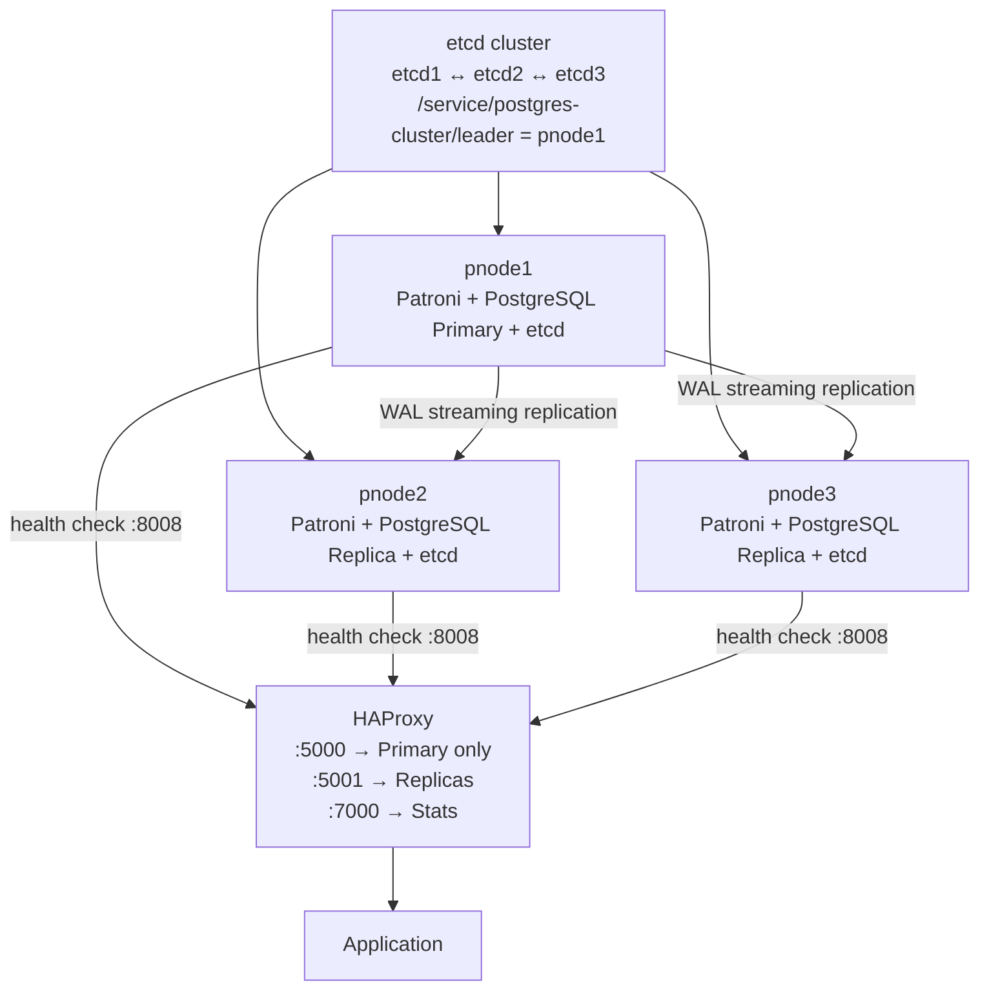

# PostgreSQL High Availability Cluster Setup
## Using Patroni + etcd + HAProxy on Rocky Linux 9

---

## Table of Contents

1. [Architecture Overview](#architecture-overview)
2. [Prerequisites](#prerequisites)
3. [Phase 1 — etcd Cluster Setup](#phase-1--etcd-cluster-setup)
4. [Phase 2 — PostgreSQL Setup](#phase-2--postgresql-setup)
5. [Phase 3 — Patroni Setup](#phase-3--patroni-setup)
6. [Phase 4 — HAProxy Setup](#phase-4--haproxy-setup)
7. [Phase 5 — Verification and Testing](#phase-5--verification-and-testing)
8. [Phase 6 — Failure Scenarios](#phase-6--failure-scenarios)
9. [Monitoring and Troubleshooting](#monitoring-and-troubleshooting)
10. [Backup and Restore](#backup-and-restore)
11. [Quick Reference](#quick-reference)

---

## Architecture Overview

This guide sets up a fully automated PostgreSQL High Availability (HA) cluster that eliminates single points of failure. If the Primary database server crashes, the cluster automatically promotes a Replica to Primary within ~30 seconds without any manual intervention.

### Why This Architecture

A single PostgreSQL server is a Single Point of Failure (SPOF). If it crashes, the application goes down. This architecture solves three fundamental HA problems:

| Problem | Component That Solves It |
|---------|--------------------------|
| Who is the Primary? (split-brain prevention) | **etcd** — acts as a neutral distributed judge |
| Who manages PostgreSQL Primary/Replica state? | **Patroni** — automates failover and replication |
| Where does the application connect? | **HAProxy** — provides a single stable endpoint |

### Node Layout

| Hostname | IP Address | Role |
|----------|------------|------|
| pnode1 | 172.16.93.136 | PostgreSQL + Patroni + etcd |
| pnode2 | 172.16.93.137 | PostgreSQL + Patroni + etcd |
| pnode3 | 172.16.93.138 | PostgreSQL + Patroni + etcd |
| haproxy | 172.16.93.139 | HAProxy Load Balancer |

### Port Reference

| Port | Service | Used By |
|------|---------|---------|
| 2379 | etcd client communication | Patroni → etcd |
| 2380 | etcd peer communication | etcd ↔ etcd |
| 5432 | PostgreSQL | HAProxy → PostgreSQL |
| 8008 | Patroni REST API | HAProxy health checks |
| 5000 | HAProxy write port | Application → Primary |
| 5001 | HAProxy read port | Application → Replicas |
| 7000 | HAProxy stats dashboard | Browser monitoring |

### Traffic Flow Diagram



---

## Prerequisites

### System Requirements

- Rocky Linux 9 on all 4 nodes
- Minimum 2 CPU, 4GB RAM per node
- All nodes must be able to reach each other over the network
- `sudo` access on all nodes

### Before You Begin

Run the following on **all 4 nodes** to configure hostname resolution:

```bash
sudo tee -a /etc/hosts <<EOF
172.16.93.136 pnode1
172.16.93.137 pnode2
172.16.93.138 pnode3
172.16.93.139 haproxy
EOF
```

**Why:** Using hostnames instead of raw IPs makes configuration files more readable and easier to maintain. All nodes — including HAProxy — need to resolve each other by name.

**Verify:**
```bash
cat /etc/hosts
# You should see all 4 entries at the bottom
```

---

## Phase 1 — etcd Cluster Setup

> **What is etcd and why does it come first?**
>
> etcd is a distributed key-value store that acts as the single source of truth for the cluster. Patroni uses etcd to store who the current Primary is:
> ```
> /service/postgres-cluster/leader = "pnode1"
> ```
> Without etcd running first, Patroni has nowhere to register or look up the Primary — it cannot start properly. etcd must always be set up before Patroni.

### Step 1 — Open Firewall Ports

Run on **pnode1, pnode2, pnode3**:

```bash
sudo firewall-cmd --permanent --add-port=2379/tcp
sudo firewall-cmd --permanent --add-port=2380/tcp
sudo firewall-cmd --reload
```

**Why:**
- Port **2379** is the etcd client port — Patroni connects here to read and write cluster state
- Port **2380** is the etcd peer port — etcd nodes talk to each other here to sync data and elect a leader

**Verify:**
```bash
sudo firewall-cmd --list-ports
# Output should include: 2379/tcp 2380/tcp
```

---

### Step 2 — Install etcd Binary

Run on **pnode1, pnode2, pnode3**:

```bash
ETCD_VER=v3.5.17
cd /tmp
sudo curl -L https://github.com/etcd-io/etcd/releases/download/${ETCD_VER}/etcd-${ETCD_VER}-linux-amd64.tar.gz -o etcd.tar.gz
tar xzvf etcd.tar.gz
sudo mv /tmp/etcd-${ETCD_VER}-linux-amd64/etcd /usr/local/bin/
sudo mv /tmp/etcd-${ETCD_VER}-linux-amd64/etcdctl /usr/local/bin/
```

**Why `/usr/local/bin/`:** This is the standard Linux location for manually installed binaries. Any user can run `etcd` or `etcdctl` from any directory without specifying a full path.

**Fix SELinux context** (Rocky Linux blocks manually placed binaries by default):
```bash
sudo restorecon -v /usr/local/bin/etcd
sudo restorecon -v /usr/local/bin/etcdctl
```

**Why:** Rocky Linux runs SELinux in Enforcing mode. SELinux assigns a security context to every file. A binary placed manually in `/usr/local/bin/` does not have the correct context, so SELinux blocks it from executing. `restorecon` applies the correct context.

**Verify:**
```bash
etcd --version
etcdctl version
# Both should display version numbers
```

---

### Step 3 — Create etcd User and Directories

Run on **pnode1, pnode2, pnode3**:

```bash
# Create a dedicated system user for etcd
sudo useradd -r -s /sbin/nologin etcd

# Create the config directory
sudo mkdir -p /etc/etcd

# Create the data directory
sudo mkdir -p /etcd/data
sudo chown etcd:etcd /etcd/data
sudo chmod 700 /etcd/data
```

**Why a dedicated user (`-r`):** Running services as root is a security risk. If etcd is compromised, an attacker only gets the limited `etcd` user permissions, not full root access. `-r` creates a system user with no home directory. `-s /sbin/nologin` means no one can log in as this user.

**Why `/etcd/data` instead of default `/var/lib/etcd`:** In production, it is best practice to store data on a separate path (ideally a separate disk partition). If the OS disk fills up, etcd data remains unaffected.

**Why `chmod 700`:** Only the `etcd` user can read, write, or access this directory.

---

### Step 4 — Create etcd Configuration File

> **Note:** Each node gets a different config because each node has a different IP. The `ETCD_INITIAL_CLUSTER` line is identical on all three — it tells every node where all the others are.

**On pnode1:**
```bash
sudo tee /etc/etcd/etcd.conf <<EOF
ETCD_NAME="etcd1"
ETCD_DATA_DIR="/etcd/data"
ETCD_LISTEN_PEER_URLS="http://172.16.93.136:2380"
ETCD_LISTEN_CLIENT_URLS="http://172.16.93.136:2379,http://127.0.0.1:2379"
ETCD_INITIAL_ADVERTISE_PEER_URLS="http://172.16.93.136:2380"
ETCD_ADVERTISE_CLIENT_URLS="http://172.16.93.136:2379"
ETCD_INITIAL_CLUSTER="etcd1=http://172.16.93.136:2380,etcd2=http://172.16.93.137:2380,etcd3=http://172.16.93.138:2380"
ETCD_INITIAL_CLUSTER_STATE="new"
ETCD_INITIAL_CLUSTER_TOKEN="etcd-cluster-1"
ETCD_QUOTA_BACKEND_BYTES=8589934592
ETCD_AUTO_COMPACTION_MODE=revision
ETCD_AUTO_COMPACTION_RETENTION=1000
EOF
```

**On pnode2:**
```bash
sudo tee /etc/etcd/etcd.conf <<EOF
ETCD_NAME="etcd2"
ETCD_DATA_DIR="/etcd/data"
ETCD_LISTEN_PEER_URLS="http://172.16.93.137:2380"
ETCD_LISTEN_CLIENT_URLS="http://172.16.93.137:2379,http://127.0.0.1:2379"
ETCD_INITIAL_ADVERTISE_PEER_URLS="http://172.16.93.137:2380"
ETCD_ADVERTISE_CLIENT_URLS="http://172.16.93.137:2379"
ETCD_INITIAL_CLUSTER="etcd1=http://172.16.93.136:2380,etcd2=http://172.16.93.137:2380,etcd3=http://172.16.93.138:2380"
ETCD_INITIAL_CLUSTER_STATE="new"
ETCD_INITIAL_CLUSTER_TOKEN="etcd-cluster-1"
ETCD_QUOTA_BACKEND_BYTES=8589934592
ETCD_AUTO_COMPACTION_MODE=revision
ETCD_AUTO_COMPACTION_RETENTION=1000
EOF
```

**On pnode3:**
```bash
sudo tee /etc/etcd/etcd.conf <<EOF
ETCD_NAME="etcd3"
ETCD_DATA_DIR="/etcd/data"
ETCD_LISTEN_PEER_URLS="http://172.16.93.138:2380"
ETCD_LISTEN_CLIENT_URLS="http://172.16.93.138:2379,http://127.0.0.1:2379"
ETCD_INITIAL_ADVERTISE_PEER_URLS="http://172.16.93.138:2380"
ETCD_ADVERTISE_CLIENT_URLS="http://172.16.93.138:2379"
ETCD_INITIAL_CLUSTER="etcd1=http://172.16.93.136:2380,etcd2=http://172.16.93.137:2380,etcd3=http://172.16.93.138:2380"
ETCD_INITIAL_CLUSTER_STATE="new"
ETCD_INITIAL_CLUSTER_TOKEN="etcd-cluster-1"
ETCD_QUOTA_BACKEND_BYTES=8589934592
ETCD_AUTO_COMPACTION_MODE=revision
ETCD_AUTO_COMPACTION_RETENTION=1000
EOF
```

**Configuration Parameter Explanations:**

| Parameter | Explanation |
|-----------|-------------|
| `ETCD_NAME` | Unique name for this node within the etcd cluster. Used in `etcdctl member list` output. |
| `ETCD_DATA_DIR` | Where etcd stores its database files, WAL logs, and snapshots. |
| `ETCD_LISTEN_PEER_URLS` | The address this node listens on for connections from other etcd nodes (peer sync, leader election). Port 2380. Does NOT include `127.0.0.1` because other machines cannot reach this machine's localhost. |
| `ETCD_LISTEN_CLIENT_URLS` | The address this node listens on for connections from clients (Patroni). Includes `127.0.0.1:2379` so Patroni on the same machine can connect via localhost — faster and avoids network overhead. |
| `ETCD_INITIAL_ADVERTISE_PEER_URLS` | The address this node tells other nodes to use when connecting to it. Usually matches `LISTEN_PEER_URLS`. |
| `ETCD_ADVERTISE_CLIENT_URLS` | The address this node advertises to clients (Patroni) for connections. |
| `ETCD_INITIAL_CLUSTER` | The complete list of all etcd members and their peer URLs. Must be identical on all nodes. This is how they find each other at startup. |
| `ETCD_INITIAL_CLUSTER_STATE` | `new` = brand new cluster. `existing` = adding a new node to an already-running cluster. |
| `ETCD_INITIAL_CLUSTER_TOKEN` | A unique cluster identifier. Prevents nodes from accidentally joining a different etcd cluster on the same network. |
| `ETCD_QUOTA_BACKEND_BYTES` | Maximum database size. Set to 8GB. Default is only 2GB — fills quickly in production. When quota is exceeded, etcd stops accepting writes and Patroni cannot update cluster state. |
| `ETCD_AUTO_COMPACTION_MODE` | `revision` means track compaction by number of changes. |
| `ETCD_AUTO_COMPACTION_RETENTION` | Keep only the last 1000 revisions, delete older history automatically. etcd stores the full history of every change — without compaction this grows indefinitely. |

---

### Step 5 — Create systemd Service

Run on **pnode1, pnode2, pnode3** (identical on all three):

```bash
sudo tee /etc/systemd/system/etcd.service <<EOF
[Unit]
Description=etcd key-value store
After=network.target

[Service]
User=etcd
EnvironmentFile=/etc/etcd/etcd.conf
ExecStart=/usr/local/bin/etcd
Restart=always
RestartSec=5s
LimitNOFILE=40000

[Install]
WantedBy=multi-user.target
EOF
```

**Key settings:**
- `EnvironmentFile` loads all variables from `/etc/etcd/etcd.conf`
- `Restart=always` means systemd restarts etcd if it crashes
- `RestartSec=5s` waits 5 seconds before restarting to avoid rapid restart loops
- `LimitNOFILE=40000` increases the open file descriptor limit — etcd opens many files simultaneously

---

### Step 6 — Start etcd Cluster

> **Important:** Start etcd on all three nodes within a few seconds of each other. etcd needs a majority (2 of 3) of members to form a cluster. A single node started alone will wait and eventually time out.

Run on **pnode1, pnode2, pnode3**:

```bash
sudo systemctl daemon-reload
sudo systemctl enable etcd
sudo systemctl start etcd
```

**Verify:**
```bash
sudo systemctl status etcd
# Look for: Active: active (running)
```

**If the service fails, check logs:**
```bash
sudo journalctl -u etcd -n 50 --no-pager
```

---

### Step 7 — Verify etcd Cluster

Run from **any one node**:

```bash
# Check all members have joined
etcdctl --endpoints=http://172.16.93.136:2379,http://172.16.93.137:2379,http://172.16.93.138:2379 member list
```

Expected output — all three shown as `started`:
```
xxxxxxx, started, etcd1, http://172.16.93.136:2380, http://172.16.93.136:2379, false
xxxxxxx, started, etcd2, http://172.16.93.137:2380, http://172.16.93.137:2379, false
xxxxxxx, started, etcd3, http://172.16.93.138:2380, http://172.16.93.138:2379, false
```

```bash
# Check which node is the etcd leader and database sizes
etcdctl --endpoints=http://172.16.93.136:2379,http://172.16.93.137:2379,http://172.16.93.138:2379 endpoint status --write-out=table
```

One node has `IS LEADER = true`. All nodes should have the same `RAFT INDEX` (meaning they are in sync).

```bash
# Confirm cluster health
ETCDCTL_API=3 etcdctl --endpoints=http://172.16.93.136:2379,http://172.16.93.137:2379,http://172.16.93.138:2379 endpoint health --cluster
```

Expected:
```
172.16.93.136:2379 is healthy
172.16.93.137:2379 is healthy
172.16.93.138:2379 is healthy
```

**Phase 1 complete.** etcd cluster is running with 3 members and automatic leader election.

---

## Phase 2 — PostgreSQL Setup

> **Why install PostgreSQL before Patroni?**
>
> Patroni is an agent that *manages* PostgreSQL — it does not install it. Patroni needs the PostgreSQL binaries (`pg_ctl`, `initdb`, `pg_rewind`, `pg_basebackup`) to exist on the system first. However, we deliberately do **not** initialize or start PostgreSQL manually. Patroni handles that entirely during bootstrap in Phase 3.

### Step 1 — Add PostgreSQL Repository

Run on **pnode1, pnode2, pnode3**:

```bash
# Add the official PostgreSQL Global Development Group (PGDG) repository
sudo dnf install -y https://download.postgresql.org/pub/repos/yum/reporpms/EL-9-x86_64/pgdg-redhat-repo-latest.noarch.rpm

# Disable Rocky Linux's built-in PostgreSQL module to prevent version conflicts
sudo dnf -qy module disable postgresql
```

**Why disable the built-in module:** Rocky Linux ships an older PostgreSQL version in its default repos. Both the built-in module and PGDG provide a package named `postgresql-server`. Without disabling the built-in, `dnf` may pull the wrong version.

**Verify:**
```bash
sudo dnf repolist | grep pgdg
# Should show pgdg16 and other pgdg repositories
```

---

### Step 2 — Install PostgreSQL 16

Run on **pnode1, pnode2, pnode3**:

```bash
sudo dnf install -y postgresql16-server postgresql16-contrib
```

**Why `postgresql16-contrib`:** Includes additional tools like `pg_rewind` support libraries and other extensions needed in production HA setups.

> **Do NOT run `postgresql-16-setup initdb` or `systemctl start postgresql-16`.**
> Patroni initializes the data directory and starts PostgreSQL during cluster bootstrap. If you initialize manually, Patroni will encounter an existing data directory and fail.

**Verify:**
```bash
/usr/pgsql-16/bin/postgres --version
# Output: postgres (PostgreSQL) 16.x
```

---

### Step 3 — Open Firewall Ports

Run on **pnode1, pnode2, pnode3**:

```bash
sudo firewall-cmd --permanent --add-port=5432/tcp
sudo firewall-cmd --permanent --add-port=8008/tcp
sudo firewall-cmd --reload
```

**Why:**
- Port **5432** — standard PostgreSQL port, HAProxy forwards database queries here
- Port **8008** — Patroni REST API, HAProxy calls this to determine Primary vs Replica

**Verify:**
```bash
sudo firewall-cmd --list-ports
# Should show: 2379/tcp 2380/tcp 5432/tcp 8008/tcp
```

---

### Step 4 — Create PostgreSQL Data Directory

Run on **pnode1, pnode2, pnode3**:

```bash
sudo mkdir -p /data/patroni
sudo chown postgres:postgres /data/patroni
sudo chmod 700 /data/patroni
```

**Why a custom directory:** Storing data on a separate path (ideally a separate disk) keeps data safe if the OS partition fills up and simplifies storage management.

**Why `postgres` user owns it:** Patroni runs PostgreSQL as the `postgres` OS user. That user must have full ownership to initialize and manage the data directory.

**Verify:**
```bash
ls -la /data/
# Should show: drwx------. postgres postgres ... patroni
```

---

### Step 5 — Set postgres OS User Password

Run on **pnode1, pnode2, pnode3** (use the same password on all nodes):

```bash
sudo passwd postgres
```

**Phase 2 complete.** PostgreSQL 16 is installed on all three nodes. The data directory is prepared but empty — Patroni will populate it.

---

## Phase 3 — Patroni Setup

> **What does Patroni do?**
>
> Patroni is a Python-based HA agent running on each node. It:
> - Races with other Patroni instances to claim the Primary role via etcd distributed lock
> - Initializes PostgreSQL on the winning (Primary) node via `initdb`
> - Creates required database users (superuser, replicator)
> - Configures Replicas by running `pg_basebackup` from the Primary
> - Monitors PostgreSQL health every 10 seconds
> - Renews the Primary lease in etcd every 10 seconds
> - Automatically promotes a Replica when the Primary's etcd lease expires
> - Exposes a REST API on port 8008 so HAProxy can identify Primary vs Replica

### Step 1 — Install Python Dependencies

Run on **pnode1, pnode2, pnode3**:

```bash
sudo dnf install -y python3-pip python3-devel gcc
```

---

### Step 2 — Install Patroni

Run on **pnode1, pnode2, pnode3**:

```bash
sudo pip3 install patroni[etcd] psycopg2-binary
```

**Why `patroni[etcd]`:** Installs Patroni with the etcd3 driver. Without this, Patroni cannot communicate with etcd.

**Why `psycopg2-binary`:** The Python PostgreSQL adapter Patroni uses to connect internally. The `-binary` variant comes pre-compiled and requires no additional system libraries.

**Verify:**
```bash
patroni --version
patronictl --version
# Both should show: Patroni 4.x.x
```

---

### Step 3 — Create Patroni Config Directory

Run on **pnode1, pnode2, pnode3**:

```bash
sudo mkdir -p /etc/patroni
sudo chown postgres:postgres /etc/patroni
```

**Why `postgres` owns it:** The Patroni systemd service runs as `postgres`. That user must be able to read the config file.

---

### Step 4 — Create Patroni Configuration File

> **Note:** The config differs per node only in `name`, `restapi.listen`, `restapi.connect_address`, `postgresql.listen`, and `postgresql.connect_address` — all reflecting the node's own IP.
>
> Use `sudo -u postgres tee` instead of `sudo tee` so the file is owned by `postgres` directly, avoiding a separate `chown` step.

**On pnode1:**
```bash
sudo -u postgres tee /etc/patroni/patroni.yml <<EOF
scope: postgres-cluster
namespace: /service/
name: pnode1

restapi:
  listen: 172.16.93.136:8008
  connect_address: 172.16.93.136:8008

etcd3:
  hosts:
    - 172.16.93.136:2379
    - 172.16.93.137:2379
    - 172.16.93.138:2379

bootstrap:
  dcs:
    ttl: 30
    loop_wait: 10
    retry_timeout: 10
    maximum_lag_on_failover: 1048576
    postgresql:
      use_pg_rewind: true
      use_slots: true
      parameters:
        wal_level: replica
        hot_standby: "on"
        max_wal_senders: 10
        max_replication_slots: 10
        wal_log_hints: "on"

  initdb:
    - encoding: UTF8
    - data-checksums

  pg_hba:
    - host replication replicator 127.0.0.1/32 md5
    - host replication replicator 172.16.93.136/24 md5
    - host all all 0.0.0.0/0 md5

  users:
    admin:
      password: admin123
      options:
        - createrole
        - createdb
    replicator:
      password: replicator123
      options:
        - replication

postgresql:
  listen: 172.16.93.136:5432
  connect_address: 172.16.93.136:5432
  data_dir: /data/patroni
  bin_dir: /usr/pgsql-16/bin
  pgpass: /tmp/pgpass
  authentication:
    replication:
      username: replicator
      password: replicator123
    superuser:
      username: postgres
      password: postgres123

tags:
  nofailover: false
  noloadbalance: false
  clonefrom: false
  nosync: false
EOF
```

**On pnode2:**
```bash
sudo -u postgres tee /etc/patroni/patroni.yml <<EOF
scope: postgres-cluster
namespace: /service/
name: pnode2

restapi:
  listen: 172.16.93.137:8008
  connect_address: 172.16.93.137:8008

etcd3:
  hosts:
    - 172.16.93.136:2379
    - 172.16.93.137:2379
    - 172.16.93.138:2379

bootstrap:
  dcs:
    ttl: 30
    loop_wait: 10
    retry_timeout: 10
    maximum_lag_on_failover: 1048576
    postgresql:
      use_pg_rewind: true
      use_slots: true
      parameters:
        wal_level: replica
        hot_standby: "on"
        max_wal_senders: 10
        max_replication_slots: 10
        wal_log_hints: "on"

  initdb:
    - encoding: UTF8
    - data-checksums

  pg_hba:
    - host replication replicator 127.0.0.1/32 md5
    - host replication replicator 172.16.93.136/24 md5
    - host all all 0.0.0.0/0 md5

  users:
    admin:
      password: admin123
      options:
        - createrole
        - createdb
    replicator:
      password: replicator123
      options:
        - replication

postgresql:
  listen: 172.16.93.137:5432
  connect_address: 172.16.93.137:5432
  data_dir: /data/patroni
  bin_dir: /usr/pgsql-16/bin
  pgpass: /tmp/pgpass
  authentication:
    replication:
      username: replicator
      password: replicator123
    superuser:
      username: postgres
      password: postgres123

tags:
  nofailover: false
  noloadbalance: false
  clonefrom: false
  nosync: false
EOF
```

**On pnode3:**
```bash
sudo -u postgres tee /etc/patroni/patroni.yml <<EOF
scope: postgres-cluster
namespace: /service/
name: pnode3

restapi:
  listen: 172.16.93.138:8008
  connect_address: 172.16.93.138:8008

etcd3:
  hosts:
    - 172.16.93.136:2379
    - 172.16.93.137:2379
    - 172.16.93.138:2379

bootstrap:
  dcs:
    ttl: 30
    loop_wait: 10
    retry_timeout: 10
    maximum_lag_on_failover: 1048576
    postgresql:
      use_pg_rewind: true
      use_slots: true
      parameters:
        wal_level: replica
        hot_standby: "on"
        max_wal_senders: 10
        max_replication_slots: 10
        wal_log_hints: "on"

  initdb:
    - encoding: UTF8
    - data-checksums

  pg_hba:
    - host replication replicator 127.0.0.1/32 md5
    - host replication replicator 172.16.93.136/24 md5
    - host all all 0.0.0.0/0 md5

  users:
    admin:
      password: admin123
      options:
        - createrole
        - createdb
    replicator:
      password: replicator123
      options:
        - replication

postgresql:
  listen: 172.16.93.138:5432
  connect_address: 172.16.93.138:5432
  data_dir: /data/patroni
  bin_dir: /usr/pgsql-16/bin
  pgpass: /tmp/pgpass
  authentication:
    replication:
      username: replicator
      password: replicator123
    superuser:
      username: postgres
      password: postgres123

tags:
  nofailover: false
  noloadbalance: false
  clonefrom: false
  nosync: false
EOF
```

**Configuration Parameter Explanations:**

| Parameter | Explanation |
|-----------|-------------|
| `scope` | The cluster name. Must be identical on all nodes. Used as the etcd key prefix: `/service/postgres-cluster/` |
| `namespace` | etcd path prefix. Combined with scope to form the full path. |
| `name` | This node's unique name within the cluster. Must differ on each node. |
| `restapi.listen` | Address Patroni's HTTP API listens on. HAProxy calls this port for health checks. |
| `etcd3.hosts` | All etcd endpoints. Patroni tries each if one is unreachable. |
| `bootstrap` | **Used only once** — when the cluster is first created. After that, settings are stored in etcd. To change them later, use `patronictl edit-config`. |
| `bootstrap.dcs.ttl` | Primary's lease lifetime in etcd (30 seconds). If the Primary stops renewing within this time, the lease expires and a new election begins. |
| `bootstrap.dcs.loop_wait` | Patroni's monitoring loop interval (10 seconds). The Primary renews its lease on every loop. |
| `bootstrap.dcs.retry_timeout` | How long to retry failed etcd or PostgreSQL operations. |
| `bootstrap.dcs.maximum_lag_on_failover` | A Replica more than 1MB behind the Primary will not be promoted during failover — it has missed too much data. |
| `use_pg_rewind` | When an old Primary rejoins after failover, instead of a full `pg_basebackup`, it uses `pg_rewind` to sync only the diverged portion. Saves significant time on large databases. |
| `use_slots` | Replication slots prevent the Primary from discarding WAL that a Replica hasn't consumed yet — even if the Replica is temporarily offline. |
| `wal_level: replica` | PostgreSQL must write enough WAL detail for streaming replication. Without this, Replicas cannot decode the WAL stream. |
| `hot_standby: on` | Allows Replicas to serve read queries while in standby mode. Without this, no connections can be made to Replicas. |
| `max_wal_senders` | Maximum simultaneous WAL streaming connections. Each Replica uses one. Set to 10 for headroom. |
| `wal_log_hints: on` | Required for `pg_rewind` to work correctly. |
| `initdb.data-checksums` | Enables page-level data checksums. Detects silent data corruption on disk. |
| `pg_hba` | PostgreSQL access control. Line 2 (`172.16.93.136/24`) allows all nodes in the subnet to replicate. Line 3 allows any host to connect with a password — restrict to application server IPs in production. |
| `users.replicator` | Created during bootstrap with `replication` permission. Replicas authenticate as this user to stream WAL from the Primary. |
| `postgresql.bin_dir` | Where Patroni finds PostgreSQL executables: `pg_ctl`, `initdb`, `pg_rewind`. |
| `postgresql.pgpass` | Patroni writes passwords here for passwordless internal connections to PostgreSQL. |
| `tags.nofailover` | Set `true` to prevent this node from ever being promoted to Primary. Useful for weaker hardware. |
| `tags.noloadbalance` | Set `true` to exclude this node from HAProxy's read load balancing on port 5001. |

**Verify file ownership:**
```bash
ls -la /etc/patroni/
# patroni.yml must be owned by postgres:postgres
```

---

### Step 5 — Create Patroni systemd Service

Run on **pnode1, pnode2, pnode3** (identical):

```bash
sudo tee /etc/systemd/system/patroni.service <<EOF
[Unit]
Description=Patroni PostgreSQL HA
After=syslog.target network.target etcd.service
Wants=etcd.service

[Service]
Type=simple
User=postgres
Group=postgres
ExecStart=/usr/local/bin/patroni /etc/patroni/patroni.yml
ExecReload=/bin/kill -s HUP \$MAINPID
KillMode=process
TimeoutSec=30
Restart=always
RestartSec=5s

[Install]
WantedBy=multi-user.target
EOF
```

**Key settings:**
- `After=etcd.service` — systemd starts Patroni only after etcd is running
- `Wants=etcd.service` — if etcd is not running, systemd attempts to start it first
- `User=postgres` — Patroni runs as `postgres`, the same user that owns the data directory
- `KillMode=process` — when stopping, only kill Patroni itself, not PostgreSQL

---

### Step 6 — Start Patroni

> **Important:** Start Patroni on all three nodes quickly (within a few seconds). The first node wins the etcd lock and becomes Primary. The others need to be up promptly to receive the base backup and begin replication.

Run on **pnode1, pnode2, pnode3**:

```bash
sudo systemctl daemon-reload
sudo systemctl enable patroni
sudo systemctl start patroni
```

**Watch the bootstrap in real time:**
```bash
sudo journalctl -u patroni -f
```

On the Primary you will see: `acquired session lock as a leader`, `promoted to leader`
On Replicas you will see: `following a leader`

---

### Step 7 — Verify Patroni Cluster

Run from **any node**:

```bash
patronictl -c /etc/patroni/patroni.yml list
```

Expected output:
```
+ Cluster: postgres-cluster ----+----+-----------+
| Member | Host              | Role    | State     | TL | Lag in MB |
+--------+-------------------+---------+-----------+----+-----------+
| pnode1 | 172.16.93.136:5432| Leader  | running   |  1 |           |
| pnode2 | 172.16.93.137:5432| Replica | streaming |  1 |         0 |
| pnode3 | 172.16.93.138:5432| Replica | streaming |  1 |         0 |
+--------+-------------------+---------+-----------+----+-----------+
```

**Verify Patroni has written cluster state to etcd:**
```bash
etcdctl --endpoints=http://127.0.0.1:2379 get --prefix /service/postgres-cluster/
```

You will see the leader key and member info for each node stored in etcd.

**Phase 3 complete.** PostgreSQL is running with streaming replication managed entirely by Patroni.

---

## Phase 4 — HAProxy Setup

> **What does HAProxy do?**
>
> HAProxy provides a single stable endpoint for applications. Without it, the application must know which IP is the current Primary and update its connection string after every failover. HAProxy solves this by:
> - Checking Patroni's REST API (port 8008) every 3 seconds on all nodes
> - Routing **write traffic** (port 5000) only to the node returning HTTP 200 for `/primary`
> - Routing **read traffic** (port 5001) to all nodes returning HTTP 200 for `/replica`
> - Updating routing automatically after any failover with no application changes needed

### Step 1 — Install HAProxy

Run on **haproxy node only**:

```bash
sudo dnf install -y haproxy
```

**Verify:**
```bash
haproxy -v
```

---

### Step 2 — Open Firewall Ports

Run on **haproxy node only**:

```bash
sudo firewall-cmd --permanent --add-port=5000/tcp
sudo firewall-cmd --permanent --add-port=5001/tcp
sudo firewall-cmd --permanent --add-port=7000/tcp
sudo firewall-cmd --reload
```

**Verify:**
```bash
sudo firewall-cmd --list-ports
# Should show: 5000/tcp 5001/tcp 7000/tcp
```

---

### Step 3 — Fix SELinux for HAProxy

Run on **haproxy node**:

```bash
sudo dnf install -y policycoreutils-python-utils

sudo semanage port -a -t http_port_t -p tcp 7000
sudo semanage port -a -t postgresql_port_t -p tcp 5000
sudo semanage port -a -t postgresql_port_t -p tcp 5001

sudo setsebool -P haproxy_connect_any 1
```

**Why:** SELinux restricts which ports services can bind to. `semanage port` registers custom ports with the correct SELinux type. `setsebool haproxy_connect_any 1` allows HAProxy to forward traffic to the PostgreSQL backends.

---

### Step 4 — Create HAProxy Configuration

Run on **haproxy node**:

```bash
sudo tee /etc/haproxy/haproxy.cfg <<EOF
global
    maxconn 100
    log 127.0.0.1 local2

defaults
    log global
    mode tcp
    retries 2
    timeout client 30m
    timeout connect 4s
    timeout server 30m
    timeout check 5s

listen stats
    mode http
    bind *:7000
    stats enable
    stats uri /

listen primary
    bind *:5000
    option httpchk OPTIONS /primary
    http-check expect status 200
    default-server inter 3s fall 3 rise 2 on-marked-down shutdown-sessions
    server pnode1 172.16.93.136:5432 maxconn 100 check port 8008
    server pnode2 172.16.93.137:5432 maxconn 100 check port 8008
    server pnode3 172.16.93.138:5432 maxconn 100 check port 8008

listen replica
    bind *:5001
    option httpchk OPTIONS /replica
    http-check expect status 200
    default-server inter 3s fall 3 rise 2 on-marked-down shutdown-sessions
    server pnode1 172.16.93.136:5432 maxconn 100 check port 8008
    server pnode2 172.16.93.137:5432 maxconn 100 check port 8008
    server pnode3 172.16.93.138:5432 maxconn 100 check port 8008
EOF
```

**Configuration Parameter Explanations:**

| Parameter | Explanation |
|-----------|-------------|
| `maxconn 100` | Maximum simultaneous connections HAProxy handles. Increase for high-traffic environments. |
| `mode tcp` | HAProxy passes raw TCP bytes without interpreting them. Required because PostgreSQL uses its own wire protocol, not HTTP. |
| `retries 2` | Retry a backend connection 2 times before marking it failed. |
| `timeout client 30m` | Close connection if client is idle for 30 minutes. |
| `timeout connect 4s` | Fail a backend connection attempt if it takes more than 4 seconds. |
| `timeout server 30m` | Close connection if backend is idle for 30 minutes. |
| `timeout check 5s` | Health check must complete within 5 seconds or counts as failure. |
| `listen stats` | Separate HTTP listener for the monitoring dashboard at port 7000. |
| `option httpchk OPTIONS /primary` | Even though data flows over TCP, health checks use HTTP. HAProxy sends an HTTP request to each node's port 8008 (Patroni REST API). |
| `http-check expect status 200` | A node is UP only if it returns HTTP 200. Primary returns 200 for `/primary`. Replicas return 503. |
| `inter 3s` | Health check interval: every 3 seconds per server. |
| `fall 3` | 3 consecutive failures → server marked DOWN. Prevents flapping from brief network glitches. |
| `rise 2` | 2 consecutive successes → server marked UP again. |
| `on-marked-down shutdown-sessions` | When a server is marked DOWN, terminate all existing connections to it immediately. Forces application connection pools to reconnect to the new Primary. |
| `check port 8008` | Health checks go to port 8008 (Patroni API). Actual database traffic goes to port 5432. This is the key mechanism — Patroni determines health, PostgreSQL serves data. |

**How health check routing works:**

```
Primary node (e.g., pnode1):
  GET :8008/primary  →  HTTP 200  →  UP in "primary" section (port 5000)
  GET :8008/replica  →  HTTP 503  →  DOWN in "replica" section (port 5001)

Replica node (e.g., pnode2):
  GET :8008/primary  →  HTTP 503  →  DOWN in "primary" section (port 5000)
  GET :8008/replica  →  HTTP 200  →  UP in "replica" section (port 5001)
```

Port 5000 always routes to exactly one node (the Primary).
Port 5001 load balances across all Replicas.

---

### Step 5 — Start HAProxy

Run on **haproxy node**:

```bash
sudo systemctl enable haproxy
sudo systemctl start haproxy
sudo systemctl status haproxy
# Look for: Active: active (running)
```

**If it fails:**
```bash
sudo journalctl -u haproxy -n 30 --no-pager
# Common fix: sudo setsebool -P haproxy_connect_any 1
```

---

### Step 6 — Verify HAProxy

**Open the stats dashboard in a browser:**
```
http://172.16.93.139:7000
```

What you should see:
- **primary** section: one node green (UP), two nodes red (DOWN)
- **replica** section: two nodes green (UP), one node red (DOWN)
- The UP node in primary must be DOWN in replica, and vice versa

**Phase 4 complete.** HAProxy is routing traffic based on Patroni health checks.

---

## Phase 5 — Verification and Testing

### Test 1 — Confirm Primary/Replica identification via HAProxy

```bash
# Connect through port 5000 (should reach Primary)
psql -h 172.16.93.139 -p 5000 -U postgres -c "SELECT pg_is_in_recovery();"
# Expected: f  (false = Primary, not in recovery)

# Connect through port 5001 (should reach a Replica)
psql -h 172.16.93.139 -p 5001 -U postgres -c "SELECT pg_is_in_recovery();"
# Expected: t  (true = Replica, in recovery/standby mode)
```

---

### Test 2 — Verify end-to-end replication

**Create test data on the Primary:**
```bash
psql -h 172.16.93.139 -p 5000 -U postgres
```
```sql
CREATE DATABASE testdb;
\c testdb
CREATE TABLE employees (id SERIAL PRIMARY KEY, name VARCHAR(50), city VARCHAR(50));
INSERT INTO employees (name, city) VALUES ('Alice', 'Dhaka');
INSERT INTO employees (name, city) VALUES ('Bob', 'Chittagong');
INSERT INTO employees (name, city) VALUES ('Carol', 'Sylhet');
SELECT * FROM employees;
\q
```

**Read the same data from a Replica:**
```bash
psql -h 172.16.93.139 -p 5001 -U postgres -d testdb -c "SELECT * FROM employees;"
# All three rows must appear — replication is confirmed working
```

**Confirm Replicas reject write operations:**
```bash
psql -h 172.16.93.139 -p 5001 -U postgres -d testdb -c "INSERT INTO employees (name, city) VALUES ('Dave', 'Rajshahi');"
# Expected: ERROR: cannot execute INSERT in a read-only transaction
```

---

### Test 3 — Verify replication stream status

```bash
# From Primary: check connected Replicas and their lag
psql -h 172.16.93.139 -p 5000 -U postgres -c \
  "SELECT client_addr, state, sent_lsn, replay_lsn, sync_state FROM pg_stat_replication;"
# Both Replicas should show state: streaming, with matching sent_lsn and replay_lsn (lag = 0)

# From Replica: check which Primary it is streaming from
psql -h 172.16.93.139 -p 5001 -U postgres -c "SELECT * FROM pg_stat_wal_receiver;"
# sender_host should show the current Primary's IP
```

---

## Phase 6 — Failure Scenarios

### Scenario 1 — Planned Switchover

Use when you need to take the current Primary offline for maintenance. Zero data loss.

```bash
# Check current state first
patronictl -c /etc/patroni/patroni.yml list

# Initiate switchover
patronictl -c /etc/patroni/patroni.yml switchover postgres-cluster
# Follow the prompts: select current Primary as master, choose candidate, confirm with 'y'
```

After switchover:
```bash
patronictl -c /etc/patroni/patroni.yml list
# A different node is now Leader, timeline (TL) has incremented
```

Verify HAProxy updated automatically:
```
http://172.16.93.139:7000
# The new Primary node is now green in the primary section
```

---

### Scenario 2 — Unplanned Failover Simulation

Simulate a Primary crash:

```bash
# On the current Primary node
sudo systemctl stop patroni
```

Watch the automatic failover from another node (run repeatedly over 30-40 seconds):
```bash
patronictl -c /etc/patroni/patroni.yml list
```

Timeline of events:
1. Primary node shows `stopped`
2. HAProxy marks the Primary DOWN after 3 failed checks (~9 seconds)
3. After ~30 seconds (TTL expiry), a new Leader is elected
4. The new Leader shows an incremented TL number

Bring the old Primary back online:
```bash
sudo systemctl start patroni
```

It automatically rejoins as a Replica:
```bash
patronictl -c /etc/patroni/patroni.yml list
# All three nodes running: 1 Leader + 2 Replicas
```

---

### Scenario 3 — Verify Data Integrity After Failover

```bash
psql -h 172.16.93.139 -p 5000 -U postgres -d testdb -c "SELECT * FROM employees;"
# All rows must still be present on the new Primary — no data loss
```

---

## Monitoring and Troubleshooting

### Daily Monitoring Commands

```bash
# 1. Overall cluster health
patronictl -c /etc/patroni/patroni.yml list

# 2. etcd cluster status and DB sizes
etcdctl --endpoints=http://172.16.93.136:2379,http://172.16.93.137:2379,http://172.16.93.138:2379 \
  endpoint status --write-out=table

# 3. Replication lag in bytes (run on Primary)
psql -h 172.16.93.139 -p 5000 -U postgres -c \
  "SELECT client_addr, state, pg_wal_lsn_diff(sent_lsn, replay_lsn) AS lag_bytes FROM pg_stat_replication;"

# 4. Replication slot status (inactive slots can fill disk with retained WAL)
psql -h 172.16.93.139 -p 5000 -U postgres -c \
  "SELECT slot_name, active, pg_wal_lsn_diff(pg_current_wal_lsn(), restart_lsn) AS lag_bytes FROM pg_replication_slots;"

# 5. Disk usage
df -h /data/patroni
df -h /etcd/data
```

### Warning Signs to Watch For

| Symptom | Likely Cause | Recommended Action |
|---------|--------------|-------------------|
| `State: stopped` in patronictl | PostgreSQL crashed or failed to start | `journalctl -u patroni` on that node |
| `Lag: 100+` in patronictl | Replica falling behind | Check network and disk I/O on the Replica |
| No Leader in patronictl | etcd quorum lost, or all Patroni instances down | Check etcd health first, then Patroni |
| `active: false` in replication slots | Replica disconnected but slot is retained | Investigate Replica; drop slot if node is permanently decommissioned |
| etcd DB SIZE approaching 8GB | Compaction not keeping up | Run manual compaction and defrag |
| HAProxy shows all backends DOWN | All nodes failed health checks | Check Patroni on all nodes immediately |

### Log Locations

```bash
# Patroni logs (live follow)
sudo journalctl -u patroni -f

# Patroni logs (last 100 lines)
sudo journalctl -u patroni -n 100 --no-pager

# etcd logs
sudo journalctl -u etcd -n 100 --no-pager

# HAProxy logs
sudo journalctl -u haproxy -n 100 --no-pager
```

### etcd Quota Exceeded — Recovery Procedure

When etcd stops accepting writes due to quota exhaustion:

```bash
# Step 1: Check for active alarms
etcdctl --endpoints=http://127.0.0.1:2379 alarm list

# Step 2: Get current revision number
REV=$(etcdctl --endpoints=http://127.0.0.1:2379 endpoint status --write-out=json | \
  python3 -c "import sys,json; print(json.load(sys.stdin)[0]['Status']['header']['revision'])")

# Step 3: Compact old revisions
ETCDCTL_API=3 etcdctl --endpoints=http://127.0.0.1:2379 compaction $REV

# Step 4: Defragment all nodes to reclaim disk space
ETCDCTL_API=3 etcdctl --endpoints=http://172.16.93.136:2379 defrag
ETCDCTL_API=3 etcdctl --endpoints=http://172.16.93.137:2379 defrag
ETCDCTL_API=3 etcdctl --endpoints=http://172.16.93.138:2379 defrag

# Step 5: Clear the alarm to resume write operations
etcdctl --endpoints=http://127.0.0.1:2379 alarm disarm
```

### Reinitialize a Broken Replica

If a Replica is stuck and cannot rejoin on its own:

```bash
patronictl -c /etc/patroni/patroni.yml reinit postgres-cluster pnode2
```

This wipes the Replica's data directory and takes a fresh base backup from the Primary.

### Validate patroni.yml Syntax Before Applying

```bash
python3 -c "import yaml; yaml.safe_load(open('/etc/patroni/patroni.yml'))"
# No output = valid YAML syntax
```

---

## Backup and Restore

> **HA is not a backup.** Patroni protects against server crashes. It does not protect against accidental `DROP TABLE` or application-level data corruption — those changes replicate to all nodes immediately. Always maintain independent backups.

### Logical Backup (pg_dump)

Best for: individual database backups, migrations, long-term archival.

```bash
mkdir -p /backup
pg_dump -h 172.16.93.139 -p 5000 -U postgres -d testdb > /backup/testdb_$(date +%Y%m%d).sql
```

**Restore:**
```bash
psql -h 172.16.93.139 -p 5000 -U postgres -d testdb < /backup/testdb_20260306.sql
```

---

### Physical Backup (pg_basebackup)

Best for: full cluster backup, base for point-in-time recovery.

```bash
mkdir -p /backup/base
pg_basebackup \
  -h 172.16.93.139 \
  -p 5000 \
  -U replicator \
  -D /backup/base/$(date +%Y%m%d) \
  -Ft -z -P
```

**Flag explanations:**
- `-Ft` — tar format output
- `-z` — gzip compress
- `-P` — show progress during backup

---

### Point-in-Time Recovery (PITR)

PITR allows restoring the database to any specific moment in time — for example, right before an accidental `DROP TABLE`.

**Step 1 — Enable WAL archiving** (add to `postgresql` section in `patroni.yml` on all nodes, then reload):

```yaml
postgresql:
  parameters:
    archive_mode: "on"
    archive_command: "cp %p /backup/wal_archive/%f"
    archive_timeout: 300
```

`%p` = full path to the WAL file. `%f` = filename only. In production, replace `cp` with a command that copies to a remote storage system (S3, NFS, etc.).

**Step 2 — Restore to a specific point in time:**

```bash
# Extract the base backup
mkdir -p /data/restore
tar xzf /backup/base/20260306/base.tar.gz -C /data/restore/

# Configure recovery target
cat >> /data/restore/postgresql.conf <<EOF
restore_command = 'cp /backup/wal_archive/%f %p'
recovery_target_time = '2026-03-06 09:59:00'
recovery_target_action = 'promote'
EOF

# Create the recovery signal file (tells PostgreSQL to enter recovery mode)
touch /data/restore/recovery.signal

# Start PostgreSQL in recovery mode
/usr/pgsql-16/bin/pg_ctl start -D /data/restore/
```

PostgreSQL replays WAL files sequentially until it reaches `09:59:00`, then promotes to a writable state.

---

### Recommended Backup Schedule

| Backup Type | Frequency | Retention |
|-------------|-----------|-----------|
| `pg_basebackup` | Daily | 7 days |
| WAL archiving | Continuous (forced every 5 min via `archive_timeout`) | 7 days |
| `pg_dump` | Weekly | 30 days |

> **Always test your backups.** A backup that has never been restored is untested. Periodically restore to a test environment and verify data integrity before you need it in production.

---

## Quick Reference

### Component Startup Order

When starting from a full shutdown, always follow this sequence:

```
1. pnode1, pnode2, pnode3  →  sudo systemctl start etcd
2. pnode1, pnode2, pnode3  →  sudo systemctl start patroni
3. haproxy                 →  sudo systemctl start haproxy
```

HAProxy must come last — it needs backend nodes up to perform initial health checks.

### Important File Paths

| Path | Purpose |
|------|---------|
| `/etcd/data` | etcd database storage |
| `/etc/etcd/etcd.conf` | etcd configuration |
| `/etc/systemd/system/etcd.service` | etcd systemd unit file |
| `/data/patroni` | PostgreSQL data directory |
| `/etc/patroni/patroni.yml` | Patroni configuration |
| `/etc/systemd/system/patroni.service` | Patroni systemd unit file |
| `/etc/haproxy/haproxy.cfg` | HAProxy configuration |
| `/usr/pgsql-16/bin/` | PostgreSQL binaries (`pg_ctl`, `initdb`, etc.) |
| `/usr/local/bin/etcd` | etcd binary |
| `/usr/local/bin/patronictl` | Patroni management CLI |

### Most-Used Commands

```bash
# View cluster status
patronictl -c /etc/patroni/patroni.yml list

# Planned Primary change (no data loss)
patronictl -c /etc/patroni/patroni.yml switchover postgres-cluster

# Emergency failover (when Primary is unresponsive)
patronictl -c /etc/patroni/patroni.yml failover postgres-cluster \
  --master <current-primary> --candidate <target-node> --force

# Edit cluster DCS configuration stored in etcd
patronictl -c /etc/patroni/patroni.yml edit-config

# Reinitialize a broken Replica from scratch
patronictl -c /etc/patroni/patroni.yml reinit postgres-cluster <node-name>

# Pause automatic failover (for planned maintenance)
patronictl -c /etc/patroni/patroni.yml pause postgres-cluster

# Resume automatic failover after maintenance
patronictl -c /etc/patroni/patroni.yml resume postgres-cluster

# View failover history
patronictl -c /etc/patroni/patroni.yml history postgres-cluster

# etcd cluster health check
etcdctl \
  --endpoints=http://172.16.93.136:2379,http://172.16.93.137:2379,http://172.16.93.138:2379 \
  endpoint health --cluster

# View what Patroni has written to etcd
etcdctl --endpoints=http://127.0.0.1:2379 get --prefix /service/postgres-cluster/

# Connect to Primary via HAProxy (write operations)
psql -h 172.16.93.139 -p 5000 -U postgres

# Connect to Replica via HAProxy (read operations)
psql -h 172.16.93.139 -p 5001 -U postgres

# HAProxy live stats dashboard (open in browser)
# http://172.16.93.139:7000
```

### Patronictl List Output Reference

| Column | Meaning |
|--------|---------|
| Role | `Leader` = Primary, `Replica` = Standby |
| State | `running` = healthy, `streaming` = Replica actively receiving WAL, `stopped` = problem |
| TL | Timeline — increments each time the Primary changes |
| Receive LSN | How much WAL the Replica has received from the Primary |
| Replay LSN | How much WAL the Replica has applied to its database |
| Lag | How far behind the Replica is (0 = fully in sync) |

---

*Guide prepared for: Rocky Linux 9 | PostgreSQL 16 | Patroni 4.x | etcd 3.5.x | HAProxy 2.8.x*
