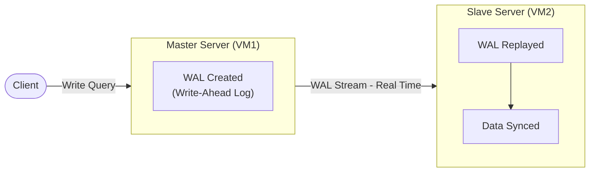
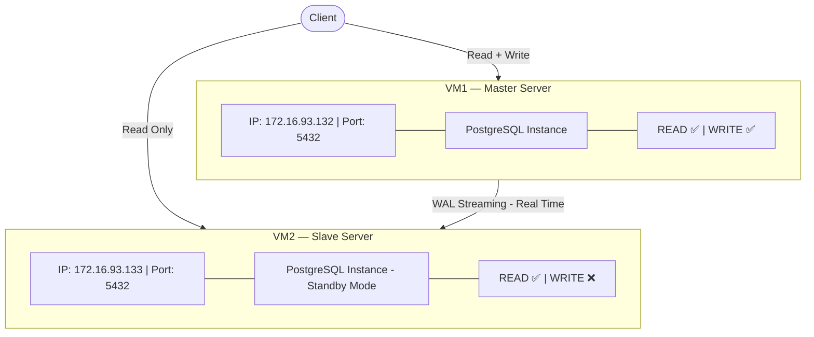
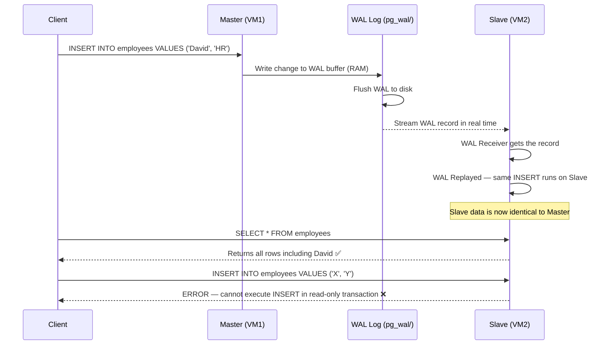

# PostgreSQL Master-Slave Streaming Replication — Complete Step-by-Step Guide

## Table of Contents

- [Overview](#overview)
- [What is a PostgreSQL Cluster?](#what-is-a-postgresql-cluster)
- [What is Streaming Replication?](#what-is-streaming-replication)
- [Architecture Diagram](#architecture-diagram)
- [Prerequisites](#prerequisites)
- [Environment Setup](#environment-setup)
- [MASTER SERVER Configuration](#master-server-configuration)
  - [Step 1 — Create Replication User](#step-1--create-replication-user)
  - [Step 2 — Configure postgresql.conf](#step-2--configure-postgresqlconf)
  - [Step 3 — Configure pg_hba.conf](#step-3--configure-pg_hbaconf)
  - [Step 4 — Open Firewall Port](#step-4--open-firewall-port)
  - [Step 5 — Restart Master PostgreSQL](#step-5--restart-master-postgresql)
  - [Step 6 — Verify Master Configuration](#step-6--verify-master-configuration)
- [SLAVE SERVER Configuration](#slave-server-configuration)
  - [Step 7 — Stop PostgreSQL on Slave](#step-7--stop-postgresql-on-slave)
  - [Step 8 — Clear Slave Data Directory](#step-8--clear-slave-data-directory)
  - [Step 9 — Take Base Backup from Master](#step-9--take-base-backup-from-master)
  - [Step 10 — Verify Backup Files](#step-10--verify-backup-files)
  - [Step 11 — Start PostgreSQL on Slave](#step-11--start-postgresql-on-slave)
- [Verify Replication is Working](#verify-replication-is-working)
  - [Step 12 — Check Slave Connection on Master](#step-12--check-slave-connection-on-master)
  - [Step 13 — Check Slave is in Standby Mode](#step-13--check-slave-is-in-standby-mode)
- [Testing Read/Write and Real-Time Sync](#testing-readwrite-and-real-time-sync)
  - [Step 14 — Write Data on Master](#step-14--write-data-on-master)
  - [Step 15 — Read Data from Slave](#step-15--read-data-from-slave)
  - [Step 16 — Prove Slave is Read-Only](#step-16--prove-slave-is-read-only)
  - [Step 17 — Real-Time Sync Test](#step-17--real-time-sync-test)
- [How It All Works — Full Flow Summary](#how-it-all-works--full-flow-summary)
- [Troubleshooting](#troubleshooting)

---

## Overview

This guide walks through setting up a **PostgreSQL Master-Slave Streaming Replication** cluster across two servers. The goal is:

- **Master Server** — accepts both READ and WRITE operations
- **Slave Server** — accepts READ only; data is automatically synced from Master in real time
- Any data written to Master is immediately replicated to Slave via WAL streaming
- Slave cannot accept any write operations (INSERT, UPDATE, DELETE)

---

## What is a PostgreSQL Cluster?

In PostgreSQL, a **"cluster"** does not mean a group of machines. It refers to a **single PostgreSQL instance managing a single data directory**. When you install PostgreSQL, it automatically creates one cluster.

The data directory (the cluster) lives here on Ubuntu:

```
/var/lib/postgresql/16/main/
```

Inside this directory:

```
/var/lib/postgresql/16/main/
├── base/             ← actual database files
├── global/           ← cluster-wide data (roles, users)
├── pg_wal/           ← Write-Ahead Log files
├── postgresql.conf   ← main configuration file
├── pg_hba.conf       ← authentication/access rules
├── PG_VERSION        ← version number
└── postmaster.pid    ← running process ID
```

> **One Cluster = One Data Directory = One PostgreSQL Instance**

---

## What is Streaming Replication?

Every change made in PostgreSQL (INSERT, UPDATE, DELETE) is first written to a **WAL (Write-Ahead Log)** file before being applied to actual data. This is a safety mechanism to prevent data loss.

In **Streaming Replication**:

1. Master writes changes to WAL
2. WAL is **streamed in real time** to the Slave
3. Slave **replays** the WAL (applies the same changes to its own data)
4. Slave stays in sync with Master continuously



---

## Architecture Diagram



---

## Prerequisites

- Two Ubuntu Server VMs (VM1 = Master, VM2 = Slave)
- PostgreSQL installed on **both** VMs
- Both VMs on the same network (can ping each other)
- SSH or terminal access to both VMs

Check PostgreSQL version on both VMs:

```bash
psql --version
```

> Note the version number (e.g., `16`). You will use it in directory paths throughout this guide.

---

## Environment Setup

| Role   | VM  | IP Address      |
|--------|-----|-----------------|
| Master | VM1 | 172.16.93.132   |
| Slave  | VM2 | 172.16.93.133   |

To find your IP on each VM:

```bash
ip a
```

Look under `ens33` (or similar) for the `inet` value. **Do not use `lo` (127.0.0.1)** — that is the loopback address and only works locally. You need the actual network interface IP.

---

# MASTER SERVER Configuration

> All steps in this section are performed on **VM1 (Master)**

---

## Step 1 — Create Replication User

Switch to the PostgreSQL system user:

```bash
sudo -i -u postgres
```

> **`sudo -i -u postgres`** — runs a login shell as the `postgres` OS user, which is the owner of all PostgreSQL data files. PostgreSQL requires this for administrative tasks.

Open the PostgreSQL interactive terminal:

```bash
psql
```

> **`psql`** — the PostgreSQL command-line client. It connects to the local PostgreSQL instance as the current OS user (`postgres`).

Create a dedicated replication user:

```sql
CREATE ROLE replicator WITH REPLICATION LOGIN PASSWORD 'replica123';
```

> - **`CREATE ROLE`** — creates a new database role (user)
> - **`WITH REPLICATION`** — grants permission to initiate WAL streaming (required for replication)
> - **`LOGIN`** — allows this role to log in (connect to the database)
> - **`PASSWORD 'replica123'`** — sets the password for authentication

Verify the user was created:

```sql
\du
```

Expected output:

```
 Role name  |         Attributes
------------+------------------------------------
 postgres   | Superuser, Create role, Create DB
 replicator | Replication
```

Exit psql:

```sql
\q
```

Exit the postgres user:

```bash
exit
```

---

## Step 2 — Configure postgresql.conf

This is the **main PostgreSQL configuration file**. It controls how the PostgreSQL instance behaves.

Open the file:

```bash
sudo nano /etc/postgresql/16/main/postgresql.conf
```

> Replace `16` with your actual PostgreSQL version number.

> **`nano`** — a terminal-based text editor. Use `Ctrl+W` to search for text inside the file.

Make the following changes (find each line, uncomment it by removing `#`, and set the value):

---

### `listen_addresses`

Find:
```
#listen_addresses = 'localhost'
```

Change to:
```
listen_addresses = '*'
```

> **`listen_addresses`** — defines which network interfaces PostgreSQL listens on for incoming connections.
> - `'localhost'` (default) — only accepts connections from the same machine
> - `'*'` — accepts connections from any IP address, allowing the Slave to connect

---

### `wal_level`

Find:
```
#wal_level = replica
```

Change to:
```
wal_level = replica
```

> **`wal_level`** — controls how much information is written to the WAL (Write-Ahead Log).
> - `minimal` — minimum info, not enough for replication
> - `replica` — includes all info needed for streaming replication ✅
> - `logical` — needed for logical replication (more detailed, not needed here)

---

### `max_wal_senders`

Find:
```
#max_wal_senders = 10
```

Change to:
```
max_wal_senders = 5
```

> **`max_wal_senders`** — the maximum number of simultaneous WAL sender processes. Each Slave connected to this Master uses one WAL sender process. Setting `5` allows up to 5 Slave servers.

---

### `wal_keep_size`

Find:
```
#wal_keep_size = 0
```

Change to:
```
wal_keep_size = 64
```

> **`wal_keep_size`** — the minimum amount of WAL files (in MB) to keep on disk. If a Slave falls behind, it can catch up using these retained WAL files instead of requiring a full re-sync. `64` means keep at least 64 MB of WAL history.

Save and exit: `Ctrl+X` → `Y` → `Enter`

---

## Step 3 — Configure pg_hba.conf

This file controls **who can connect to PostgreSQL, from where, and how they authenticate**.

```bash
sudo nano /etc/postgresql/16/main/pg_hba.conf
```

Go to the very bottom of the file (`Ctrl+End`) and add this line:

```
host    replication     replicator      172.16.93.133/32        md5
```

> Each field explained:
>
> | Field | Value | Meaning |
> |-------|-------|---------|
> | Connection type | `host` | TCP/IP connection (network) |
> | Database | `replication` | Special keyword for replication connections |
> | User | `replicator` | Only this username is allowed |
> | IP Address | `172.16.93.133/32` | Only from this exact Slave IP |
> | Auth method | `md5` | Password-based authentication |
>
> **Why `/32` and not `/24`?**
> - `/24` means allow any IP in the range `172.16.93.0` to `172.16.93.255` (the entire subnet)
> - `/32` means allow **only this single exact IP**
> - `/32` is more secure — only your Slave can connect, not any machine on the network

Save and exit: `Ctrl+X` → `Y` → `Enter`

---

## Step 4 — Open Firewall Port

Allow incoming connections on PostgreSQL's default port:

```bash
sudo ufw allow 5432/tcp
sudo ufw reload
```

> - **`ufw`** — Uncomplicated Firewall, Ubuntu's firewall manager
> - **`5432`** — the default port PostgreSQL listens on
> - **`/tcp`** — TCP protocol (PostgreSQL uses TCP)
> - **`reload`** — applies the new rule without restarting the firewall

> If `ufw` is inactive/disabled, you can skip this step. Run `sudo ufw status` to check.

---

## Step 5 — Restart Master PostgreSQL

Apply all configuration changes by restarting the service:

```bash
sudo systemctl restart postgresql
```

Check cluster status:

```bash
sudo pg_lsclusters
```

Expected output:

```
Ver  Cluster  Port  Status  Owner     Data directory
16   main     5432  online  postgres  /var/lib/postgresql/16/main
```

> `online` means the cluster is running correctly. On Ubuntu, `systemctl status postgresql` may show `active (exited)` — this is **normal behavior** for the wrapper service. What matters is that `pg_lsclusters` shows `online`.

---

## Step 6 — Verify Master Configuration

Confirm your settings are active:

```bash
sudo -i -u postgres
psql -c "SHOW wal_level;"
psql -c "SHOW listen_addresses;"
psql -c "SHOW max_wal_senders;"
```

Expected outputs:

```
 wal_level       listen_addresses    max_wal_senders
-----------      ------------------  -----------------
 replica         *                   5
```

All correct? ✅ Master configuration is complete.

```bash
exit
```

---

# SLAVE SERVER Configuration

> All steps in this section are performed on **VM2 (Slave)**

---

## Step 7 — Stop PostgreSQL on Slave

```bash
sudo systemctl stop postgresql
```

> **Why stop it?** The Slave's data directory must be completely replaced with a copy from the Master. This cannot be done while PostgreSQL is running because it holds locks on the files.

Verify it stopped:

```bash
sudo pg_lsclusters
```

Expected: Status shows `down`.

---

## Step 8 — Clear Slave Data Directory

```bash
sudo -i -u postgres
rm -rf /var/lib/postgresql/16/main/*
```

> - **`rm -rf`** — forcefully removes files and directories recursively
> - **`*`** — deletes everything **inside** the directory but keeps the directory itself
>
> **Why delete?** When PostgreSQL was installed, it created an empty cluster here. We must remove it completely before copying the Master's data. If we don't, the replication setup will conflict with existing files.

Verify the directory is empty:

```bash
ls /var/lib/postgresql/16/main/
```

No output = empty = correct ✅

---

## Step 9 — Take Base Backup from Master

Still as the `postgres` user, run:

```bash
pg_basebackup -h 172.16.93.132 -U replicator -D /var/lib/postgresql/16/main/ -P -Xs -R
```

> **`pg_basebackup`** — PostgreSQL's built-in tool for creating a binary copy of a running cluster. Specifically designed for setting up replication standbys.

> Each flag explained:
>
> | Flag | Meaning |
> |------|---------|
> | `-h 172.16.93.132` | Connect to Master's IP |
> | `-U replicator` | Use this username to connect |
> | `-D /var/lib/.../main/` | Write the backup to Slave's data directory |
> | `-P` | Show progress percentage during backup |
> | `-Xs` | Stream WAL files during the backup so no changes are missed |
> | `-R` | Auto-create `standby.signal` and write connection info to `postgresql.auto.conf` |

When prompted: type `replica123` and press Enter.

```
30264/30264 kB (100%), 1/1 tablespace
```

Backup complete ✅

> **What `-R` does:** Automatically creates `standby.signal` (tells PostgreSQL it is a Slave) and writes `primary_conninfo` to `postgresql.auto.conf` (tells Slave how to reach Master). Without `-R`, both would need to be done manually.

```bash
exit
```

---

## Step 10 — Verify Backup Files

```bash
sudo -i -u postgres
ls /var/lib/postgresql/16/main/standby.signal
cat /var/lib/postgresql/16/main/postgresql.auto.conf
```

Expected output of `cat`:

```
primary_conninfo = 'user=replicator password=replica123 host=172.16.93.132 port=5432 ...'
```

> - **`standby.signal`** — empty file that tells PostgreSQL to run in read-only standby mode
> - **`primary_conninfo`** — connection string telling the Slave where the Master is

```bash
exit
```

---

## Step 11 — Start PostgreSQL on Slave

```bash
sudo systemctl start postgresql
sudo pg_lsclusters
```

`online` = Slave is running ✅

---

# Verify Replication is Working

---

## Step 12 — Check Slave Connection on Master

On **VM1 (Master)**:

```bash
sudo -i -u postgres
psql -c "SELECT * FROM pg_stat_replication;"
```

Expected output:

```
 pid  | usename    | client_addr    | state     | sync_state
------+------------+----------------+-----------+------------
 1234 | replicator | 172.16.93.133  | streaming | async
```

> - **`state: streaming`** — WAL is actively being sent to the Slave ✅
> - **`sync_state: async`** — asynchronous replication (Master does not wait for Slave confirmation)

```bash
exit
```

---

## Step 13 — Check Slave is in Standby Mode

On **VM2 (Slave)**:

```bash
sudo -i -u postgres
psql -c "SELECT pg_is_in_recovery();"
```

Expected output:

```
 pg_is_in_recovery
-------------------
 t
```

> `t` = `true` = Slave is correctly in standby mode ✅
> `f` = `false` = something went wrong

```bash
exit
```

---

# Testing Read/Write and Real-Time Sync

---

## Step 14 — Write Data on Master

On **VM1 (Master)**:

```bash
sudo -i -u postgres
psql
```

```sql
CREATE DATABASE testdb;
\c testdb

CREATE TABLE employees (
    id         SERIAL PRIMARY KEY,
    name       VARCHAR(100),
    department VARCHAR(100)
);

INSERT INTO employees (name, department) VALUES
    ('Alice', 'Engineering'),
    ('Bob', 'Marketing'),
    ('Charlie', 'Finance');

SELECT * FROM employees;
```

Expected output:

```
 id |  name   | department
----+---------+-------------
  1 | Alice   | Engineering
  2 | Bob     | Marketing
  3 | Charlie | Finance
```

Data exists on Master ✅

---

## Step 15 — Read Data from Slave

On **VM2 (Slave)**, connect locally:

```bash
sudo -i -u postgres
psql -d testdb -c "SELECT * FROM employees;"
```

Expected output:

```
 id |  name   | department
----+---------+-------------
  1 | Alice   | Engineering
  2 | Bob     | Marketing
  3 | Charlie | Finance
```

> **The data written on Master is readable on Slave!** ✅ WAL streaming replication is confirmed working.

---

## Step 16 — Prove Slave is Read-Only

On **VM2 (Slave)**:

```bash
sudo -i -u postgres
psql -d testdb
```

```sql
INSERT INTO employees (name, department) VALUES ('Hacker', 'Unknown');
```

Expected:

```
ERROR:  cannot execute INSERT in a read-only transaction
```

> This error proves the Slave is correctly in **read-only mode**. The `standby.signal` file and WAL recovery mode prevent any write operations. ✅

---

## Step 17 — Real-Time Sync Test

Open **two terminals side by side** — one for Master (VM1), one for Slave (VM2).

**Slave terminal** — check current rows:

```sql
SELECT * FROM employees;
-- Shows: Alice, Bob, Charlie (3 rows)
```

**Master terminal** — insert a new row:

```sql
INSERT INTO employees (name, department) VALUES ('David', 'HR');
```

**Slave terminal** — run SELECT again immediately:

```sql
SELECT * FROM employees;
```

Expected:

```
 id |  name   | department
----+---------+-------------
  1 | Alice   | Engineering
  2 | Bob     | Marketing
  3 | Charlie | Finance
  4 | David   | HR
```

> **David appeared on Slave almost instantly!** ✅ Real-time WAL streaming replication confirmed.

---

# How It All Works — Full Flow Summary



---

# Troubleshooting

### `pg_stat_replication` is empty (no rows)

The Slave is not connecting to Master. On Slave, check the logs:

```bash
sudo tail -30 /var/log/postgresql/postgresql-16-main.log
```

| Problem | Fix |
|---------|-----|
| Wrong Master IP in backup | Re-run `pg_basebackup` with correct IP |
| Firewall blocking port 5432 | Run `sudo ufw allow 5432/tcp` on Master |
| Wrong IP in `pg_hba.conf` | Edit `pg_hba.conf` on Master with correct Slave IP |
| Password wrong | Check `postgresql.auto.conf` on Slave for correct password |

---

### Slave shows `pg_is_in_recovery() = f`

`standby.signal` file may be missing. Check:

```bash
ls /var/lib/postgresql/16/main/standby.signal
```

If missing, create it manually:

```bash
sudo -i -u postgres
touch /var/lib/postgresql/16/main/standby.signal
sudo systemctl restart postgresql
```

---

### `pg_basebackup` fails with "Connection refused"

1. Confirm `listen_addresses = '*'` in Master's `postgresql.conf`
2. Confirm Slave IP is in Master's `pg_hba.conf`
3. Confirm PostgreSQL was restarted after config changes
4. Confirm port is open: `sudo ufw allow 5432/tcp`

Test connectivity from Slave to Master:

```bash
psql -h 172.16.93.132 -U replicator -d postgres
```

---

### `active (exited)` in systemctl status

This is **normal on Ubuntu**. Check actual cluster status:

```bash
sudo pg_lsclusters
```

If it shows `online`, PostgreSQL is running correctly.

---

*Guide covers PostgreSQL 16 on Ubuntu Server with VMware. Adjust version numbers in paths as needed for your installation.*
