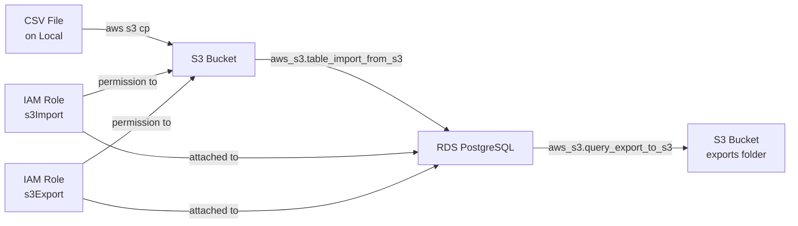
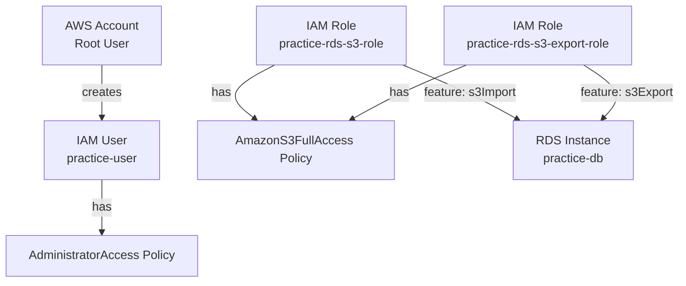

# S3 ↔ RDS (PostgreSQL) Data Pipeline — Complete Guide

A complete end-to-end guide to import data from S3 into RDS PostgreSQL and export data from RDS back to S3. Written for AWS beginners with a basic SQL background.

---

## Architecture Overview





---

## Prerequisites

- AWS Free Tier account
- Ubuntu/Linux terminal
- AWS CLI installed
- `psql` (PostgreSQL client) installed
- Basic SQL knowledge (SELECT, INSERT, CREATE TABLE)

---

## Phase 1 — Create IAM User

Never use the root account for daily work. The root account has unlimited permissions and cannot be restricted. Instead, create an IAM User with controlled permissions.

Never use the root account for daily work. The root account has unlimited permissions and cannot be restricted. Instead, create an IAM User with controlled permissions.

### Steps (GUI):

1. Search `IAM` in the console search bar → click it.
2. Left menu → **Users** → **Create user**.
3. **User name:** `practice-user`
4. Check **"Provide user access to the AWS Management Console"**.
5. Select **"I want to create an IAM user"** (not Identity Center — that's for multi-account organizations).
6. Select **"Custom password"** → set a password you'll remember.
7. **Uncheck** "Users must create a new password at next sign-in" → Next.
8. Permission options — choose **"Attach policies directly"**:
   - **Add user to group** — for managing many users with same permissions (not needed now).
   - **Copy permissions** — copies permissions from another existing user (not needed now).
   - **Attach policies directly** — directly assign a policy to this user. ✅ Use this.
9. Search `AdministratorAccess` → check it → Next → **Create user**.
10. Copy the **Console sign-in URL** shown (looks like `https://123456789.signin.aws.amazon.com/console`).
11. Click **Download .csv** to save credentials.

Log out of root → go to the copied URL → log in as `practice-user`.

---

## Phase 2 — Create IAM User Access Key (for CLI)

The CLI cannot use your console password. It uses an **Access Key** (a key ID + secret pair) instead.

### Steps (GUI):

1. IAM → Users → click `practice-user` → **Security credentials** tab.
2. Scroll to **Access keys** → **Create access key**.
3. Select **"Command Line Interface (CLI)"** → check the confirmation checkbox → Next → **Create access key**.
4. **Download .csv immediately** — the secret key is shown only once and cannot be retrieved later.

---

## Phase 3 — Install and Configure AWS CLI

### Install AWS CLI

```bash
curl "https://awscli.amazonaws.com/awscli-exe-linux-x86_64.zip" -o "awscliv2.zip"
unzip awscliv2.zip
sudo ./aws/install
```

Verify installation:
```bash
aws --version
# Expected: aws-cli/2.x.x Python/3.x.x ...
```

### Configure CLI

```bash
aws configure
```

This prompts for 4 values:

| Prompt | Value | Why |
|--------|-------|-----|
| AWS Access Key ID | from downloaded .csv | Identifies who you are |
| AWS Secret Access Key | from downloaded .csv | Proves it's really you |
| Default region name | `ap-southeast-1` | Singapore — closest to Bangladesh |
| Default output format | `json` | Readable structured output |

### Verify CLI works:
```bash
aws sts get-caller-identity
```

Expected output:
```json
{
    "UserId": "AIDXXXXXXXXXXXXXXXXX",
    "Account": "536277613129",
    "Arn": "arn:aws:iam::536277613129:user/practice-user"
}
```

`practice-user` in the output confirms the CLI is authenticated correctly.

---

## Phase 4 — Set Up Project Folder

Keep all files organized from the start to avoid clutter in your home directory.

```bash
mkdir -p ~/aws-practice/data
cd ~/aws-practice
```

- `~/aws-practice` — all config files (JSON policies, etc.)
- `~/aws-practice/data` — all CSV data files

**All subsequent commands should be run from `~/aws-practice` unless stated otherwise.**

---

## Phase 5 — Create S3 Bucket

S3 (Simple Storage Service) is where CSV files are stored. Think of a **bucket** as a folder in the cloud. Bucket names must be globally unique across all AWS accounts worldwide.

```bash
aws s3api create-bucket \
  --bucket practice-bucket-masud \
  --region ap-southeast-1 \
  --create-bucket-configuration LocationConstraint=ap-southeast-1
```

**Parameter breakdown:**

| Parameter | Value | Why |
|-----------|-------|-----|
| `--bucket` | `practice-bucket-masud` | Unique bucket name (add your name to ensure uniqueness) |
| `--region` | `ap-southeast-1` | Where the bucket is physically stored |
| `--create-bucket-configuration LocationConstraint` | `ap-southeast-1` | Required for all regions except `us-east-1` |

Expected output:
```json
{
    "Location": "http://practice-bucket-masud.s3.amazonaws.com/"
}
```

Confirm bucket exists:
```bash
aws s3 ls
```

---

## Phase 6 — Create and Upload CSV File

Create a sample CSV file that will be imported into RDS.

```bash
cat > ~/aws-practice/data/users.csv << 'EOF'
id,name,email,age
1,Rahim,rahim@email.com,25
2,Karim,karim@email.com,30
3,Jamal,jamal@email.com,22
4,Nila,nila@email.com,28
5,Masud,masud@email.com,35
EOF
```

Upload to S3:
```bash
aws s3 cp ~/aws-practice/data/users.csv s3://practice-bucket-masud/users.csv
```

**`aws s3 cp`** — copies a file. Works like the Linux `cp` command but between local and S3.

Confirm upload:
```bash
aws s3 ls s3://practice-bucket-masud/
```

---

## Phase 7 — Create RDS PostgreSQL Instance

RDS (Relational Database Service) is AWS's managed database service. You get a fully running PostgreSQL database without managing the server yourself.

```bash
aws rds create-db-instance \
  --db-instance-identifier practice-db \
  --db-instance-class db.t3.micro \
  --engine postgres \
  --master-username postgres \
  --master-user-password YOUR_PASSWORD_HERE \
  --allocated-storage 20 \
  --db-name practicedb \
  --publicly-accessible \
  --no-multi-az \
  --no-storage-encrypted \
  --region ap-southeast-1
```

**Parameter breakdown:**

| Parameter | Value | Why |
|-----------|-------|-----|
| `--db-instance-identifier` | `practice-db` | Name to identify this instance in AWS |
| `--db-instance-class` | `db.t3.micro` | Hardware size — free tier eligible |
| `--engine` | `postgres` | Use PostgreSQL |
| `--master-username` | `postgres` | Database superuser name |
| `--master-user-password` | your password | Database login password — save this |
| `--allocated-storage` | `20` | 20GB disk — free tier limit |
| `--db-name` | `practicedb` | Creates an initial database inside the instance |
| `--publicly-accessible` | — | Allows connection from your laptop (practice only) |
| `--no-multi-az` | — | Single availability zone — not needed for practice |
| `--no-storage-encrypted` | — | No encryption — simplifies practice setup |

Wait for instance to become available (5–10 minutes):
```bash
aws rds describe-db-instances \
  --db-instance-identifier practice-db \
  --query 'DBInstances[0].DBInstanceStatus' \
  --output text
```

Keep running until it shows `available`.

Get the endpoint address (needed to connect):
```bash
aws rds describe-db-instances \
  --db-instance-identifier practice-db \
  --query 'DBInstances[0].Endpoint.Address' \
  --output text
```

Save this endpoint — it looks like:
```
practice-db.abc123.ap-southeast-1.rds.amazonaws.com
```

---

## Phase 8 — Create and Attach Security Group

By default, RDS is completely locked — nothing can connect to it. A **Security Group** acts as a firewall. You need to open port `5432` (PostgreSQL's port) for your IP address.

### Step 1: Get your Default VPC ID
```bash
aws ec2 describe-vpcs \
  --filters "Name=isDefault,Values=true" \
  --query 'Vpcs[0].VpcId' \
  --output text
```

Save the output (looks like `vpc-0abc123456`).

### Step 2: Create Security Group
```bash
aws ec2 create-security-group \
  --group-name practice-db-sg \
  --description "Security group for practice RDS" \
  --vpc-id vpc-0abc123456
```

**Replace `vpc-0abc123456`** with your actual VPC ID from Step 1.

Save the `GroupId` from output (looks like `sg-0abc123456`).

### Step 3: Get your current IP
```bash
curl checkip.amazonaws.com
```

### Step 4: Allow PostgreSQL port from your IP
```bash
aws ec2 authorize-security-group-ingress \
  --group-id sg-0abc123456 \
  --protocol tcp \
  --port 5432 \
  --cidr YOUR_IP_HERE/32
```

**Replace `sg-0abc123456`** with your Security Group ID and **`YOUR_IP_HERE`** with your IP from Step 3.

`/32` means only this exact IP is allowed — no one else.

### Step 5: Attach Security Group to RDS
```bash
aws rds modify-db-instance \
  --db-instance-identifier practice-db \
  --vpc-security-group-ids sg-0abc123456 \
  --apply-immediately
```

**Replace `sg-0abc123456`** with your Security Group ID.

---

## Phase 9 — Install psql

`psql` is the PostgreSQL command-line client — used to connect to and query the database.

```bash
sudo apt-get install postgresql-client
```

---

## Phase 10 — Create IAM Roles for RDS ↔ S3

RDS cannot log into S3 on its own. It needs an **IAM Role** — a set of permissions assigned to a service (not a person). Two separate roles are needed: one for import, one for export.

> **Why two roles?** AWS does not allow the same IAM role to be attached to RDS for both `s3Import` and `s3Export` features simultaneously. Each feature requires its own role.

### Create Trust Policy File

This file tells AWS: "only RDS is allowed to use this role."

```bash
cat > ~/aws-practice/trust-policy.json << 'EOF'
{
  "Version": "2012-10-17",
  "Statement": [
    {
      "Effect": "Allow",
      "Principal": {
        "Service": "rds.amazonaws.com"
      },
      "Action": "sts:AssumeRole"
    }
  ]
}
EOF
```

**JSON field breakdown:**

| Field | Value | Meaning |
|-------|-------|---------|
| `Version` | `2012-10-17` | AWS policy syntax version — always this value |
| `Effect` | `Allow` | Grant permission (not deny) |
| `Principal.Service` | `rds.amazonaws.com` | Only RDS can use this role |
| `Action` | `sts:AssumeRole` | RDS is allowed to "pick up" this role and use its permissions |

### Create Import Role
```bash
aws iam create-role \
  --role-name practice-rds-s3-role \
  --assume-role-policy-document file://trust-policy.json
```

`file://trust-policy.json` — reads the policy from the local file you just created.

Save the `Arn` from the output.

### Attach S3 Permission to Import Role
```bash
aws iam attach-role-policy \
  --role-name practice-rds-s3-role \
  --policy-arn arn:aws:iam::aws:policy/AmazonS3FullAccess
```

`arn:aws:iam::aws:policy/AmazonS3FullAccess` — this is an AWS-managed policy (pre-built by AWS). The `aws` in the middle means it belongs to AWS, not your account.

### Create Export Role

Copy the same trust policy for the export role:
```bash
cp trust-policy.json trust-policy-export.json
```

```bash
aws iam create-role \
  --role-name practice-rds-s3-export-role \
  --assume-role-policy-document file://trust-policy-export.json
```

### Attach S3 Permission to Export Role
```bash
aws iam attach-role-policy \
  --role-name practice-rds-s3-export-role \
  --policy-arn arn:aws:iam::aws:policy/AmazonS3FullAccess
```

### Attach Import Role to RDS

Replace `YOUR_ACCOUNT_ID` with your actual account number (found earlier with `aws sts get-caller-identity`):

```bash
aws rds add-role-to-db-instance \
  --db-instance-identifier practice-db \
  --role-arn arn:aws:iam::YOUR_ACCOUNT_ID:role/practice-rds-s3-role \
  --feature-name s3Import \
  --region ap-southeast-1
```

### Attach Export Role to RDS
```bash
aws rds add-role-to-db-instance \
  --db-instance-identifier practice-db \
  --role-arn arn:aws:iam::YOUR_ACCOUNT_ID:role/practice-rds-s3-export-role \
  --feature-name s3Export \
  --region ap-southeast-1
```

### Confirm Both Roles are Active
```bash
aws rds describe-db-instances \
  --db-instance-identifier practice-db \
  --query 'DBInstances[0].AssociatedRoles[*].{Feature:FeatureName,Status:Status}'
```

Expected output:
```json
[
    { "Feature": "s3Import", "Status": "ACTIVE" },
    { "Feature": "s3Export", "Status": "ACTIVE" }
]
```

Both must show `ACTIVE` before proceeding.

---

## Phase 11 — Connect to RDS and Install aws_s3 Extension

### Connect to RDS
```bash
psql \
  --host=$(aws rds describe-db-instances \
    --db-instance-identifier practice-db \
    --query 'DBInstances[0].Endpoint.Address' \
    --output text) \
  --port=5432 \
  --username=postgres \
  --dbname=practicedb
```

Enter your RDS password when prompted.

You should see:
```
practicedb=#
```

### Install aws_s3 Extension

The `aws_s3` extension adds S3 import/export functions directly into PostgreSQL.

```sql
CREATE EXTENSION aws_s3 CASCADE;
```

`CASCADE` automatically installs any other extensions that `aws_s3` depends on.

Confirm installation:
```sql
\dx
```

`aws_s3` should appear in the list.

---

## Phase 12 — Import Data from S3 into RDS

### Create Table

First create a table that matches the structure of `users.csv`:

```sql
CREATE TABLE users (
  id INTEGER,
  name VARCHAR(100),
  email VARCHAR(100),
  age INTEGER
);
```

Confirm table exists:
```sql
\dt
```

### Import from S3

```sql
SELECT aws_s3.table_import_from_s3(
  'users',
  '',
  '(format csv, header true)',
  'practice-bucket-masud',
  'users.csv',
  'ap-southeast-1'
);
```

**Parameter breakdown:**

| Parameter | Value | Meaning |
|-----------|-------|---------|
| `'users'` | table name | Which table to import into |
| `''` | column list | Empty means all columns |
| `'(format csv, header true)'` | options | File is CSV format, first row is header (skip it) |
| `'practice-bucket-masud'` | bucket name | Which S3 bucket |
| `'users.csv'` | object key | Which file in the bucket |
| `'ap-southeast-1'` | region | Where the bucket is |

Verify imported data:
```sql
SELECT * FROM users;
```

You should see all 5 rows from the CSV.

---

## Phase 13 — Export Data from RDS to S3

```sql
SELECT aws_s3.query_export_to_s3(
  'SELECT * FROM users',
  'practice-bucket-masud',
  'exports/users_export.csv',
  'ap-southeast-1',
  options := 'format csv, header true'
);
```

**Parameter breakdown:**

| Parameter | Value | Meaning |
|-----------|-------|---------|
| `'SELECT * FROM users'` | SQL query | Which data to export |
| `'practice-bucket-masud'` | bucket name | Which S3 bucket to export to |
| `'exports/users_export.csv'` | object key | Path and filename in the bucket |
| `'ap-southeast-1'` | region | Where the bucket is |
| `options := 'format csv, header true'` | options | Export as CSV with header row |

Exit psql:
```sql
\q
```

Confirm file exists in S3:
```bash
aws s3 ls s3://practice-bucket-masud/exports/
```

You should see `users_export.csv` listed.

---

## Phase 14 — Stop RDS When Not in Use

**Important:** RDS counts toward your 750 free tier hours even when idle. Always stop it when you're done practicing to avoid unexpected charges.

```bash
aws rds stop-db-instance \
  --db-instance-identifier practice-db \
  --region ap-southeast-1
```

To start it again later:
```bash
aws rds start-db-instance \
  --db-instance-identifier practice-db \
  --region ap-southeast-1
```

> **Note:** AWS automatically restarts a stopped RDS instance after 7 days. Check your instance status regularly.

---

## Common Errors and Fixes

### Error: `DBInstanceRoleAlreadyExists` when adding s3Export role

**Cause:** AWS does not allow the same IAM role to be used for both `s3Import` and `s3Export` on the same RDS instance.

**Fix:** Create a separate role for export (`practice-rds-s3-export-role`) and attach it with `--feature-name s3Export`. This is covered in Phase 10.

---

### Error: JSON content pasted directly into terminal

**Symptom:**
```
Version:: command not found
Statement:: command not found
```

**Cause:** JSON is not a terminal command — it must be saved to a file first.

**Fix:** Use `cat > filename.json << 'EOF' ... EOF` to create the file directly from the terminal, as shown in Phase 11.

---

### Error: Security Group not created when using CLI for RDS

**Cause:** The `aws rds create-db-instance` CLI command does not automatically create a new security group — it assigns the default VPC security group. The `--vpc-security-group-ids` parameter must be explicitly provided to use a custom security group.

**Fix:** Create the security group separately (Phase 8), then attach it to RDS using `aws rds modify-db-instance`.

---

### Error: Cannot connect to RDS with psql

**Possible causes and fixes:**

| Cause | Fix |
|-------|-----|
| Wrong endpoint | Re-check with `aws rds describe-db-instances --query 'DBInstances[0].Endpoint.Address'` |
| RDS not yet available | Wait until status is `available` |
| Your IP changed | Update Security Group inbound rule with new IP |
| Port 5432 not open | Verify Security Group has inbound rule for port 5432 |
| RDS is stopped | Start it with `aws rds start-db-instance` |

---

## Final Project Structure

```
~/aws-practice/
├── trust-policy.json         # IAM trust policy for import role
├── trust-policy-export.json  # IAM trust policy for export role
└── data/
    ├── users.csv             # Sample data uploaded to S3
    └── employees.csv         # Additional practice data
```

---

## Summary

| Phase | What was done |
|-------|--------------|
| 1 | Created IAM User for daily use |
| 2 | Created Access Key for CLI |
| 3 | Installed and configured AWS CLI |
| 4 | Organized project folder |
| 5 | Created S3 bucket |
| 6 | Created and uploaded CSV file |
| 7 | Launched RDS PostgreSQL instance |
| 8 | Created and attached Security Group |
| 9 | Installed psql client |
| 10 | Created IAM Roles and attached to RDS |
| 11 | Connected to RDS and installed aws_s3 extension |
| 12 | Imported data from S3 into RDS |
| 13 | Exported data from RDS to S3 |
| 14 | Stopped RDS to avoid charges |
