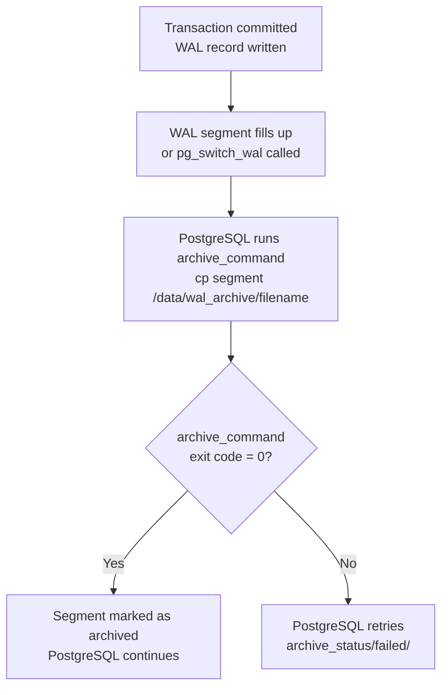

# WAL Archiving and Point-in-Time Recovery (PITR)

## Concepts First

### What is WAL?

WAL stands for Write-Ahead Log. Every change to data in PostgreSQL — an INSERT, UPDATE, DELETE, even a DROP TABLE — is first written to the WAL before the actual data files on disk are modified. This is not optional; it is how PostgreSQL guarantees data integrity.

If the server crashes mid-operation, PostgreSQL replays the WAL on restart to bring the data files back to a consistent state. Replicas work the same way — they continuously receive and replay WAL from the primary to stay in sync.

WAL is stored as segment files inside `pg_wal/` in the data directory. Each segment is 16MB by default. PostgreSQL creates new segments as needed and recycles old ones once they are no longer needed.

### What is WAL Archiving?

By default, WAL segments get recycled — overwritten once PostgreSQL no longer needs them for replication or crash recovery. This means you cannot replay WAL from last week because it no longer exists.

WAL archiving changes this. With `archive_mode = on`, PostgreSQL runs an `archive_command` every time a WAL segment is completed. This command copies the segment to a safe location — a local directory, a remote server, or an object store. The archived segments are never deleted by PostgreSQL; you manage their retention.

```
WAL segment completed in pg_wal/
            ↓
archive_command runs
            ↓
segment copied to archive location
            ↓
PostgreSQL continues with next segment
```

Without WAL archiving, you can only recover to the last full backup. With WAL archiving, you can recover to any point in time between your base backup and now — this is PITR.

### What is PITR?

PITR — Point-in-Time Recovery — lets you restore a PostgreSQL cluster to any specific moment in the past, not just the time of the last backup.

Imagine this scenario:
- A base backup was taken at 2:00 AM
- At 10:00 AM, someone accidentally ran `DROP TABLE employees`
- You want to recover the state as of 9:59 AM

With PITR this is possible because:

1. You have the base backup (state at 2:00 AM)
2. Every WAL segment from 2:00 AM to 10:00 AM is in the archive
3. PostgreSQL can restore the base backup and replay WAL segments one by one — stopping just before 10:00 AM


Without WAL archiving, PITR is not possible — you can only restore to exactly when the base backup was taken.

### How PITR Works Internally

When PostgreSQL starts in recovery mode (triggered by the presence of `recovery.signal`), it does the following:

1. Reads the base backup and applies it to the data directory
2. Looks at `restore_command` to know where to fetch WAL segments from
3. Replays WAL segments one by one in order
4. Checks each transaction's commit time against `recovery_target_time`
5. Stops replaying when it reaches the target time
6. If `recovery_target_action = 'promote'`, it promotes itself to a standalone primary

### WAL Archiving vs pgBackRest

In our cluster, pgBackRest handles WAL archiving automatically. This topic deliberately avoids pgBackRest to demonstrate the underlying mechanism — using a simple `cp` command as the archive command. Understanding the raw mechanism makes it much easier to understand what pgBackRest is doing on your behalf.

---

## Lab Environment

| Host | IP | Role in this topic |
|------|----|--------------------|
| pnode2 | 172.16.93.137 | Standalone PostgreSQL — WAL archiving + PITR practice |

pnode2 is detached from the Patroni cluster for this exercise. We run a completely independent PostgreSQL instance here — no Patroni, no etcd, no HAProxy involved.

> **Important:** Patroni was running on pnode2 even though it was supposed to be detached. Before starting, Patroni must be stopped — otherwise it will keep restarting PostgreSQL and recreating files you delete.

---

## Setup

### Step 1 — Stop Patroni

Patroni manages PostgreSQL lifecycle. If it is running, it will restart PostgreSQL whenever you stop it, and recreate data directory files whenever you delete them. Stop it first.

```bash
# Run on pnode2
sudo systemctl stop patroni
sudo systemctl status patroni
# Expected: inactive (dead)

# Confirm no PostgreSQL process is running
ps aux | grep postgres
```

After stopping Patroni, there should be no `postgres` or `patroni` process in the output.

### Step 2 — Clean the data directory

The existing `/data/patroni/` contains leftover data from when pnode2 was a cluster member. We need a clean slate.

> **Note:** `rm -rf /data/patroni/*` with glob expansion does not work reliably here due to shell expansion behavior. Use `sudo bash -c` to ensure the glob is expanded correctly.

```bash
sudo bash -c "rm -rf /data/patroni/*"
sudo ls /data/patroni/
# Expected: empty output
```

### Step 3 — Create WAL archive directory

This is where completed WAL segments will be copied. In production this would be a remote server or object storage — here we use a local directory for simplicity.

```bash
sudo mkdir -p /data/wal_archive
sudo chown postgres:postgres /data/wal_archive
sudo chmod 700 /data/wal_archive
```

`chown` gives ownership to the `postgres` OS user — required because the PostgreSQL process runs as `postgres` and needs to write here via `archive_command`. `chmod 700` restricts access to the owner only.

### Step 4 — Initialize a fresh PostgreSQL cluster

`initdb` creates a brand new PostgreSQL cluster in the specified data directory — system catalogs, default config files, and the initial database structure.

```bash
sudo -u postgres /usr/pgsql-16/bin/initdb \
  -D /data/patroni \
  --encoding=UTF8 \
  --locale=en_US.UTF-8
```

**Flags:**

| Flag | Purpose |
|------|---------|
| `-D /data/patroni` | Data directory for the new cluster |
| `--encoding=UTF8` | Default character encoding for databases |
| `--locale=en_US.UTF-8` | Default locale for collation and text sorting |

Expected output ends with: `Success. You can now start the database server using: ...`

---

## Configure WAL Archiving

### Step 5 — Edit postgresql.conf

Open the config file and set the following parameters:

```bash
sudo -u postgres vim /data/patroni/postgresql.conf
```

Find and set these values (they exist as commented defaults — uncomment and modify):

```ini
# Allow connections from any IP (needed for remote access during practice)
listen_addresses = '*'

# WAL level must be 'replica' or higher to enable archiving
wal_level = replica

# Enable WAL archiving
archive_mode = on

# The command PostgreSQL runs when a WAL segment is complete
# %p = full path of the WAL segment (source)
# %f = filename of the WAL segment (destination filename)
archive_command = 'cp %p /data/wal_archive/%f'
```

**Why `wal_level = replica`?**
`wal_level` controls how much information is written to WAL. The default (`minimal`) does not write enough information for archiving or replication. `replica` writes enough for both streaming replication and WAL archiving. PITR requires at least `replica`.

**Why `archive_command = 'cp %p /data/wal_archive/%f'`?**
This is the simplest possible archive command — just copy the file. PostgreSQL substitutes `%p` with the full source path and `%f` with just the filename. In production, this would be a pgBackRest or Barman command instead of a plain `cp`.

### Step 6 — Start PostgreSQL

```bash
sudo -u postgres mkdir -p /data/patroni/log

sudo -u postgres /usr/pgsql-16/bin/pg_ctl \
  -D /data/patroni \
  -l /data/patroni/log/postgresql.log \
  start
```

`pg_ctl start` starts the PostgreSQL server process. `-l` specifies the startup log file.

**Verify archiving is active:**

```bash
sudo -u postgres psql -c "SHOW archive_mode;"
sudo -u postgres psql -c "SHOW archive_command;"
```

Both should reflect what you set in `postgresql.conf`. The archive directory will be empty for now — WAL segments are only archived when they are complete (16MB filled or a manual switch is triggered).

---

## PITR Practice

The scenario: create a table with data, note a timestamp, then accidentally drop the table. Use PITR to recover to just before the drop.

### Step 7 — Take a Base Backup

PITR requires a base backup as the starting point. Without it, there is nothing to apply WAL on top of.

```bash
sudo mkdir -p /data/base_backup
sudo chown postgres:postgres /data/base_backup

sudo -u postgres pg_basebackup \
  -h 127.0.0.1 \
  -p 5432 \
  -U postgres \
  -D /data/base_backup \
  -Fp \
  -Xs \
  -P \
  -v
```

We connect to localhost (`127.0.0.1`) because the source and destination are the same server. `-Fp` is plain format, `-Xs` streams WAL during backup. See the pg_basebackup topic for full flag reference.

### Step 8 — Create a Database and Insert Data

```bash
sudo -u postgres psql -c "CREATE DATABASE pitr_test;"

sudo -u postgres psql -d pitr_test << 'EOF'
CREATE TABLE employees (
  id SERIAL PRIMARY KEY,
  name VARCHAR(100),
  department VARCHAR(100)
);
INSERT INTO employees (name, department) VALUES
  ('Alice', 'Engineering'),
  ('Bob', 'Marketing'),
  ('Charlie', 'Engineering');
EOF

sudo -u postgres psql -d pitr_test -c "SELECT * FROM employees;"
```

You should see three rows. This data was created after the base backup — it exists only in WAL at this point.

### Step 9 — Note the Recovery Target Timestamp

This timestamp is the point we want to recover to. Everything that happens after this moment will be discarded during PITR.

```bash
sudo -u postgres psql -d pitr_test -c "SELECT now();"
```

**Note this timestamp carefully.** Example output:
```
2026-03-26 14:42:11.459176+06
```

You will use this in the recovery configuration. Use `14:42:11+06` as the target — drop the microseconds.

### Step 10 — Simulate the Accident

Insert one more row (this will be lost after PITR — it was created after the target timestamp), then drop the table.

```bash
# This row was inserted after our recovery target — it will not survive PITR
sudo -u postgres psql -d pitr_test -c \
  "INSERT INTO employees (name, department) VALUES ('Dave', 'HR');"

# The accident
sudo -u postgres psql -d pitr_test -c "DROP TABLE employees;"

# Confirm the table is gone
sudo -u postgres psql -d pitr_test -c "SELECT * FROM employees;"
# Expected: ERROR: relation "employees" does not exist
```

### Step 11 — Force WAL Archive

The current WAL segment may not be archived yet — it is only archived when it is complete (16MB) or manually switched. Force it now to ensure all WAL up to the DROP TABLE is in the archive.

```bash
# pg_switch_wal() closes the current WAL segment and starts a new one
# The closed segment gets archived immediately
sudo -u postgres psql -c "SELECT pg_switch_wal();"

sleep 2

# Verify WAL segments are in the archive
sudo ls /data/wal_archive/
```

You should see several WAL segment files like `000000010000000000000001`, `000000010000000000000002`, etc. These are the segments that will be replayed during PITR.

### Step 12 — Stop PostgreSQL

PITR requires restoring the data directory from the base backup. The server must be stopped first.

```bash
sudo -u postgres /usr/pgsql-16/bin/pg_ctl \
  -D /data/patroni \
  stop
```

### Step 13 — Restore the Base Backup

Remove the current (corrupted) data directory contents and replace with the base backup.

```bash
# Remove current data
sudo bash -c "rm -rf /data/patroni/*"

# Restore base backup
sudo -u postgres cp -a /data/base_backup/. /data/patroni/

# Fix permissions — cp -a sometimes changes directory permissions
sudo chmod 700 /data/patroni

# Verify
sudo ls /data/patroni/
```

`cp -a` preserves file attributes, ownership, and timestamps — important for PostgreSQL which is strict about file permissions. However it can sometimes change the data directory's own permission bits, which is why `chmod 700` is needed after.

### Step 14 — Configure Recovery Settings

Tell PostgreSQL how to fetch archived WAL and when to stop replaying.

```bash
sudo -u postgres bash -c "cat >> /data/patroni/postgresql.conf << 'EOF'

# PITR Recovery Settings
restore_command = 'cp /data/wal_archive/%f %p'
recovery_target_time = '2026-03-26 14:42:11+06'
recovery_target_action = 'promote'
EOF"
```

**What each setting does:**

| Setting | Purpose |
|---------|---------|
| `restore_command` | How PostgreSQL fetches a WAL segment from archive. `%f` = filename, `%p` = destination path. PostgreSQL calls this for each segment it needs during replay. |
| `recovery_target_time` | Stop replaying WAL at this timestamp. Any transaction committed after this time is not applied. Use the timestamp from Step 9. |
| `recovery_target_action = 'promote'` | After reaching the target, promote to a standalone primary. Without this, PostgreSQL would pause in recovery and wait for manual intervention. |

**Create `recovery.signal`:**

```bash
sudo -u postgres touch /data/patroni/recovery.signal
```

The presence of `recovery.signal` tells PostgreSQL to start in recovery mode when it starts up. Without this file, PostgreSQL would start normally and ignore `restore_command` and `recovery_target_time` entirely.

**Verify the config:**

```bash
sudo tail -6 /data/patroni/postgresql.conf
ls /data/patroni/recovery.signal
```

### Step 15 — Start PostgreSQL in Recovery Mode

```bash
sudo -u postgres /usr/pgsql-16/bin/pg_ctl \
  -D /data/patroni \
  -l /data/patroni/log/postgresql.log \
  start
```

Watch the recovery log:

```bash
sudo tail -30 /data/patroni/log/postgresql-$(date +%a).log
```

You should see the recovery process step by step:

```
LOG:  starting point-in-time recovery to 2026-03-26 14:42:11+06
LOG:  restored log file "000000010000000000000002" from archive
LOG:  redo starts at 0/2000028
LOG:  restored log file "000000010000000000000003" from archive
LOG:  completed backup recovery ...
LOG:  consistent recovery state reached at 0/2000100
LOG:  restored log file "000000010000000000000004" from archive
LOG:  recovery stopping before commit of transaction 744, time 2026-03-26 14:42:50+06
LOG:  redo done at 0/345F7C0
LOG:  selected new timeline ID: 2
LOG:  archive recovery complete
LOG:  database system is ready to accept connections
```

Key lines to understand:

- `starting point-in-time recovery to ...` — recovery mode started with your target time
- `restored log file "..." from archive` — each WAL segment fetched via `restore_command`
- `recovery stopping before commit of transaction ...` — found a transaction past the target time, stopped here
- `selected new timeline ID: 2` — after PITR, PostgreSQL starts a new timeline (more on this below)
- `archive recovery complete` — recovery finished, server promoted

The `cp: cannot stat '/data/wal_archive/00000002.history': No such file or directory` messages are harmless — PostgreSQL looks for timeline history files that do not exist yet, which is expected.

### Step 16 — Verify PITR Succeeded

```bash
# The table should be back with the original 3 rows
sudo -u postgres psql -d pitr_test -c "SELECT * FROM employees;"

# Dave (inserted after recovery target) should NOT be here
# DROP TABLE should NOT have happened

# Confirm this is now a standalone primary, not in recovery
sudo -u postgres psql -c "SELECT pg_is_in_recovery();"
# Expected: f (false)

# Check the current timeline
sudo -u postgres psql -c "SELECT timeline_id FROM pg_control_checkpoint();"
# Expected: 2
```

---

## Understanding Timeline Change

After PITR, `timeline_id` changed from 1 to 2. This is an important concept.

When PostgreSQL performs PITR and stops at a point in the past, it has diverged from the original history. The original timeline (1) continued with the DROP TABLE and whatever came after. The recovered instance (timeline 2) took a different path — the DROP TABLE never happened here.

PostgreSQL tracks this with timeline IDs to prevent confusion:

```
Timeline 1:  Base backup → Alice/Bob/Charlie → Dave inserted → DROP TABLE → ...
                                    ↑
                          recovery_target_time
                                    ↓
Timeline 2:  Base backup → Alice/Bob/Charlie → (new history begins here)
```

If you take a new backup from this recovered instance, it will be on timeline 2. WAL segments on timeline 2 have filenames starting with `00000002...` instead of `00000001...`.

---

## How archive_command Works in Detail



PostgreSQL checks the exit code of `archive_command`. Exit code 0 means success. Any non-zero exit code means failure — PostgreSQL will retry indefinitely and will not delete or recycle the segment until it is successfully archived.

This means if your archive destination fills up or becomes unavailable, PostgreSQL will keep retrying and `pg_wal/` will grow. Monitor archive failures in production.

---

## Troubleshooting

### Patroni keeps restarting PostgreSQL

**Symptom:** Files you delete keep reappearing. PostgreSQL process keeps coming back.

**Cause:** Patroni is running and managing the PostgreSQL lifecycle. It restarts PostgreSQL whenever it stops and recreates state files.

**Fix:**
```bash
sudo systemctl stop patroni
ps aux | grep patroni  # confirm it is gone
```

### rm -rf /data/patroni/* does not delete files

**Cause:** Shell glob expansion with `*` can behave unexpectedly when run via `sudo`. The glob is expanded by the non-root shell before `sudo` gets the command.

**Fix:** Use `sudo bash -c` so the glob is expanded inside a root shell:
```bash
sudo bash -c "rm -rf /data/patroni/*"
```

### PostgreSQL fails to start — invalid permissions

**Symptom in log:**
```
FATAL: data directory "/data/patroni" has invalid permissions
DETAIL: Permissions should be u=rwx (0700) or u=rwx,g=rx (0750).
```

**Cause:** After `cp -a`, the data directory's permission bits may have changed.

**Fix:**
```bash
sudo chmod 700 /data/patroni
```

### Recovery does not start — recovery.signal missing

**Symptom:** PostgreSQL starts normally, ignores `restore_command` and `recovery_target_time`.

**Cause:** `recovery.signal` file is missing. Without it, PostgreSQL does not enter recovery mode.

**Fix:**
```bash
sudo -u postgres touch /data/patroni/recovery.signal
```
Then restart PostgreSQL.

### WAL segment not found during recovery

**Symptom in log:**
```
cp: cannot stat '/data/wal_archive/000000010000000000000005': No such file or directory
```

**Cause:** This is usually normal — PostgreSQL tries to fetch the next WAL segment and gets this error when it has replayed everything available. It then checks if the recovery target has been reached.

It becomes a problem if you see this before reaching the recovery target time, which means a WAL segment is missing from the archive (the `pg_switch_wal()` step in Step 11 was skipped).

**Fix:** Ensure `pg_switch_wal()` was called before stopping PostgreSQL to flush the last segment to the archive.

---

## Key Concepts Summary

```
WAL Archiving and PITR essentials:

1. WAL (Write-Ahead Log) — every change is logged before data files are modified
2. WAL archiving — completed segments are copied to a safe location via archive_command
3. archive_mode = on + archive_command — minimum config for WAL archiving
4. wal_level = replica — required for archiving (default 'minimal' is not enough)
5. PITR requires two things:
   - A base backup (starting point)
   - Archived WAL from base backup time to recovery target time
6. recovery.signal — tells PostgreSQL to start in recovery mode
7. restore_command — how PostgreSQL fetches WAL segments during recovery
8. recovery_target_time — stop replaying at this timestamp
9. recovery_target_action = 'promote' — become standalone primary after recovery
10. pg_switch_wal() — force current WAL segment to archive before stopping
11. Timeline ID increments after every PITR — prevents history confusion
12. archive_command exit code matters — non-zero = failure, PostgreSQL retries
```

---

## pg_basebackup vs WAL Archiving vs PITR

| Concept | What it provides |
|---------|-----------------|
| pg_basebackup alone | Restore to exact backup time only |
| WAL archiving alone | No use without a base backup |
| pg_basebackup + WAL archiving | Full PITR capability |
| recovery_target_time | Recover to a specific moment |
| recovery_target_action = promote | Become primary after recovery |
| pgBackRest (Topic 5) | Manages all of the above automatically |
