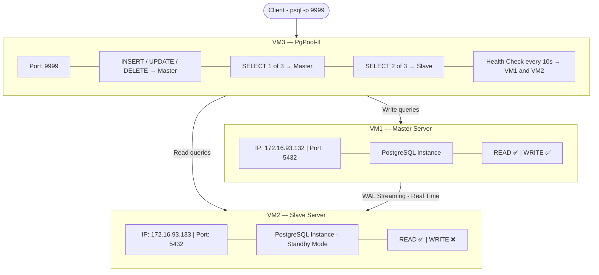
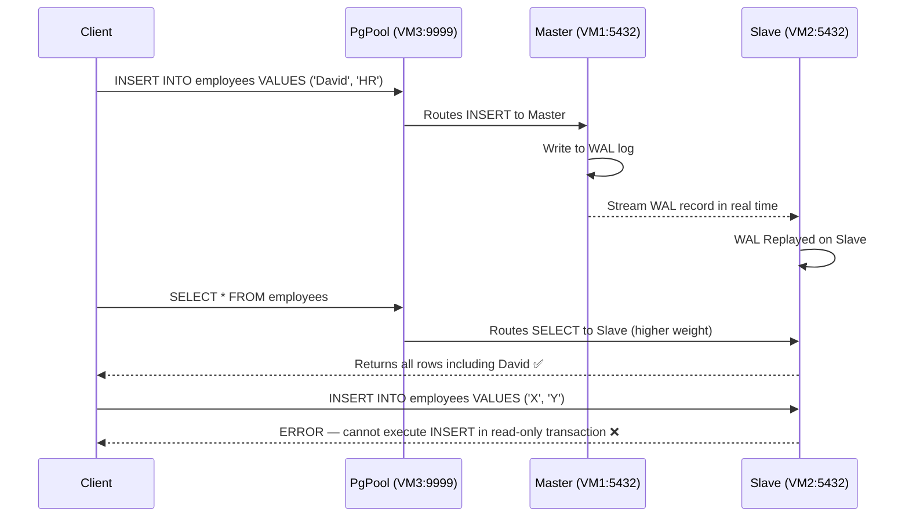
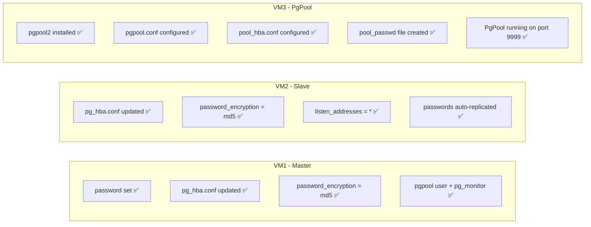

# PgPool-II Setup with PostgreSQL Streaming Replication — Complete Step-by-Step Guide

## Prerequisites

Before starting this guide, the following must already be in place:

- **VM1 (Master)** — PostgreSQL running, accepts Read + Write
- **VM2 (Slave)** — PostgreSQL running, Read Only, WAL streaming replication active with VM1
- Real-time data sync working between VM1 and VM2

## Environment

| Role | VM | IP Address |
|------|----|------------|
| Master | VM1 | 172.16.93.132 |
| Slave | VM2 | 172.16.93.133 |
| PgPool | VM3 | 172.16.93.134 |

> Replace all IP addresses with your actual IPs throughout this guide.

---

## Architecture



---

## Table of Contents

- [PART 1 — Create VM3](#part-1--create-vm3)
- [PART 2 — Prepare Master VM1](#part-2--prepare-master-vm1)
- [PART 3 — Prepare Slave VM2](#part-3--prepare-slave-vm2)
- [PART 4 — Configure PgPool on VM3](#part-4--configure-pgpool-on-vm3)
- [PART 5 — Verify and Test](#part-5--verify-and-test)

---

# PART 1 — Create VM3

---

## Step 1 — Create New VM in VMware

Create a new Ubuntu Server VM in VMware (same as VM1/VM2). After installation, find the IP address:

```bash
ip a
```

Look under `ens33` for the `inet` value. Note this as your VM3 IP.

> **Important:** Always use the `ens33` IP, never `lo` (127.0.0.1). The `lo` interface is loopback — only works locally and cannot be reached by other machines.

---

## Step 2 — Install PostgreSQL Client Tools on VM3

VM3 does **not** need a full PostgreSQL server. It only needs client tools so PgPool can run health checks and failover scripts.

```bash
sudo apt update
sudo apt install postgresql-client -y
```

> **`postgresql-client`** — installs only client-side tools like `psql` and `pg_isready`. Does NOT install the PostgreSQL server. PgPool uses these tools internally for health checking and replication status verification.

Verify installation:

```bash
psql --version
```

---

## Step 3 — Install PgPool-II on VM3

```bash
sudo apt install pgpool2 -y
```

Verify installation:

```bash
pgpool --version
```

---

# PART 2 — Prepare Master VM1

> All steps in this section are performed on **VM1 (Master)**

---

## Step 4 — Set Password for postgres User on Master

PgPool needs to authenticate with PostgreSQL backends using a password. By default, the `postgres` user may not have a password set. Set it now:

```bash
sudo -i -u postgres
psql -c "ALTER USER postgres PASSWORD 'postgres123';"
exit
```

> **`ALTER USER postgres PASSWORD`** — sets a login password for the `postgres` superuser. This is required because PgPool will connect to VM1 and VM2 using this password for health checks and query routing.

> **Note:** You do NOT need to do this on VM2 separately. Since VM2 is a Slave replicating from VM1, this `ALTER USER` command will automatically replicate to VM2 via WAL streaming.

---

## Step 5 — Create a Dedicated PgPool User on Master

```bash
sudo -i -u postgres
psql
```

```sql
CREATE ROLE pgpool WITH LOGIN PASSWORD 'pgpool123';
GRANT pg_monitor TO pgpool;
```

> - **`CREATE ROLE pgpool WITH LOGIN`** — creates a new database user named `pgpool`. PgPool uses this user specifically for health checks (checking if backends are alive every 10 seconds).
> - **`GRANT pg_monitor TO pgpool`** — grants permission to view server status information. Without this, the health check user cannot read monitoring data from PostgreSQL.

```sql
\q
exit
```

---

## Step 6 — Update pg_hba.conf on Master to Allow VM3

This file controls which hosts can connect to PostgreSQL, as which user, and with what authentication method.

```bash
sudo nano /etc/postgresql/16/main/pg_hba.conf
```

Add these lines at the bottom:

```
# Allow PgPool (VM3) to connect for health checks
host    all    pgpool      172.16.93.134/32    md5

# Allow PgPool (VM3) to route all user queries
host    all    all         172.16.93.134/32    md5
```

> - **`172.16.93.134/32`** — VM3's IP address. `/32` means only this exact single IP is allowed (not the entire subnet). This is more secure than `/24` which would allow all 256 addresses in the subnet.
> - **`md5`** — password-based authentication method. PgPool will send the password in md5-hashed form.

---

## Step 7 — Change Password Encryption to md5 on Master

By default, newer PostgreSQL versions use `scram-sha-256` for password encryption. PgPool's `pool_passwd` file stores passwords in md5 format. They must match, otherwise authentication fails with:

```
ERROR: failed to authenticate with backend using SCRAM
```

Fix this by changing the encryption method:

```bash
sudo nano /etc/postgresql/16/main/postgresql.conf
```

Find:
```
#password_encryption = scram-sha-256
```

Change to:
```
password_encryption = md5
```

> **`password_encryption`** — controls how PostgreSQL stores and verifies passwords. Setting it to `md5` ensures passwords are hashed in md5 format, which is compatible with PgPool's `pool_passwd` file format.

Restart PostgreSQL to apply the change:

```bash
sudo systemctl restart postgresql
```

After restart, re-set the passwords so they are stored in the new md5 format:

```bash
sudo -i -u postgres
psql -c "ALTER USER postgres PASSWORD 'postgres123';"
psql -c "ALTER USER pgpool PASSWORD 'pgpool123';"
exit
```

> **Why re-set passwords?** Changing `password_encryption` only affects newly set passwords. Existing passwords remain in their old format (scram-sha-256). Re-setting them forces PostgreSQL to store them in the new md5 format.

---

## Step 8 — Update pg_hba.conf to Use md5 Instead of scram-sha-256

```bash
sudo nano /etc/postgresql/16/main/pg_hba.conf
```

Find lines like:
```
host    all    all    127.0.0.1/32    scram-sha-256
host    all    all    ::1/128         scram-sha-256
```

Change them to:
```
host    all    all    127.0.0.1/32    md5
host    all    all    ::1/128         md5
```

> All authentication methods in `pg_hba.conf` must be `md5` to be consistent with the `password_encryption = md5` setting and PgPool's password file format.

Reload to apply:

```bash
sudo systemctl reload postgresql
```

> **`systemctl reload`** — reloads configuration files without restarting PostgreSQL. Existing connections are not dropped. Use `reload` for `pg_hba.conf` changes, `restart` for `postgresql.conf` changes.

---

# PART 3 — Prepare Slave VM2

> All steps in this section are performed on **VM2 (Slave)**

---

## Step 9 — Update pg_hba.conf on Slave to Allow VM3

VM2 also needs to allow PgPool (VM3) to connect, since PgPool sends read queries (SELECT) to the Slave.

```bash
sudo nano /etc/postgresql/16/main/pg_hba.conf
```

Add at the bottom:

```
# Allow PgPool (VM3) health checks
host    all    pgpool      172.16.93.134/32    md5

# Allow PgPool (VM3) to route queries
host    all    all         172.16.93.134/32    md5
```

Also change any `scram-sha-256` entries to `md5` (same as Step 8 on Master).

Reload:

```bash
sudo systemctl reload postgresql
```

---

## Step 10 — Change Password Encryption to md5 on Slave

```bash
sudo nano /etc/postgresql/16/main/postgresql.conf
```

Find:
```
#password_encryption = scram-sha-256
```

Change to:
```
password_encryption = md5
```

Restart:

```bash
sudo systemctl restart postgresql
```

> **Note:** You do NOT need to run `ALTER USER` on the Slave. The password change made on Master in Step 7 was automatically replicated to Slave via WAL streaming. The Slave already has the updated passwords.

---

## Step 11 — Ensure listen_addresses is Set Correctly on Slave

```bash
sudo grep listen_addresses /etc/postgresql/16/main/postgresql.conf
```

If it shows `localhost`, change it to `*`:

```bash
sudo nano /etc/postgresql/16/main/postgresql.conf
```

```
listen_addresses = '*'
```

Reload:

```bash
sudo systemctl reload postgresql
```

> **`listen_addresses = '*'`** — allows PostgreSQL to accept connections from any network interface. Default `localhost` only accepts local connections, which would prevent PgPool (running on VM3) from connecting to the Slave.

---

# PART 4 — Configure PgPool on VM3

> All steps in this section are performed on **VM3 (PgPool)**

---

## Step 12 — Test Connectivity from VM3 to VM1 and VM2

Before configuring PgPool, verify VM3 can actually reach both backends manually.

Test connection to Master (VM1):

```bash
psql -h 172.16.93.132 -p 5432 -U pgpool -d postgres
```

Password: `pgpool123`

If `postgres=#` prompt appears, connection is successful ✅. Exit with `\q`.

Test connection to Slave (VM2):

```bash
psql -h 172.16.93.133 -p 5432 -U pgpool -d postgres
```

Password: `pgpool123`

Both must connect successfully before proceeding. If either fails, go back and check `pg_hba.conf` and `listen_addresses` on that server.

---

## Step 13 — Configure pgpool.conf

This is PgPool's main configuration file.

```bash
sudo nano /etc/pgpool2/pgpool.conf
```

Use `Ctrl+W` to search for each setting. Make the following changes:

---

### PgPool Listening Port

```
listen_addresses = '*'
port = 9999
```

> - **`listen_addresses = '*'`** — PgPool accepts connections from any IP
> - **`port = 9999`** — clients connect to PgPool on this port (NOT 5432). PgPool then internally connects to PostgreSQL on port 5432.

---

### Backend 0 — Master Server VM1

```
backend_hostname0 = '172.16.93.132'
backend_port0 = 5432
backend_weight0 = 1
backend_data_directory0 = '/var/lib/postgresql/16/main'
backend_flag0 = 'ALLOW_TO_FAILOVER'
```

> - **`backend_hostname0`** — Master's IP address
> - **`backend_port0`** — Master's PostgreSQL port
> - **`backend_weight0 = 1`** — load balancing weight. With weight 1 (Master) vs 2 (Slave), Master receives 1/3 of SELECT queries
> - **`backend_data_directory0`** — Master's data directory path, used by failover scripts
> - **`backend_flag0 = 'ALLOW_TO_FAILOVER'`** — this node can be promoted during failover

---

### Backend 1 — Slave Server VM2

```
backend_hostname1 = '172.16.93.133'
backend_port1 = 5432
backend_weight1 = 2
backend_data_directory1 = '/var/lib/postgresql/16/main'
backend_flag1 = 'ALLOW_TO_FAILOVER'
```

> **`backend_weight1 = 2`** — Slave receives 2/3 of SELECT queries. Higher weight on Slave offloads read traffic from Master.

---

### Load Balancing

```
load_balance_mode = on
```

> **`load_balance_mode = on`** — enables automatic distribution of SELECT queries between Master and Slave according to their weights. When `off`, all queries go to Master only, making the Slave idle.

---

### Clustering Mode

```
backend_clustering_mode = 'streaming_replication'
```

> **`streaming_replication`** mode — tells PgPool that PostgreSQL Streaming Replication is being used. In this mode, PgPool knows which node is Primary (Master) and which is Standby (Slave), and routes write queries exclusively to the Primary.

---

### Connection Pooling

```
num_init_children = 32
max_pool = 4
child_life_time = 300
connection_life_time = 600
```

> - **`num_init_children = 32`** — number of PgPool worker processes. Each worker handles one client connection. So 32 clients can connect simultaneously.
> - **`max_pool = 4`** — each worker can maintain up to 4 cached connections to PostgreSQL backends
> - **`child_life_time = 300`** — idle worker process exits after 300 seconds (5 minutes)
> - **`connection_life_time = 600`** — a cached backend connection is closed after 600 seconds (10 minutes)

---

### Health Check

PgPool periodically connects to Master and Slave to check if they are alive.

```
health_check_period = 10
health_check_timeout = 20
health_check_user = 'pgpool'
health_check_password = 'pgpool123'
health_check_database = 'postgres'
health_check_max_retries = 3
health_check_retry_delay = 1
```

> - **`health_check_period = 10`** — check every 10 seconds
> - **`health_check_timeout = 20`** — wait 20 seconds for a response before considering it failed
> - **`health_check_max_retries = 3`** — retry 3 times before declaring the node dead
> - **`health_check_user`** — the PostgreSQL user used for health check connections (the `pgpool` role created in Step 5)

---

### Streaming Replication Check

```
sr_check_period = 10
sr_check_user = 'pgpool'
sr_check_password = 'pgpool123'
sr_check_database = 'postgres'
```

> **`sr_check`** — PgPool checks every 10 seconds whether the Slave is actually in sync with the Master. If the Slave falls too far behind (replication lag), PgPool can stop sending queries to it.

---

### Enable pool_passwd File

```
pool_passwd = 'pool_passwd'
```

> **`pool_passwd`** — specifies the filename where PgPool looks for stored passwords. This must be uncommented (no `#` at the start). Without this, PgPool cannot find the password file and authentication fails with "valid password not found".

Save and exit: `Ctrl+X` → `Y` → `Enter`

---

## Step 14 — Configure pool_hba.conf

This is PgPool's own authentication file — equivalent to PostgreSQL's `pg_hba.conf`, but for connections coming INTO PgPool (from clients).

```bash
sudo nano /etc/pgpool2/pool_hba.conf
```

Add at the bottom:

```
host    all    all    0.0.0.0/0    md5
```

> Allows any user from any IP to connect to PgPool using md5 password authentication.

Save and exit.

---

## Step 15 — Create PgPool Password File (pool_passwd)

PgPool is a service that runs automatically — nobody types passwords manually. It needs passwords stored in a file so it can authenticate with PostgreSQL backends on its own.

```bash
sudo pg_md5 -m -f /etc/pgpool2/pgpool.conf -u postgres postgres123
sudo pg_md5 -m -f /etc/pgpool2/pgpool.conf -u pgpool pgpool123
```

> Each part of the command explained:
>
> | Part | Meaning |
> |------|---------|
> | `pg_md5` | PgPool's password hashing tool |
> | `-m` | write the hashed password into the `pool_passwd` file |
> | `-f /etc/pgpool2/pgpool.conf` | location of pgpool.conf so it knows where to write `pool_passwd` |
> | `-u postgres` | the username this password belongs to |
> | `postgres123` | the actual plain-text password (gets stored as md5 hash) |

Verify the file was created:

```bash
sudo cat /etc/pgpool2/pool_passwd
```

Expected output:

```
postgres:md5xxxxxxxxxxxxxxxxxxxxxxxxxxxxxxxx
pgpool:md5yyyyyyyyyyyyyyyyyyyyyyyyyyyyyyyy
```

> Passwords are stored as md5 hashes, not plain text. Even if someone reads this file, they cannot see the actual passwords.

---

## Step 16 — Start and Enable PgPool

```bash
sudo systemctl start pgpool2
sudo systemctl enable pgpool2
```

> - **`start`** — starts PgPool immediately
> - **`enable`** — ensures PgPool automatically starts on every system boot

After running `enable`, you may see this message:

```
Synchronizing state of pgpool2.service with SysV service script...
Executing: /usr/lib/systemd/systemd-sysv-install enable pgpool2
```

> This is **completely normal** — not a warning or error. PgPool uses an older SysV init script format. systemd is converting it to its own format so it can manage it. The end result is the same: PgPool will auto-start on boot.

Check status:

```bash
sudo systemctl status pgpool2
```

`active (running)` means PgPool is running ✅

---

# PART 5 — Verify and Test

---

## Step 17 — Check PgPool Node Status

Connect to PgPool (port 9999) and check if it sees both backends correctly:

```bash
psql -h 172.16.93.134 -p 9999 -U postgres -c "SHOW pool_nodes;"
```

Expected output:

```
 node_id | hostname       | port | status | pg_status | lb_weight |  role   | pg_role | select_cnt | load_balance_node | replication_delay
---------+----------------+------+--------+-----------+-----------+---------+---------+------------+-------------------+------------------
 0       | 172.16.93.132  | 5432 | up     | up        | 0.333333  | primary | primary | 0          | false             | 0
 1       | 172.16.93.133  | 5432 | up     | up        | 0.666667  | standby | standby | 0          | true              | 0
```

> Each field explained:
>
> | Field | Expected Value | Meaning |
> |-------|---------------|---------|
> | `status` | `up` | PgPool's health check confirms server is alive |
> | `pg_status` | `up` | PostgreSQL process itself is responding |
> | `role` | `primary / standby` | PgPool correctly identified Master and Slave |
> | `pg_role` | `primary / standby` | PostgreSQL itself confirms its role |
> | `lb_weight` | `0.333 / 0.667` | Load balancing ratio (1:2 weight) |
> | `replication_delay` | `0` | Slave is fully in sync, no lag |
> | `load_balance_node` | `true` on standby | Next SELECT query will go to Slave (weight 2 is higher) |

> **Why is `load_balance_node` true on Slave and false on Master?**
> This shows which node will receive the NEXT incoming SELECT query. Since Slave has higher weight (2 vs 1), most of the time the next query goes to Slave. This value toggles between nodes based on the weight ratio — it is not a permanent state.

All values correct ✅

---

## Step 18 — Write Data Through PgPool (Goes to Master)

Connect to PgPool on port 9999:

```bash
psql -h 172.16.93.134 -p 9999 -U postgres -d testdb
```

Insert a new row:

```sql
INSERT INTO employees (name, department) VALUES ('Frank', 'PgPool Test');
```

Verify it was inserted:

```sql
SELECT * FROM employees;
```

`Frank` appears ✅ — Write operation went through PgPool to Master successfully.

---

## Step 19 — Read Data from Slave Directly (Bypassing PgPool)

This verifies that WAL streaming replicated the data from Master to Slave in real time.

On **VM2 (Slave)**, connect locally:

```bash
sudo -i -u postgres
psql -d testdb -c "SELECT * FROM employees;"
```

`Frank` appears on Slave too ✅ — Real-time replication is working.

---

## Step 20 — Verify Slave is Read-Only

On **VM2 (Slave)**:

```bash
sudo -i -u postgres
psql -d testdb
```

Try to write:

```sql
INSERT INTO employees (name, department) VALUES ('Hacker', 'Test');
```

Expected error:

```
ERROR:  cannot execute INSERT in a read-only transaction
```

> This confirms the Slave is correctly operating in read-only standby mode. The `standby.signal` file and WAL recovery mode prevent any write operations on the Slave. ✅

---

## Step 21 — Verify Load Balancing

Run multiple SELECT queries through PgPool:

```bash
psql -h 172.16.93.134 -p 9999 -U postgres -d testdb -c "SELECT * FROM employees;"
psql -h 172.16.93.134 -p 9999 -U postgres -d testdb -c "SELECT * FROM employees;"
psql -h 172.16.93.134 -p 9999 -U postgres -d testdb -c "SELECT * FROM employees;"
```

Now check the `select_cnt` column:

```bash
psql -h 172.16.93.134 -p 9999 -U postgres -c "SHOW pool_nodes;"
```

Expected:

```
 node_id | hostname       | role    | select_cnt
---------+----------------+---------+------------
 0       | 172.16.93.132  | primary | 1
 1       | 172.16.93.133  | standby | 2
```

> `select_cnt` shows how many SELECT queries each node has received. Slave received more (2 out of 3) because its weight is higher (2 vs 1). Load balancing is working correctly ✅

---

## Step 22 — Real-Time Sync Test



Open two terminals side by side — one SSH into VM1 (Master), one SSH into VM2 (Slave).

**Slave terminal** — check current rows:

```sql
SELECT * FROM employees;
-- Shows existing rows only
```

**Master terminal** — insert a new row:

```sql
INSERT INTO employees (name, department) VALUES ('David', 'HR');
```

**Slave terminal** — run SELECT again immediately:

```sql
SELECT * FROM employees;
```

`David` appears on Slave almost instantly ✅ — Real-time WAL streaming replication confirmed end-to-end through PgPool.

---

## Final Summary



---

## Quick Reference Commands

| Command | Purpose |
|---------|---------|
| `SHOW pool_nodes;` | View Master/Slave status, roles, load balancing weights |
| `SHOW pool_processes;` | View PgPool worker processes and their connections |
| `SHOW pool_pools;` | View current state of connection pools |
| `SHOW pool_version;` | View PgPool version |
| `sudo pg_md5 -m -u user pass` | Add/update a password in pool_passwd file |
| `sudo systemctl restart pgpool2` | Restart PgPool after config changes |
| `sudo systemctl status pgpool2` | Check if PgPool is running |
| `sudo journalctl -u pgpool2 --no-pager \| tail -30` | View PgPool logs for troubleshooting |

---

## Common Issues and Fixes

| Error | Cause | Fix |
|-------|-------|-----|
| `valid password not found` | `pool_passwd` setting commented out in pgpool.conf or file is empty | Uncomment `pool_passwd = 'pool_passwd'` in pgpool.conf, recreate pool_passwd file |
| `failed to authenticate using SCRAM` | PostgreSQL using scram-sha-256 but PgPool uses md5 | Set `password_encryption = md5` in postgresql.conf, re-set passwords, update pg_hba.conf |
| `no pg_hba.conf entry for host` | VM3's IP not in pg_hba.conf of VM1 or VM2 | Add `host all all 172.16.93.134/32 md5` to pg_hba.conf and reload |
| `Connection refused` on port 5432 from VM3 | `listen_addresses = localhost` on VM2 | Change to `listen_addresses = '*'` and restart |
| `SHOW pool_nodes` shows empty or error | PgPool cannot reach backends | Run connectivity test from VM3 to VM1 and VM2 manually using psql |

---

*Guide covers PostgreSQL 16 and PgPool-II 4.3 on Ubuntu Server. Adjust version numbers in paths as needed.*
