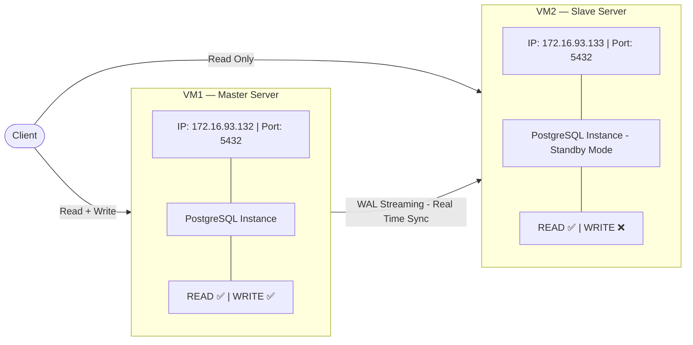
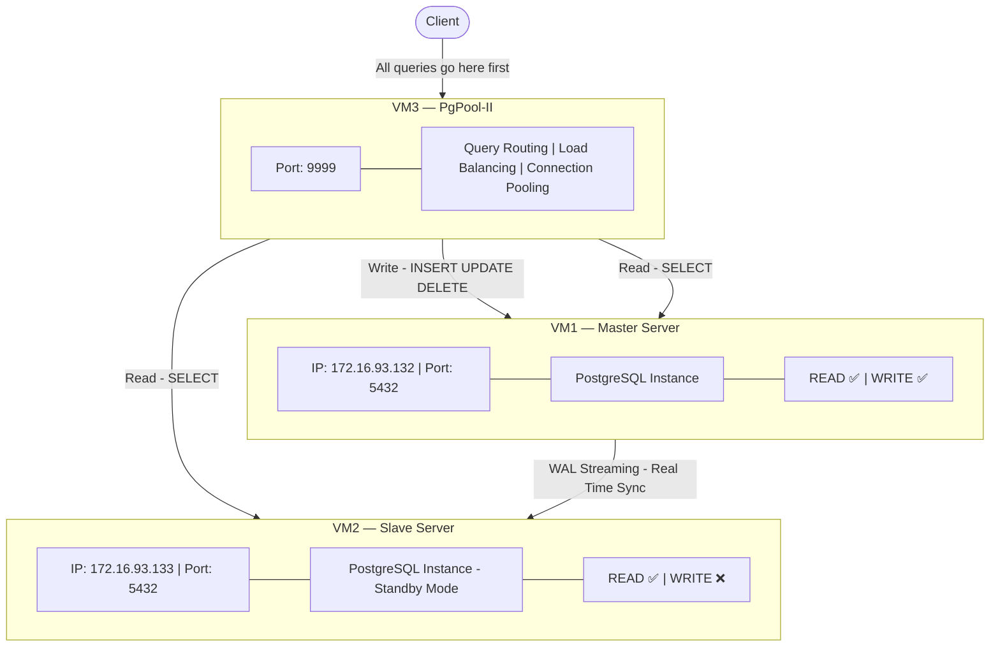
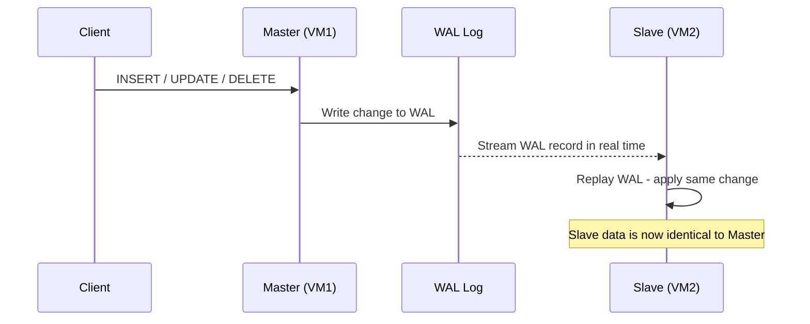
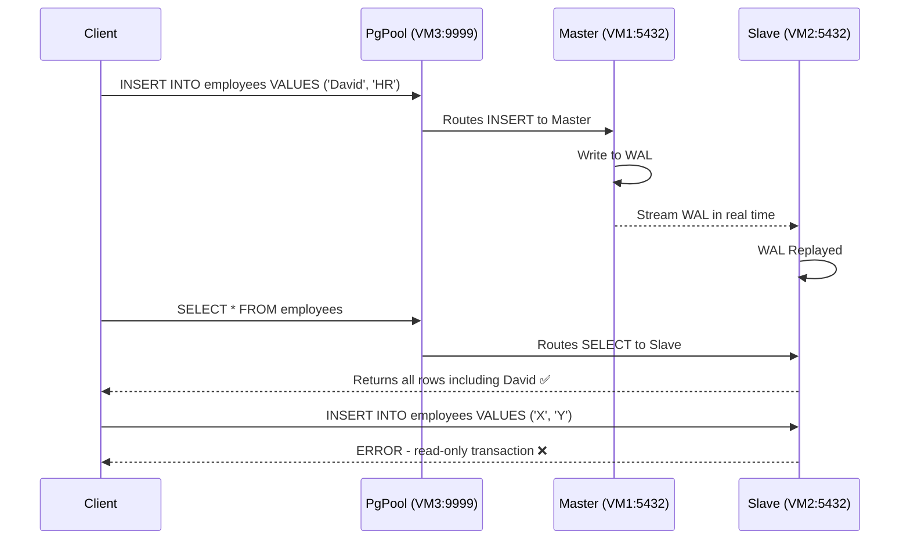

# PostgreSQL Master-Slave Streaming Replication with PgPool-II — Complete Step-by-Step Guide

## Table of Contents

- [Overview](#overview)
- [Environment Setup](#environment-setup)
- [Architecture](#architecture)
- [PART 1 — Master-Slave Streaming Replication](#part-1--master-slave-streaming-replication)
  - [What is a PostgreSQL Cluster?](#what-is-a-postgresql-cluster)
  - [What is Streaming Replication?](#what-is-streaming-replication)
  - [MASTER SERVER Configuration](#master-server-configuration)
    - [Step 1 — Create Replication User](#step-1--create-replication-user)
    - [Step 2 — Configure postgresql.conf](#step-2--configure-postgresqlconf)
    - [Step 3 — Configure pg_hba.conf](#step-3--configure-pg_hbaconf)
    - [Step 4 — Open Firewall Port](#step-4--open-firewall-port)
    - [Step 5 — Restart Master PostgreSQL](#step-5--restart-master-postgresql)
    - [Step 6 — Verify Master Configuration](#step-6--verify-master-configuration)
  - [SLAVE SERVER Configuration](#slave-server-configuration)
    - [Step 7 — Stop PostgreSQL on Slave](#step-7--stop-postgresql-on-slave)
    - [Step 8 — Clear Slave Data Directory](#step-8--clear-slave-data-directory)
    - [Step 9 — Take Base Backup from Master](#step-9--take-base-backup-from-master)
    - [Step 10 — Verify Backup Files](#step-10--verify-backup-files)
    - [Step 11 — Start PostgreSQL on Slave](#step-11--start-postgresql-on-slave)
  - [Verify Replication](#verify-replication)
    - [Step 12 — Check Slave Connection on Master](#step-12--check-slave-connection-on-master)
    - [Step 13 — Check Slave is in Standby Mode](#step-13--check-slave-is-in-standby-mode)
  - [Test Replication](#test-replication)
    - [Step 14 — Write Data on Master](#step-14--write-data-on-master)
    - [Step 15 — Read Data from Slave](#step-15--read-data-from-slave)
    - [Step 16 — Prove Slave is Read-Only](#step-16--prove-slave-is-read-only)
    - [Step 17 — Real-Time Sync Test](#step-17--real-time-sync-test)
- [PART 2 — PgPool-II Setup](#part-2--pgpool-ii-setup)
  - [What is PgPool-II?](#what-is-pgpool-ii)
  - [CREATE VM3](#create-vm3)
    - [Step 18 — Create New VM in VMware](#step-18--create-new-vm-in-vmware)
    - [Step 19 — Install PostgreSQL Client Tools on VM3](#step-19--install-postgresql-client-tools-on-vm3)
    - [Step 20 — Install PgPool-II on VM3](#step-20--install-pgpool-ii-on-vm3)
  - [Prepare Master VM1 for PgPool](#prepare-master-vm1-for-pgpool)
    - [Step 21 — Set Password for postgres User](#step-21--set-password-for-postgres-user)
    - [Step 22 — Create Dedicated PgPool User](#step-22--create-dedicated-pgpool-user)
    - [Step 23 — Update pg_hba.conf on Master to Allow VM3](#step-23--update-pg_hbaconf-on-master-to-allow-vm3)
    - [Step 24 — Change Password Encryption to md5 on Master](#step-24--change-password-encryption-to-md5-on-master)
    - [Step 25 — Update pg_hba.conf Auth Method to md5](#step-25--update-pg_hbaconf-auth-method-to-md5)
  - [Prepare Slave VM2 for PgPool](#prepare-slave-vm2-for-pgpool)
    - [Step 26 — Update pg_hba.conf on Slave to Allow VM3](#step-26--update-pg_hbaconf-on-slave-to-allow-vm3)
    - [Step 27 — Change Password Encryption to md5 on Slave](#step-27--change-password-encryption-to-md5-on-slave)
    - [Step 28 — Ensure listen_addresses is Correct on Slave](#step-28--ensure-listen_addresses-is-correct-on-slave)
  - [Configure PgPool on VM3](#configure-pgpool-on-vm3)
    - [Step 29 — Test Connectivity from VM3](#step-29--test-connectivity-from-vm3)
    - [Step 30 — Configure pgpool.conf](#step-30--configure-pgpoolconf)
    - [Step 31 — Configure pool_hba.conf](#step-31--configure-pool_hbaconf)
    - [Step 32 — Create PgPool Password File](#step-32--create-pgpool-password-file)
    - [Step 33 — Start and Enable PgPool](#step-33--start-and-enable-pgpool)
  - [Verify and Test PgPool](#verify-and-test-pgpool)
    - [Step 34 — Check PgPool Node Status](#step-34--check-pgpool-node-status)
    - [Step 35 — Write Data Through PgPool](#step-35--write-data-through-pgpool)
    - [Step 36 — Read Data from Slave Directly](#step-36--read-data-from-slave-directly)
    - [Step 37 — Verify Slave is Read-Only](#step-37--verify-slave-is-read-only)
    - [Step 38 — Verify Load Balancing](#step-38--verify-load-balancing)
    - [Step 39 — Real-Time Sync Test Through PgPool](#step-39--real-time-sync-test-through-pgpool)
- [Troubleshooting](#troubleshooting)

---

## Overview

This guide walks through two parts:

**Part 1** — Setting up PostgreSQL Master-Slave Streaming Replication across two servers so that any data written to Master is automatically synced to Slave in real time.

**Part 2** — Setting up PgPool-II on a third server to sit in front of the replication cluster, handling query routing, load balancing, and connection pooling.

---

## Environment Setup

| Role | VM | IP Address | Port |
|------|----|------------|------|
| Master | VM1 | 172.16.93.132 | 5432 |
| Slave | VM2 | 172.16.93.133 | 5432 |
| PgPool | VM3 | 172.16.93.134 | 9999 |

> Replace all IP addresses with your actual IPs throughout this guide.

To find your IP on each VM:

```bash
ip a
```

Look under `ens33` for the `inet` value. **Never use `lo` (127.0.0.1)** — that is the loopback address, only works locally.

---

## Architecture

### Part 1 — Streaming Replication Only (before PgPool)



### Part 2 — With PgPool-II (final architecture)



---

---

# PART 1 — Master-Slave Streaming Replication

---

## What is a PostgreSQL Cluster?

In PostgreSQL, a **"cluster"** does not mean a group of machines. It refers to a **single PostgreSQL instance managing a single data directory**. When you install PostgreSQL, it automatically creates one cluster.

The data directory lives here on Ubuntu:

```
/var/lib/postgresql/16/main/
├── base/             ← actual database files
├── global/           ← cluster-wide data (roles, users)
├── pg_wal/           ← Write-Ahead Log files
├── postgresql.conf   ← main configuration file
├── pg_hba.conf       ← authentication/access rules
├── PG_VERSION        ← version number
└── postmaster.pid    ← running process ID
```

> **One Cluster = One Data Directory = One PostgreSQL Instance**

---

## What is Streaming Replication?

Every change in PostgreSQL (INSERT, UPDATE, DELETE) is first written to a **WAL (Write-Ahead Log)** file before being applied to actual data. In Streaming Replication:

1. Master writes changes to WAL
2. WAL is **streamed in real time** to the Slave
3. Slave **replays** the WAL — applies the same changes to its own data
4. Slave stays continuously in sync with Master



---

## MASTER SERVER Configuration

> All steps in this section are performed on **VM1 (Master)**

---

### Step 1 — Create Replication User

```bash
sudo -i -u postgres
psql
```

> - **`sudo -i -u postgres`** — switches to the `postgres` OS user who owns all PostgreSQL data files
> - **`psql`** — opens the PostgreSQL interactive terminal

```sql
CREATE ROLE replicator WITH REPLICATION LOGIN PASSWORD 'replica123';
```

> - **`CREATE ROLE`** — creates a new database role (user)
> - **`WITH REPLICATION`** — grants permission to initiate WAL streaming
> - **`LOGIN`** — allows this role to log in
> - **`PASSWORD 'replica123'`** — sets the password

Verify:

```sql
\du
```

Expected:

```
 Role name  |         Attributes
------------+------------------------------------
 postgres   | Superuser, Create role, Create DB
 replicator | Replication
```

```sql
\q
exit
```

---

### Step 2 — Configure postgresql.conf

```bash
sudo nano /etc/postgresql/16/main/postgresql.conf
```

> Replace `16` with your actual PostgreSQL version. Use `Ctrl+W` to search inside the file.

Find and change the following settings (remove `#` to uncomment):

**`listen_addresses`**

```
listen_addresses = '*'
```

> Allows PostgreSQL to accept connections from any IP. Default `localhost` would block the Slave from connecting.

**`wal_level`**

```
wal_level = replica
```

> Controls how much detail is written to WAL. `replica` includes everything needed for streaming replication.

**`max_wal_senders`**

```
max_wal_senders = 5
```

> Maximum number of Slave servers that can connect simultaneously.

**`wal_keep_size`**

```
wal_keep_size = 64
```

> Minimum MB of WAL files to keep on disk. Allows a lagging Slave to catch up without needing a full re-sync.

Save and exit: `Ctrl+X` → `Y` → `Enter`

---

### Step 3 — Configure pg_hba.conf

This file controls **who can connect, from where, and how they authenticate**.

```bash
sudo nano /etc/postgresql/16/main/pg_hba.conf
```

Add at the very bottom:

```
host    replication     replicator      172.16.93.133/32        md5
```

> | Field | Value | Meaning |
> |-------|-------|---------|
> | `host` | — | TCP/IP connection |
> | `replication` | — | for replication connections only |
> | `replicator` | — | only this username |
> | `172.16.93.133/32` | — | only from this exact Slave IP |
> | `md5` | — | password-based authentication |
>
> `/32` means only this single exact IP. `/24` would allow the entire subnet — less secure.

Save and exit.

---

### Step 4 — Open Firewall Port

```bash
sudo ufw allow 5432/tcp
sudo ufw reload
```

> Opens port 5432 (PostgreSQL's default port) so the Slave can connect. Skip if `ufw` is inactive (`sudo ufw status` to check).

---

### Step 5 — Restart Master PostgreSQL

```bash
sudo systemctl restart postgresql
sudo pg_lsclusters
```

Expected:

```
Ver  Cluster  Port  Status  Owner
16   main     5432  online  postgres
```

> `online` = running correctly. `active (exited)` in `systemctl status` is **normal on Ubuntu** — what matters is `pg_lsclusters` shows `online`.

---

### Step 6 — Verify Master Configuration

```bash
sudo -i -u postgres
psql -c "SHOW wal_level;"
psql -c "SHOW listen_addresses;"
psql -c "SHOW max_wal_senders;"
exit
```

All should return `replica`, `*`, and `5` respectively ✅

---

## SLAVE SERVER Configuration

> All steps in this section are performed on **VM2 (Slave)**

---

### Step 7 — Stop PostgreSQL on Slave

```bash
sudo systemctl stop postgresql
sudo pg_lsclusters
```

Status should show `down` ✅

> Slave must be stopped before replacing its data directory with Master's copy.

---

### Step 8 — Clear Slave Data Directory

```bash
sudo -i -u postgres
rm -rf /var/lib/postgresql/16/main/*
ls /var/lib/postgresql/16/main/
```

No output = empty = correct ✅

> Removes the default empty cluster created during installation. Must be cleared before copying Master's data.

---

### Step 9 — Take Base Backup from Master

```bash
pg_basebackup -h 172.16.93.132 -U replicator -D /var/lib/postgresql/16/main/ -P -Xs -R
```

> | Flag | Meaning |
> |------|---------|
> | `-h 172.16.93.132` | Master's IP |
> | `-U replicator` | connect as this user |
> | `-D /var/lib/.../main/` | write backup to Slave's data directory |
> | `-P` | show progress percentage |
> | `-Xs` | stream WAL during backup so no changes are missed |
> | `-R` | auto-create `standby.signal` and write `primary_conninfo` to `postgresql.auto.conf` |

Password: `replica123`

```
30264/30264 kB (100%), 1/1 tablespace
```

Backup complete ✅

```bash
exit
```

---

### Step 10 — Verify Backup Files

```bash
sudo -i -u postgres
ls /var/lib/postgresql/16/main/standby.signal
cat /var/lib/postgresql/16/main/postgresql.auto.conf
```

> - **`standby.signal`** — empty file that tells PostgreSQL to run in read-only standby mode
> - **`primary_conninfo`** — tells Slave how to reach Master for WAL streaming

Expected in `postgresql.auto.conf`:

```
primary_conninfo = 'user=replicator password=replica123 host=172.16.93.132 port=5432 ...'
```

```bash
exit
```

---

### Step 11 — Start PostgreSQL on Slave

```bash
sudo systemctl start postgresql
sudo pg_lsclusters
```

`online` = Slave is running ✅

---

## Verify Replication

---

### Step 12 — Check Slave Connection on Master

On **VM1 (Master)**:

```bash
sudo -i -u postgres
psql -c "SELECT * FROM pg_stat_replication;"
```

Expected:

```
 pid  | usename    | client_addr    | state     | sync_state
------+------------+----------------+-----------+------------
 1234 | replicator | 172.16.93.133  | streaming | async
```

> - **`state: streaming`** — WAL is actively being sent to Slave ✅
> - **`sync_state: async`** — Master does not wait for Slave confirmation

```bash
exit
```

---

### Step 13 — Check Slave is in Standby Mode

On **VM2 (Slave)**:

```bash
sudo -i -u postgres
psql -c "SELECT pg_is_in_recovery();"
exit
```

Expected:

```
 pg_is_in_recovery
-------------------
 t
```

> `t` = true = Slave is correctly in standby mode ✅

---

## Test Replication

---

### Step 14 — Write Data on Master

On **VM1 (Master)**:

```bash
sudo -i -u postgres
psql
```

```sql
CREATE DATABASE testdb;
\c testdb

CREATE TABLE employees (
    id         SERIAL PRIMARY KEY,
    name       VARCHAR(100),
    department VARCHAR(100)
);

INSERT INTO employees (name, department) VALUES
    ('Alice', 'Engineering'),
    ('Bob', 'Marketing'),
    ('Charlie', 'Finance');

SELECT * FROM employees;
```

Expected:

```
 id |  name   | department
----+---------+-------------
  1 | Alice   | Engineering
  2 | Bob     | Marketing
  3 | Charlie | Finance
```

Data exists on Master ✅

---

### Step 15 — Read Data from Slave

On **VM2 (Slave)**:

```bash
sudo -i -u postgres
psql -d testdb -c "SELECT * FROM employees;"
```

Same 3 rows appear ✅

> Data written on Master is readable on Slave — WAL streaming replication confirmed working.

---

### Step 16 — Prove Slave is Read-Only

On **VM2 (Slave)**:

```bash
sudo -i -u postgres
psql -d testdb
```

```sql
INSERT INTO employees (name, department) VALUES ('Hacker', 'Unknown');
```

Expected:

```
ERROR:  cannot execute INSERT in a read-only transaction
```

Slave is correctly read-only ✅

---

### Step 17 — Real-Time Sync Test

Open two terminals — one for Master (VM1), one for Slave (VM2).

**Slave terminal:**

```sql
SELECT * FROM employees;
-- Shows: Alice, Bob, Charlie
```

**Master terminal:**

```sql
INSERT INTO employees (name, department) VALUES ('David', 'HR');
```

**Slave terminal — run again immediately:**

```sql
SELECT * FROM employees;
-- Now shows: Alice, Bob, Charlie, David ✅
```

> David appeared on Slave instantly — real-time WAL streaming replication confirmed ✅

---

---

# PART 2 — PgPool-II Setup

---

## What is PgPool-II?

PgPool-II is a **middleware** that sits between the Client and PostgreSQL servers. The Client connects to PgPool — PgPool then decides which PostgreSQL server to forward each query to.

> **PgPool does NOT do replication.** Replication is done by PostgreSQL (Part 1). PgPool manages the traffic on top of the already-replicated cluster.

PgPool's main jobs:

| Feature | What it does |
|---------|-------------|
| **Query Routing** | Sends WRITE queries to Master, READ queries to Master or Slave |
| **Load Balancing** | Distributes SELECT queries between Master and Slave based on weight |
| **Connection Pooling** | Reuses existing connections so thousands of clients can connect efficiently |
| **Health Check** | Monitors Master and Slave every few seconds to detect failures |

---

## CREATE VM3

---

### Step 18 — Create New VM in VMware

Create a new Ubuntu Server VM. After installation:

```bash
ip a
```

Note the `ens33` inet IP as VM3's IP.

---

### Step 19 — Install PostgreSQL Client Tools on VM3

VM3 does **not** need a full PostgreSQL server — only client tools for PgPool's internal use.

```bash
sudo apt update
sudo apt install postgresql-client -y
psql --version
```

> **`postgresql-client`** — installs `psql` and `pg_isready` tools only. PgPool uses these for health checking and replication status checks.

---

### Step 20 — Install PgPool-II on VM3

```bash
sudo apt install pgpool2 -y
pgpool --version
```

---

## Prepare Master VM1 for PgPool

> All steps in this section are performed on **VM1 (Master)**

---

### Step 21 — Set Password for postgres User

```bash
sudo -i -u postgres
psql -c "ALTER USER postgres PASSWORD 'postgres123';"
exit
```

> PgPool connects to VM1 and VM2 using this password for health checks and query routing. By default, `postgres` user may not have a password set.

> **Note:** No need to do this on VM2. Since Slave replicates from Master, this change automatically syncs to VM2 via WAL.

---

### Step 22 — Create Dedicated PgPool User

```bash
sudo -i -u postgres
psql
```

```sql
CREATE ROLE pgpool WITH LOGIN PASSWORD 'pgpool123';
GRANT pg_monitor TO pgpool;
\q
exit
```

> - **`pgpool` role** — PgPool uses this user for health checks every 10 seconds
> - **`pg_monitor`** — allows this user to read server status data from PostgreSQL

---

### Step 23 — Update pg_hba.conf on Master to Allow VM3

```bash
sudo nano /etc/postgresql/16/main/pg_hba.conf
```

Add at the bottom:

```
host    all    pgpool      172.16.93.134/32    md5
host    all    all         172.16.93.134/32    md5
```

> Allows PgPool (VM3) to connect to Master for health checks and query routing. `/32` means only VM3's exact IP is allowed.

---

### Step 24 — Change Password Encryption to md5 on Master

By default, newer PostgreSQL uses `scram-sha-256`. PgPool's password file uses `md5`. They must match, otherwise you get:

```
ERROR: failed to authenticate with backend using SCRAM
```

```bash
sudo nano /etc/postgresql/16/main/postgresql.conf
```

Find and change:

```
password_encryption = md5
```

Restart and re-set passwords so they store in md5 format:

```bash
sudo systemctl restart postgresql
sudo -i -u postgres
psql -c "ALTER USER postgres PASSWORD 'postgres123';"
psql -c "ALTER USER pgpool PASSWORD 'pgpool123';"
exit
```

> **Why re-set?** Changing `password_encryption` only affects new passwords. Existing ones stay in old format. Re-setting forces md5 storage.

---

### Step 25 — Update pg_hba.conf Auth Method to md5

```bash
sudo nano /etc/postgresql/16/main/pg_hba.conf
```

Change any `scram-sha-256` entries to `md5`:

```
host    all    all    127.0.0.1/32    md5
host    all    all    ::1/128         md5
```

Reload:

```bash
sudo systemctl reload postgresql
```

---

## Prepare Slave VM2 for PgPool

> All steps in this section are performed on **VM2 (Slave)**

---

### Step 26 — Update pg_hba.conf on Slave to Allow VM3

```bash
sudo nano /etc/postgresql/16/main/pg_hba.conf
```

Add at the bottom:

```
host    all    pgpool      172.16.93.134/32    md5
host    all    all         172.16.93.134/32    md5
```

Also change any `scram-sha-256` entries to `md5`.

```bash
sudo systemctl reload postgresql
```

---

### Step 27 — Change Password Encryption to md5 on Slave

```bash
sudo nano /etc/postgresql/16/main/postgresql.conf
```

```
password_encryption = md5
```

```bash
sudo systemctl restart postgresql
```

> No need to run `ALTER USER` on Slave — passwords were already replicated from Master via WAL.

---

### Step 28 — Ensure listen_addresses is Correct on Slave

```bash
sudo grep listen_addresses /etc/postgresql/16/main/postgresql.conf
```

If it shows `localhost`, change it:

```bash
sudo nano /etc/postgresql/16/main/postgresql.conf
```

```
listen_addresses = '*'
```

```bash
sudo systemctl reload postgresql
```

> Default `localhost` blocks PgPool (on VM3) from connecting to Slave. Must be `*` to allow external connections.

---

## Configure PgPool on VM3

> All steps in this section are performed on **VM3 (PgPool)**

---

### Step 29 — Test Connectivity from VM3

Before configuring PgPool, verify VM3 can reach both backends:

```bash
psql -h 172.16.93.132 -p 5432 -U pgpool -d postgres
```

Password: `pgpool123` → `postgres=#` prompt = success ✅ → `\q`

```bash
psql -h 172.16.93.133 -p 5432 -U pgpool -d postgres
```

Password: `pgpool123` → `postgres=#` prompt = success ✅ → `\q`

Both must connect before proceeding.

---

### Step 30 — Configure pgpool.conf

```bash
sudo nano /etc/pgpool2/pgpool.conf
```

Use `Ctrl+W` to find each setting:

**Listening port:**

```
listen_addresses = '*'
port = 9999
```

> Clients connect to PgPool on port 9999, not 5432.

**Backend 0 — Master:**

```
backend_hostname0 = '172.16.93.132'
backend_port0 = 5432
backend_weight0 = 1
backend_data_directory0 = '/var/lib/postgresql/16/main'
backend_flag0 = 'ALLOW_TO_FAILOVER'
```

**Backend 1 — Slave:**

```
backend_hostname1 = '172.16.93.133'
backend_port1 = 5432
backend_weight1 = 2
backend_data_directory1 = '/var/lib/postgresql/16/main'
backend_flag1 = 'ALLOW_TO_FAILOVER'
```

> `backend_weight` controls load balancing. Weight 1 vs 2 means Master gets 1/3 and Slave gets 2/3 of SELECT queries.

**Load balancing:**

```
load_balance_mode = on
```

**Clustering mode:**

```
backend_clustering_mode = 'streaming_replication'
```

> Tells PgPool that PostgreSQL Streaming Replication is in use so it correctly identifies which node is Primary and which is Standby.

**Connection pooling:**

```
num_init_children = 32
max_pool = 4
child_life_time = 300
connection_life_time = 600
```

**Health check:**

```
health_check_period = 10
health_check_timeout = 20
health_check_user = 'pgpool'
health_check_password = 'pgpool123'
health_check_database = 'postgres'
health_check_max_retries = 3
health_check_retry_delay = 1
```

> PgPool connects to VM1 and VM2 every 10 seconds using the `pgpool` user to confirm they are alive.

**Streaming replication check:**

```
sr_check_period = 10
sr_check_user = 'pgpool'
sr_check_password = 'pgpool123'
sr_check_database = 'postgres'
```

**Password file — must be uncommented:**

```
pool_passwd = 'pool_passwd'
```

> Without uncommenting this line, PgPool cannot find the password file and gives "valid password not found" error.

Save and exit: `Ctrl+X` → `Y` → `Enter`

---

### Step 31 — Configure pool_hba.conf

```bash
sudo nano /etc/pgpool2/pool_hba.conf
```

Add at the bottom:

```
host    all    all    0.0.0.0/0    md5
```

> PgPool's own authentication file — controls who can connect INTO PgPool. This allows any client from any IP using md5 password.

Save and exit.

---

### Step 32 — Create PgPool Password File

PgPool runs as a service and needs passwords pre-stored to authenticate with backends automatically.

```bash
sudo pg_md5 -m -f /etc/pgpool2/pgpool.conf -u postgres postgres123
sudo pg_md5 -m -f /etc/pgpool2/pgpool.conf -u pgpool pgpool123
```

> | Part | Meaning |
> |------|---------|
> | `pg_md5` | PgPool's password hashing tool |
> | `-m` | write hashed password to `pool_passwd` file |
> | `-f /etc/pgpool2/pgpool.conf` | pgpool.conf location so it knows where to write |
> | `-u postgres` | username this password belongs to |
> | `postgres123` | plain-text password — stored as md5 hash |

Verify:

```bash
sudo cat /etc/pgpool2/pool_passwd
```

Expected:

```
postgres:md5xxxxxxxxxxxxxxxxxxxxxxxxxxxxxxxx
pgpool:md5yyyyyyyyyyyyyyyyyyyyyyyyyyyyyyyy
```

---

### Step 33 — Start and Enable PgPool

```bash
sudo systemctl start pgpool2
sudo systemctl enable pgpool2
sudo systemctl status pgpool2
```

> After `enable`, you may see:
> ```
> Synchronizing state of pgpool2.service with SysV service script...
> ```
> This is **completely normal** — not an error. PgPool uses an older init format and systemd is converting it.

`active (running)` = PgPool is running ✅

---

## Verify and Test PgPool

---

### Step 34 — Check PgPool Node Status

```bash
psql -h 172.16.93.134 -p 9999 -U postgres -c "SHOW pool_nodes;"
```

Expected:

```
 node_id | hostname       | port | status | lb_weight |  role   | select_cnt | replication_delay
---------+----------------+------+--------+-----------+---------+------------+------------------
 0       | 172.16.93.132  | 5432 | up     | 0.333333  | primary | 0          | 0
 1       | 172.16.93.133  | 5432 | up     | 0.666667  | standby | 0          | 0
```

> | Field | Expected | Meaning |
> |-------|----------|---------|
> | `status` | `up` | server is alive and reachable |
> | `role` | `primary / standby` | PgPool correctly identified Master and Slave |
> | `lb_weight` | `0.333 / 0.667` | load balancing ratio 1:2 |
> | `replication_delay` | `0` | Slave is fully in sync with Master |

All correct ✅

---

### Step 35 — Write Data Through PgPool

```bash
psql -h 172.16.93.134 -p 9999 -U postgres -d testdb
```

```sql
INSERT INTO employees (name, department) VALUES ('Frank', 'PgPool Test');
SELECT * FROM employees;
```

`Frank` appears ✅ — Write went through PgPool to Master successfully.

---

### Step 36 — Read Data from Slave Directly

On **VM2 (Slave)**:

```bash
sudo -i -u postgres
psql -d testdb -c "SELECT * FROM employees;"
```

`Frank` appears on Slave too ✅ — WAL replication is syncing in real time.

---

### Step 37 — Verify Slave is Read-Only

On **VM2 (Slave)**:

```bash
sudo -i -u postgres
psql -d testdb
```

```sql
INSERT INTO employees (name, department) VALUES ('Hacker', 'Test');
```

Expected:

```
ERROR:  cannot execute INSERT in a read-only transaction
```

Slave is read-only ✅

---

### Step 38 — Verify Load Balancing

Run 3 SELECT queries through PgPool:

```bash
psql -h 172.16.93.134 -p 9999 -U postgres -d testdb -c "SELECT * FROM employees;"
psql -h 172.16.93.134 -p 9999 -U postgres -d testdb -c "SELECT * FROM employees;"
psql -h 172.16.93.134 -p 9999 -U postgres -d testdb -c "SELECT * FROM employees;"
```

Check `select_cnt`:

```bash
psql -h 172.16.93.134 -p 9999 -U postgres -c "SHOW pool_nodes;"
```

Expected:

```
 node_id | hostname       | role    | select_cnt
---------+----------------+---------+------------
 0       | 172.16.93.132  | primary | 1
 1       | 172.16.93.133  | standby | 2
```

Slave received more queries because its weight is higher (2 vs 1) ✅

---

### Step 39 — Real-Time Sync Test Through PgPool



Open two terminals — one for Master (VM1), one for Slave (VM2).

**Slave terminal:**

```sql
SELECT * FROM employees;
-- existing rows only
```

**Master terminal:**

```sql
INSERT INTO employees (name, department) VALUES ('David', 'HR');
```

**Slave terminal — immediately:**

```sql
SELECT * FROM employees;
-- David appears instantly ✅
```

Real-time WAL streaming replication confirmed end-to-end through PgPool ✅

---

# Troubleshooting

## Replication Issues

| Problem | Fix |
|---------|-----|
| `pg_stat_replication` is empty | Check Slave logs: `sudo tail -30 /var/log/postgresql/postgresql-16-main.log` |
| Wrong Master IP in backup | Re-run `pg_basebackup` with correct IP |
| Firewall blocking port 5432 | `sudo ufw allow 5432/tcp` on Master |
| Wrong IP in `pg_hba.conf` | Add correct Slave IP to Master's `pg_hba.conf` |
| `pg_is_in_recovery()` returns `f` | `standby.signal` missing — `touch /var/lib/postgresql/16/main/standby.signal` |
| `active (exited)` in systemctl | Normal on Ubuntu — check `sudo pg_lsclusters` instead |

## PgPool Issues

| Error | Cause | Fix |
|-------|-------|-----|
| `valid password not found` | `pool_passwd` setting commented out in pgpool.conf | Uncomment `pool_passwd = 'pool_passwd'` and recreate password file |
| `failed to authenticate using SCRAM` | PostgreSQL using scram-sha-256, PgPool uses md5 | Set `password_encryption = md5`, restart, re-set passwords |
| `no pg_hba.conf entry for host` | VM3 IP not in pg_hba.conf of VM1 or VM2 | Add `host all all 172.16.93.134/32 md5` and reload |
| `Connection refused` on port 5432 | `listen_addresses = localhost` on VM2 | Change to `listen_addresses = '*'` and restart |
| `SHOW pool_nodes` returns error | PgPool cannot reach backends | Test manually: `psql -h 172.16.93.132 -p 5432 -U pgpool -d postgres` |

## Quick Reference Commands

| Command | Purpose |
|---------|---------|
| `SHOW pool_nodes;` | View Master/Slave status, roles, load balancing weights |
| `SHOW pool_processes;` | View PgPool worker processes |
| `SHOW pool_pools;` | View connection pool state |
| `sudo pg_md5 -m -u user pass` | Add/update password in pool_passwd file |
| `sudo systemctl restart pgpool2` | Restart PgPool after config changes |
| `sudo journalctl -u pgpool2 --no-pager \| tail -30` | View PgPool logs |

---

*Guide covers PostgreSQL 16 and PgPool-II 4.3 on Ubuntu Server with VMware. Adjust version numbers in paths as needed.*
